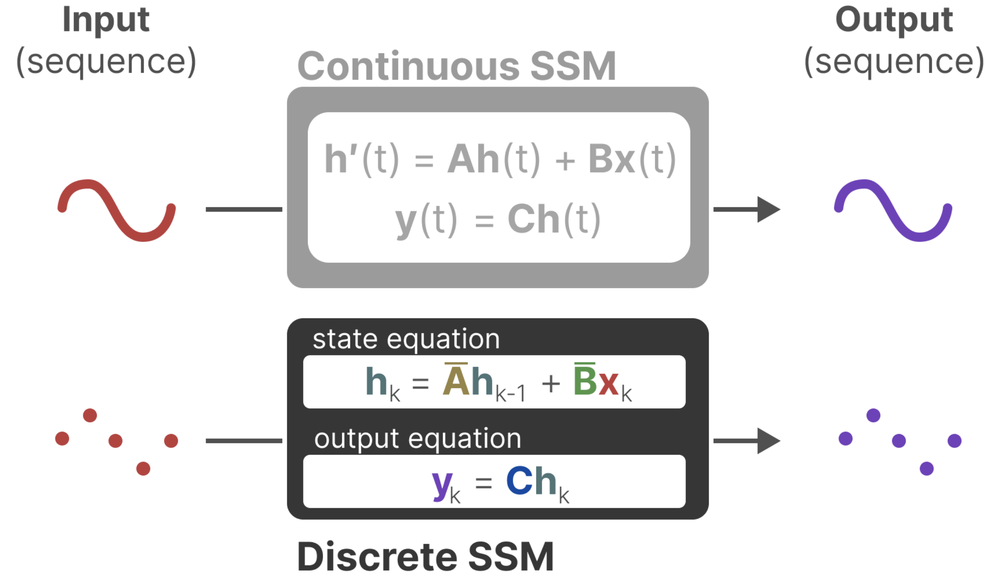
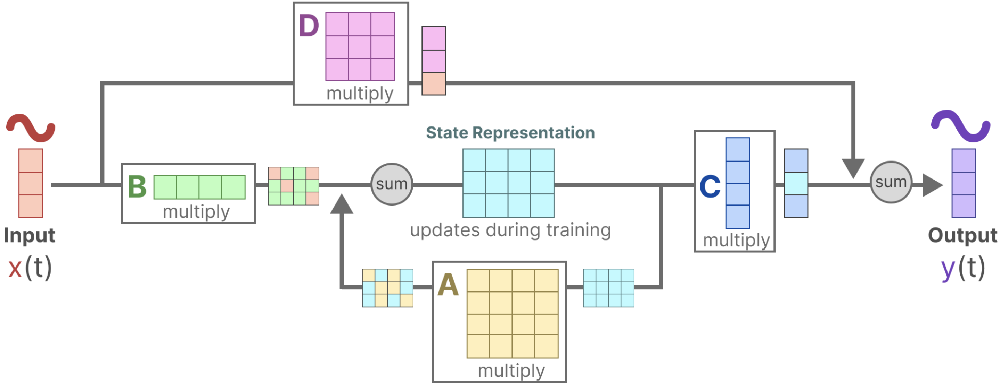

# Appendix

- [Appendix](#appendix)
  - [Machine Learning](#machine-learning)
    - [(Dec 2013) VAE: Auto-Encoding Variational Bayes](#dec-2013-vae-auto-encoding-variational-bayes)
    - [(Jun 2014) GAN: Generative Adversarial Networks](#jun-2014-gan-generative-adversarial-networks)
    - [(Dec 2015) CVAE: Learning Structured Output Representation using Deep Conditional Generative Models](#dec-2015-cvae-learning-structured-output-representation-using-deep-conditional-generative-models)
  - [Transformers](#transformers)
    - [(Jun 2017) Attention is All You Need](#jun-2017-attention-is-all-you-need)
    - [(Oct 2020) ViT: An Image is Worth 16x16 Words: Transformers for Image Recognition at Scale](#oct-2020-vit-an-image-is-worth-16x16-words-transformers-for-image-recognition-at-scale)
    - [(Apr 2024) Leave No Context Behind: Efficient Infinite Context Transformers with Infini-attention](#apr-2024-leave-no-context-behind-efficient-infinite-context-transformers-with-infini-attention)
  - [Diffusion Models](#diffusion-models)
    - [(Apr 2022) Video Diffusion Models](#apr-2022-video-diffusion-models)
  - [Reinforcement Learning](#reinforcement-learning)
    - [(Dec 2013) DQN: Playing Atari with Deep Reinforcement Learning](#dec-2013-dqn-playing-atari-with-deep-reinforcement-learning)
  - [Structured State Space Models](#structured-state-space-models)
    - [(Apr 2021) S4: Efficiently Modeling Long Sequences with Structured State Spaces](#apr-2021-s4-efficiently-modeling-long-sequences-with-structured-state-spaces)
    - [(Dec 2023) Mamba: Linear-Time Sequence Modeling with Selective State Spaces](#dec-2023-mamba-linear-time-sequence-modeling-with-selective-state-spaces)

## Machine Learning

### (Dec 2013) VAE: Auto-Encoding Variational Bayes

[Code](https://github.com/AntixK/PyTorch-VAE?tab=readme-ov-file), [Annotated Code](https://vxlabs.com/2017/12/08/variational-autoencoder-in-pytorch-commented-and-annotated/), [Blog](https://kvfrans.com/variational-autoencoders-explained/), [KL-Divergence Blog](https://kvfrans.com/deriving-the-kl/)

### (Jun 2014) GAN: Generative Adversarial Networks

[Annotated Code](https://nn.labml.ai/gan/original/index.html) [Code](https://github.com/eriklindernoren/PyTorch-GAN?tab=readme-ov-file), [Blog](https://kvfrans.com/generative-adversial-networks-explained/), [Video](https://www.youtube.com/watch?v=eyxmSmjmNS0)

### (Dec 2015) CVAE: Learning Structured Output Representation using Deep Conditional Generative Models

[Blog](https://agustinus.kristia.de/techblog/2016/12/17/conditional-vae/)

## Transformers

### (Jun 2017) Attention is All You Need

[Annotated Code](http://nlp.seas.harvard.edu/annotated-transformer/), [Video](https://www.youtube.com/watch?v=iDulhoQ2pro), [3B1B Part 1](https://youtu.be/wjZofJX0v4M?feature=shared), [3B1B Part 2](https://youtu.be/eMlx5fFNoYc?feature=shared)

### (Oct 2020) ViT: An Image is Worth 16x16 Words: Transformers for Image Recognition at Scale

[Annotated Code](https://nn.labml.ai/transformers/vit/index.html), [Code](https://github.com/google-research/vision_transformer), [Video](https://www.youtube.com/watch?v=TrdevFK_am4)

- Introduction
  - Transformer architecture has been successful in NLP
  - Apply standard transformer to image patches, providing sequence of linear embeddings of these patches as an input to a transformer
  - Worse than ResNet on ImageNet, but better on larger datasets
  - **Transformer is a generalization of an MLP**
    - The "weight" between nodes in consecutive layers is fixed in MLP, but computed on the fly in a transformer
    - This makes a transformer the most general, least generalized thing we can train in ML!
    - Transformer is less biased than other architectures
    - This is why we concatenate the input and positional encoding in a transformer
  - Completely discards the notion of convolutions
- Method
  - Follow original transformer as closely as possible
  - Standard transformer recieves a 1D sequence of token embeddings
  - For 2d images, reshape the image $x \in \mathbb{R}^{H \times W \times C}$ into a sequence of flattened 2D patches $x \in \mathbb{R}^{N \times (P^2 \cdot C)}$
    - $N = H \times W / P^2$ is the number of patches; the input sequence length
    - $P$ is the patch size
      - Use patches instead of the whole image for computational efficiency
      - Naive self attention would require each pixel to attend to every other pixel
    - $C$ is the number of channels
    - Flatten the patches and map to $D$ dimensions with linear layer; output is called the "patch embedding"
    - Position embeddings added to patch embeddings to retain positional information
    - **Patch + position embeddings are input to the transformer encoder**, output feeds into MLP for classification
  - 
  - **ViT has less image specific inductive bias than CNNs**
    - Inductive bias refers to the set of assumptions a model makes about the data
    - CNNs assume **locality** (pixels close to each other are related) and **translation invariance** (features are the same regardless of where they are in the image)
    - ViTs use self attention to consider relationships between all parts of the image simultaneously
      - Positional embeddings at initialization don't carry information about 2D position of the patches
      - For classification, only the MLP head in ViT assumes locality and translational invariance
- Experiments
  - ViT outperforms CNNs with the same computational budget
  - Internal representations
    - First layer linearly projects flattened patches to lower dimenstion
    - Learned positional embeddings are added to the patch embeddings, closer patches tend to have more similar positional embeddings, as well as row-column structure
    - 

### (Apr 2024) Leave No Context Behind: Efficient Infinite Context Transformers with Infini-attention

[Video](https://www.youtube.com/watch?v=r_UBBfTPcF0)

## Diffusion Models

### (Apr 2022) Video Diffusion Models

[Website](https://video-diffusion.github.io/)

## Reinforcement Learning

### (Dec 2013) DQN: Playing Atari with Deep Reinforcement Learning

[Annotated Code](https://nn.labml.ai/rl/dqn/index.html), [Video](https://www.youtube.com/watch?v=rFwQDDbYTm4), [Q-Learning](https://www.youtube.com/watch?v=nOBm4aYEYR4)

- Introduction
  - Challenges with deep learning for RL
    - Most deep learning applications to date require labelled training data, while RL algoithms must learn from a scalar reward signal that is sparse, noisy, and delayed
    - Deep learning assumes data samples to be independent, RL data is correlated
    - In RL, data distribution changs as the algorithm learns new behaviours; deep learning assumes fixed underlying distribution
  - This paper: **CNN + Q-learning + SGD**
  - **Experience replay**: randomly sample previous transitions to alleviate problems of correlated data and non-stationary distributions
- Background
  - At each time step, the agent selects an action from the set of legal game actions
    - Action passed to emulator and modifies game score
    - Agent only observes the raw pixels $x_t$ and reward $r_t$ representing the change in game score
  - Cannot understand current situation from only $x_t$, so consider sequences of actions and observations $s_t = x_1, a_1, x_2, a_2, ..., x_t$
    - Use complete sequence $s_t$ as state representation at time $t$
  - Q-learning
    - Future rewards discounted by factor $\gamma$ at each time step
    - **Future discounted return at time $t$**: $R_t = \sum_{t'=t}^T \gamma^{t'-t}r_{t'}$
    - **Optimal action-value function**: $Q^*(s, a) = \max_{\pi} \mathbb{E}[R_t | s_t = s, a_t = a, \pi]$
    - $\pi$ is the policy mapping sequences to actions
    - **Bellman equation**: $Q^*(s, a) = \mathbb{E}_{s'}[r + \gamma \max_{a'} Q^*(s', a') | s, a]$
      - Intuition: optimal value of current state-action pair is the reward received from that action plus the expected value of the best action from the next state
      - Many RL algorithms estimate $Q$ with a function approximator, $Q(s, a; \theta) \approx Q^*(s, a)$
    - **Q-network**: $Q(s, a; \theta) \approx Q^*(s, a)$
      - Nonlinear function approximator wth network weights $\theta$
      - **Loss function**: $L_i(\theta_i) = \mathbb{E}_{s, a\sim \rho(.)}[(y_i - Q(s, a; \theta_i))^2]$
        - Changes at each iteration $i$, parameters from previous iteration $\theta_{i-1}$ are fixed when optimizing $L_i(\theta_i)$
        - $y_i = \mathbb{E}_{s' \sim \mathcal{E}}[r + \gamma \max_{a'} Q(s', a'; \theta_{i-1}) | s, a]$ is the target for iteration $i$
        - Behavior desitribution: $\rho(s, a)$ is the probability distribution over sequences and actions
      - Gradient of loss: $\nabla_{\theta_i} L_i(\theta_i) = \mathbb{E}_{s, a\sim \rho(.), s'\sim \mathcal{E}}[(r + \gamma \max_{a'} Q(s', a'; \theta_{i-1}) - Q(s, a; \theta_i)) \nabla_{\theta_i} Q(s, a; \theta_i)]$
    - Q-learning is model free: does not need to estimate the emulator
    - Q-learning is off-policy: the policy that the agent uses to select actions during learning is different from the policy the agent is trying to improve
- Deep reinforcement learning
  - On policy training: agent learns from the data it collects
    - Ex. TD-Gammon updates parameters directly from on-policy samples of experience $(s_t, a_t, r_t, s_{t+1})$ from the algorithms interaction with the environment
  - **Experience replay (offline)**: store agent's experiences $e_t = (s_t, a_t, r_t, s_{t+1})$ at each time step in a dataset $\mathcal{D} = \{e_1, ..., e_N\}$
    - At each time step, sample a minibatch of random transitions from $\mathcal{D}$ to update the Q-network
    - $\epsilon$-greedy policy: with probability $\epsilon$ select a random action, otherwise select the action that maximizes the Q-value
  - Deep Q-learning advantages over standard online Q-learning
    - Data efficiency: each experience is used in many parameter updates
    - Randomizing samples break correlations between samples and reduces update variance
    - Reduces unwanted feedback loops
      - On-policy current parameters determine the next data sample the parameters are trained on
      - Experience replay smooths learning and avoids oscillations or divergence of parameters
- Experiments
  - Clip all positive rewards at 1 and negative rewards at -1, and 0 rewards are unchanged
    - Allows use of same learning rate across different games
    - Could negatively affect performance in games
  - Frame-skipping: repeat the selected action for $k$ frames and only record the reward and change in score for the last frame
  - Evaluation metric: predicted $Q$ is more smooth than average reward

## Structured State Space Models

### (Apr 2021) S4: Efficiently Modeling Long Sequences with Structured State Spaces

[Code](https://github.com/state-spaces/s4), [Annotated Code](https://srush.github.io/annotated-s4/), [Blog](https://huggingface.co/blog/lbourdois/get-on-the-ssm-train)

### (Dec 2023) Mamba: Linear-Time Sequence Modeling with Selective State Spaces

[Code](https://github.com/state-spaces/mamba), [Annotated Code](https://srush.github.io/annotated-mamba/hard.html), [Video](https://www.youtube.com/watch?v=9dSkvxS2EB0), [Blog](https://newsletter.maartengrootendorst.com/p/a-visual-guide-to-mamba-and-state)

- The problem with Transformers
  - When generating the next token in inference, we need to re-calculate the attention for the entire sequence
  - This is $O(n^2)$, where $n$ is the sequence length
  - RNN solution
    - RNN takes the previous hidden state and the current token as input: $O(n)$ in inference
    - Only needs to consider previous hidden state rather than the entire sequence
    - Problem: RNNs tend to forget informatio since they only have a fixed-size hidden state
    - Also, slow training, need to be trained sequentially (not parallelizable)
- State space model
  - Map input sequence $x(t)$ to a sequence of hidden states $h(t)$ to an output sequence $y(t)$
  - Instead of discrete input, use continuous state input sequence
    - State equation: $h'(t) = Ah(t) + Bx(t)$
    - Output equation: $y(t) = Ch(t) + Dx(t)$
  - Can be descretized turns function-to-function into sequence-to-sequence
    - Can model like an RNN
  - 
  - Signal first gets multiplied by $B$ which describes how the inputs influence the system
  - Multiply the state with $A$ which describes how internal states are connected as they represent the underlying dynamics of the system
    - $A$ is applied before creating the state representations and updated after the state representation has been updated
  - $C$ describes how the state is transformed into the output
  - $D$ (skip connection) how the input directly impacts output
  - 
- Mamba
  - **Selective scan algorithm**, which allows the model to filter (ir)relevant information
    - SSM lacks the ability to focus on or ignore particular inputs
    - In a Structured State Space Model (S4), the matrices $A, B, C$ are independent of the input since their dimensions are static and do not change
    - Mamba makes matrices $B, C$, and even the step size $\Delta$, dependent on the input by incorporating the sequence length and batch size of input
    - Parallel scan algorithm
  - **Hardware-aware algorithm** that allows for efficient storage of (intermediate) results through parallel scan, kernel fusion, and recomputation
