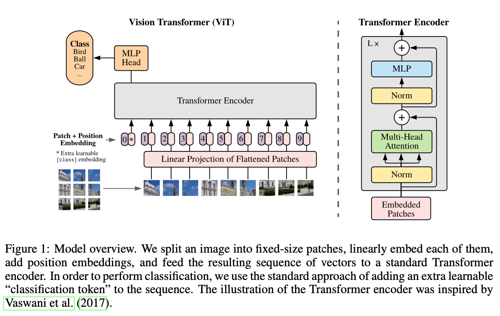

# Appendix

- [Appendix](#appendix)
  - [Deep Learning](#deep-learning)
    - [(Dec 2013) Playing Atari with Deep Reinforcement Learning](#dec-2013-playing-atari-with-deep-reinforcement-learning)
    - [(Dec 2013) VAE: Auto-Encoding Variational Bayes](#dec-2013-vae-auto-encoding-variational-bayes)
    - [(Jun 2014) GAN: Generative Adversarial Networks](#jun-2014-gan-generative-adversarial-networks)
    - [(Dec 2015) CVAE: Learning Structured Output Representation using Deep Conditional Generative Models](#dec-2015-cvae-learning-structured-output-representation-using-deep-conditional-generative-models)
    - [(Jun 2017) Attention is All You Need](#jun-2017-attention-is-all-you-need)
    - [(Oct 2020) ViT: An Image is Worth 16x16 Words: Transformers for Image Recognition at Scale](#oct-2020-vit-an-image-is-worth-16x16-words-transformers-for-image-recognition-at-scale)
    - [(Apr 2024) Leave No Context Behind: Efficient Infinite Context Transformers with Infini-attention](#apr-2024-leave-no-context-behind-efficient-infinite-context-transformers-with-infini-attention)

## Deep Learning

### (Dec 2013) Playing Atari with Deep Reinforcement Learning

[Annotated Code](https://nn.labml.ai/rl/dqn/index.html), [Video](https://www.youtube.com/watch?v=rFwQDDbYTm4), [Q-Learning](https://www.youtube.com/watch?v=nOBm4aYEYR4)

### (Dec 2013) VAE: Auto-Encoding Variational Bayes

[Code](https://github.com/AntixK/PyTorch-VAE?tab=readme-ov-file), [Annotated Code](https://vxlabs.com/2017/12/08/variational-autoencoder-in-pytorch-commented-and-annotated/), [Blog](https://kvfrans.com/variational-autoencoders-explained/), [KL-Divergence Blog](https://kvfrans.com/deriving-the-kl/)

### (Jun 2014) GAN: Generative Adversarial Networks

[Annotated Code](https://nn.labml.ai/gan/original/index.html) [Code](https://github.com/eriklindernoren/PyTorch-GAN?tab=readme-ov-file), [Blog](https://kvfrans.com/generative-adversial-networks-explained/), [Video](https://www.youtube.com/watch?v=eyxmSmjmNS0)

### (Dec 2015) CVAE: Learning Structured Output Representation using Deep Conditional Generative Models

[Blog](https://agustinus.kristia.de/techblog/2016/12/17/conditional-vae/)

### (Jun 2017) Attention is All You Need

[Annotated Code](http://nlp.seas.harvard.edu/annotated-transformer/), [Video](https://www.youtube.com/watch?v=iDulhoQ2pro), [3B1B Part 1](https://youtu.be/wjZofJX0v4M?feature=shared), [3B1B Part 2](https://youtu.be/eMlx5fFNoYc?feature=shared)

### (Oct 2020) ViT: An Image is Worth 16x16 Words: Transformers for Image Recognition at Scale

[Annotated Code](https://nn.labml.ai/transformers/vit/index.html), [Code](https://github.com/google-research/vision_transformer), [Video](https://www.youtube.com/watch?v=TrdevFK_am4)

- Introduction
  - Transformer architecture has been successful in NLP
  - Apply standard transformer to image patches, providing sequence of linear embeddings of these patches as an input to a transformer
  - Worse than ResNet on ImageNet, but better on larger datasets
  - **Transformer is a generalization of an MLP**
    - The "weight" between nodes in consecutive layers is fixed in MLP, but computed on the fly in a transformer
    - This makes a transformer the most general, least generalized thing we can train in ML!
    - Transformer is less biased than other architectures
    - This is why we concatenate the input and positional encoding in a transformer
  - Completely discards the notion of convolutions
- Method
  - Follow original transformer as closely as possible
  - Standard transformer recieves a 1D sequence of token embeddings
  - For 2d images, reshape the image $x \in \mathbb{R}^{H \times W \times C}$ into a sequence of flattened 2D patches $x \in \mathbb{R}^{N \times (P^2 \cdot C)}$
    - $N = H \times W / P^2$ is the number of patches; the input sequence length
    - $P$ is the patch size
      - Use patches instead of the whole image for computational efficiency
      - Naive self attention would require each pixel to attend to every other pixel
    - $C$ is the number of channels
    - Flatten the patches and map to $D$ dimensions with linear layer; output is called the "patch embedding"
    - Position embeddings added to patch embeddings to retain positional information
    - **Patch + position embeddings are input to the transformer encoder**, output feeds into MLP for classification
  - 
  - **ViT has less image specific inductive bias than CNNs**
    - Inductive bias refers to the set of assumptions a model makes about the data
    - CNNs assume **locality** (pixels close to each other are related) and **translation invariance** (features are the same regardless of where they are in the image)
    - ViTs use self attention to consider relationships between all parts of the image simultaneously
      - Positional embeddings at initialization don't carry information about 2D position of the patches
      - For classification, only the MLP head in ViT assumes locality and translational invariance
- Experiments
  - ViT outperforms CNNs with the same computational budget
  - Internal representations
    - First layer linearly projects flattened patches to lower dimenstion
    - Learned positional embeddings are added to the patch embeddings, closer patches tend to have more similar positional embeddings, as well as row-column structure
    - 

### (Apr 2024) Leave No Context Behind: Efficient Infinite Context Transformers with Infini-attention

[Video](https://www.youtube.com/watch?v=r_UBBfTPcF0)
