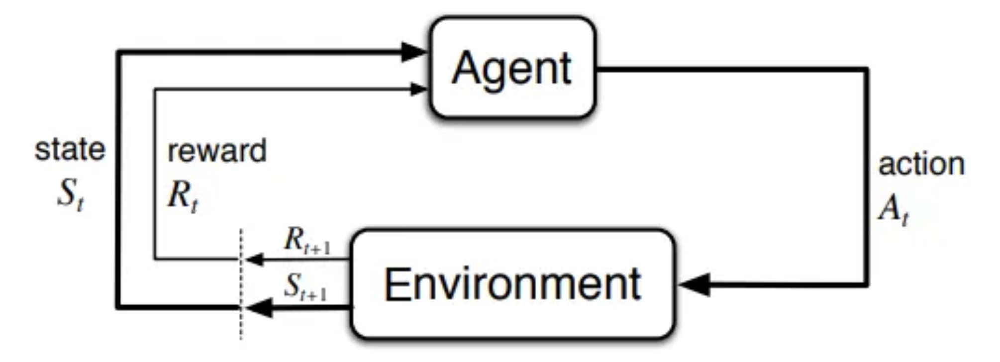
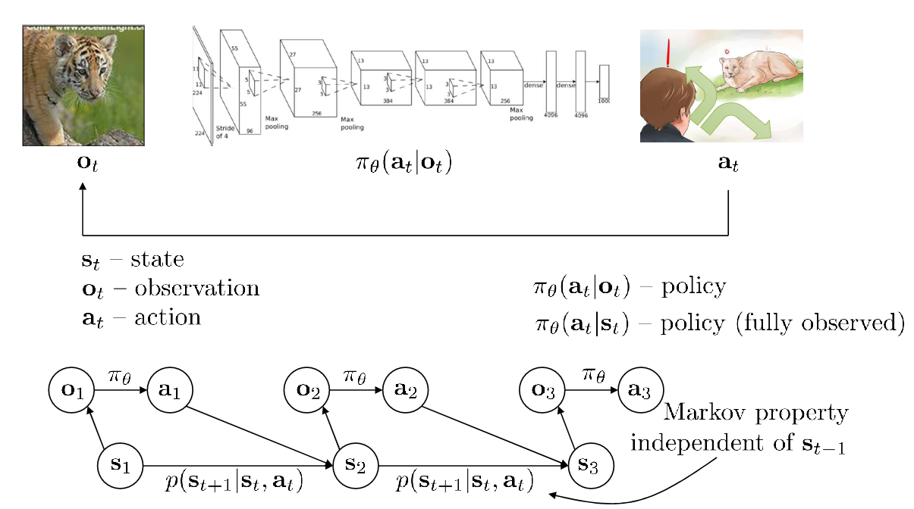
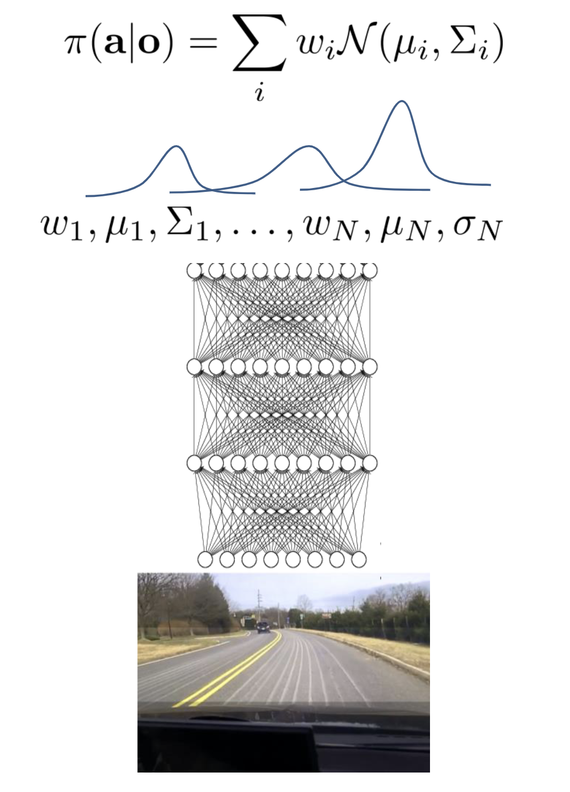
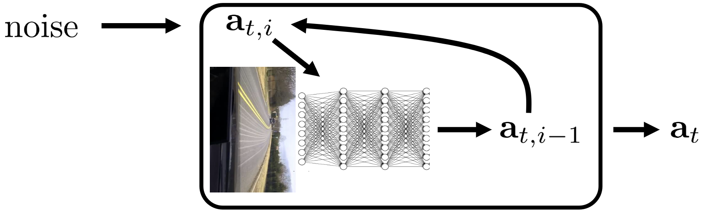
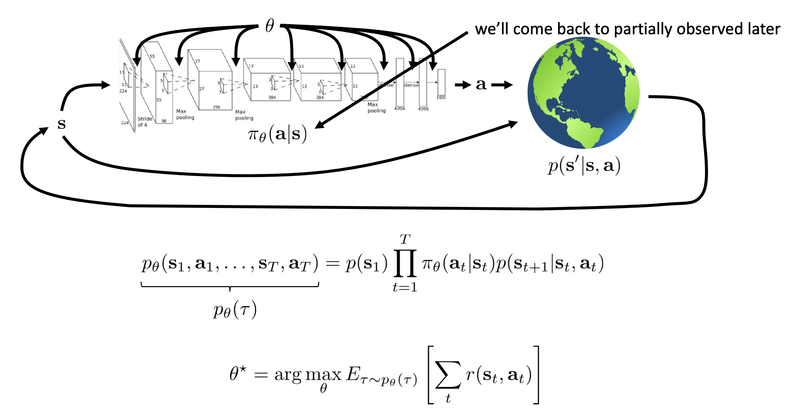
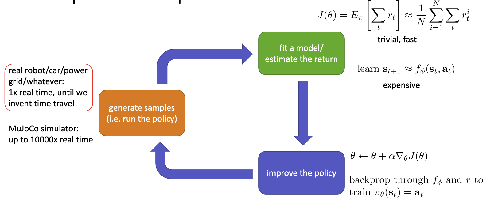
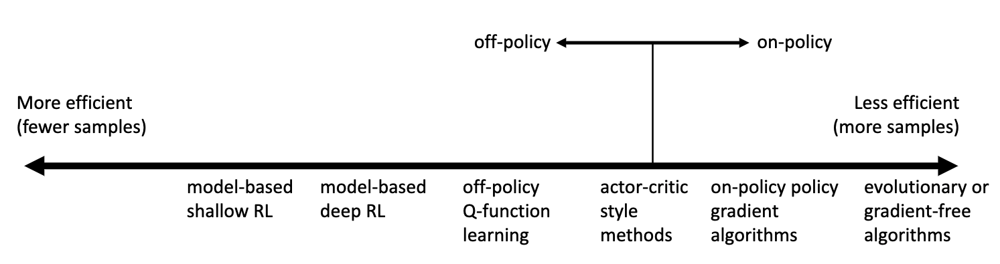

# Deep Reinforcement Learning

[Lectures (fall 2023)](https://youtube.com/playlist?list=PL_iWQOsE6TfVYGEGiAOMaOzzv41Jfm_Ps&feature=shared)

[Course website](https://rail.eecs.berkeley.edu/deeprlcourse/)

Notes from the course "CS 285: Deep RL" taught by Sergey Levine at Berkeley.

- [Deep Reinforcement Learning](#deep-reinforcement-learning)
  - [1 Introduction](#1-introduction)
  - [2 Supervised Learning of Behaviors](#2-supervised-learning-of-behaviors)
  - [3 Pytorch Tutorial](#3-pytorch-tutorial)
  - [4 Introduction to Reinforcement Learning](#4-introduction-to-reinforcement-learning)
  - [5 Policy Gradients](#5-policy-gradients)
  - [6 Actor-Critic Algorithms](#6-actor-critic-algorithms)

## 1 Introduction

Lecture [1.1](https://youtu.be/SupFHGbytvA?feature=shared), [1.2](https://youtu.be/BYh36cb92JQ?feature=shared), [1.3](https://youtu.be/Ufww5pzc_N0?feature=shared)

- Reinforcement learning: let the robot learn from its own experience
- Recent advances in AI
  - Diffusion models to generate images
  - LLMs
  - Data driven AI: data distribution drives the model
- Reinforcement learning
  - **A mathematical formalism for learning-based decision making**
  - **An approach for learning-based decision making and control from experience**
  - Classical RL: agent interacts with the environment
  - Modern methods: large scale optimization, evolutionary algorithms
  - Modern RL (deep RL): combines large scale optimization with classical RL
- What does RL do differently?
  - Supervised ML: learn a function that maps inputs to outputs
    - Assumes i.i.d. data
    - Knows ground truth labels
  - Reinforcement learning: learn a policy that maps states to actions
    - Does not assume i.i.d. data, previous outputs affect future inputs
    - Ground truth labels for each action are not available, only success/failure
- Problem formulation
  - 
  - Input: $s_t$ (state) at each time step
  - Output: $a_t$ (action) at each time step
  - Data: $(s_t, a_t, r_t)_{t=1}^{T}$
  - Goal: learn policy $\pi_{\theta}: s_t \rightarrow a_t$
- Purposes of RL
  - Learning complex physical tasks (like a robot dog jumping over obstacles)
    - Often difficult to code explicitly
  - Unexpected solutions: RL can find solutions that are not obvious to humans
  - Applied at scale in real world: ex. many robots sorting trash
  - RL with LLMs: training models with human scoring
  - RL with image generation: reward function is the similarity between the language prompt and the generated image, to find most relevant image
  - **Data-driven methods don't try to do better than the data, RL figures out new, better solutions**
- Some philosophy
  - Richard Sutton: "The two methods that seem to scale arbitrarily … are *learning* and *search*"
    - **Learning**: extract patterns from data (the "Deep" part)
    - **Search**: use computation to extract inferences (the "RL" part)
  - Why do we need ML?
    - One reason: to produce adaptable and complex decisions
  - Why do we need RL?
    - Learing-based control in real-world settings is a major open problem
- Where do rewards come from?
  - Copying observed behavior
  - Inferring rewards from observations: inverse RL
    - Inferring intentions?
  - Learning from other tasks: transfer learning, Meta learning
- Modern RL
  - Advances in pretrained models
    - Vision-language-action models for robotics (RT-2, Octo)
  - How to build intelligent machines?
    - Hypothesis: learning is the basis of intelligence
    - Further hypothesis: there is a single learning algorithm that can learn everything
  - Challenges
    - Transfer learning
    - Too data intensive, whereas humans learn quickly
    - No amazing methods for using both data and RL
    - Role of prediction in RL

## 2 Supervised Learning of Behaviors

Lecture [2.1](https://youtu.be/tbLaFtYpWWU?feature=shared), [2.2](https://youtu.be/YivJ9KDjn-o?feature=shared), [2.3](https://youtu.be/ppN5ORNrMos?feature=shared)

- Notation
  - 
  - State $s_t$ is different from observation $o_t$
    - State is a complete and concise representation of state of the world (**fully observed**)
    - Observation is what the agent sees (**partially observed**)
    - State can sometimes be inferred from observation
  - **Markov assumption**: $s_t$ contains all relevant information from the past (don't need $s_{t-1}, s_{t-2}, \ldots$ to predict $s_{t+1}$)
- Imitation learning
  - Learn policies using supervised learning
  - **Behavioral cloning**: learn a policy that mimics an expert's behavior
    - Collect data from expert
    - Train a policy to predict the expert's actions
    - Problems
      - Distribution mismatch between training and test data
      - **Violates i.i.d. assumption: small errors lead to larger and larger errors over time**
      - Let the cost function $c(s_t, a_t) = \begin{cases} 0 & \text{if } a_t = \pi^*(s_t) \\ 1 & \text{otherwise} \end{cases}$
      - Assume $\pi_{\theta}(a \neq \pi^*(s)|s) \leq \epsilon$ for all states $s\in \mathcal{D}_{\text{train}}$
      - Then the sum of expected errors across timesteps is $E\left [\sum_t c(s_t, a_t) \right ]$ is $\mathcal{O}(\epsilon T^2)$
      - **This sum grows quadratically with the number of timesteps!**
  - Paradox: more errors (and recoveries) in training data is beneficial
    - Data augmentation: add "fake" data that illustrates corrections
- Failing to fit the expert
  - Non-markovian behavior: action depends on all past observations
    - I.e. $\pi_{\theta}(a_t | o_1, o_2, \ldots, o_t)$
    - Use the whole history of observations with a sequence model (transformer, LSTM, etc.)
    - Problem: "causal confusion"
  - Multimodal behavior: expert has multiple ways to solve a problem
    - Solution 1: expressive continuous distributions
      - Gaussian mixture models
        - 
      - Latent variable models (ex. CVAE)
        - Predict a latent variable $z$ that is used to choose the distribution of actions
      - Diffusion models
        - 
- Goal-conditioned behavioral cloning
  - $\pi_{\theta}(a_t | s_t, g)$ where $g$ is the goal
- Changing the algorithm (DAgger)
  - Idea: make $p_{\text{data}}(o_t) = p_{\pi_{\theta}}(o_t)$
  - **DAgger: Dataset Aggregation**
    - Goal: collect training data from $p_{\pi_{\theta}}(o_t)$ instead of $p_{\text{data}}(o_t)$
      1. Train $\pi_{\theta}$ on human data $\mathcal{D} = \{o_1, a_1, \dots, o_N, a_N\}$
      2. Run $\pi_{\theta}(a_t|o_t)$ to get dataset $\mathcal{D}_{\pi} = \{o_1 \dots, o_M\}$
      3. Ask human to label $D_{\pi}$ with actions $a_t$
      4. Aggregate datasets: $\mathcal{D} \leftarrow \mathcal{D} \cup \mathcal{D}_{\pi}$
      5. Repeat
    - Step c. is the problem
- Big problem with imitation learning
  - Humans need to provide data, which is finite
  - Humans bad at providing some kinds of actions
  - Humans learn autonomously, can machines do the same?

## 3 Pytorch Tutorial

See lecture 3 slides.

## 4 Introduction to Reinforcement Learning

Lecture [4.1](https://youtu.be/jds0Wh9jTvE?feature=shared), [4.2](https://youtu.be/Cip5UeGrCEE?feature=shared), [4.3](https://youtu.be/Pua9zO_YmKA?feature=shared), [4.4](https://youtu.be/eG9-F4r5k70?feature=shared), [4.5](https://youtu.be/dFqoGAyofUQ?feature=shared), [4.6](https://youtu.be/hfj9mS3nTLU?feature=shared)

- Markov chain
  - $\mathcal{M} = \{\mathcal{S}, \mathcal{T}\}$
    - $\mathcal{S}$: state space
    - $\mathcal{T}$: transition operator
      - Let $\mu_{t, i} = p(s_t = i)$
      - Then $\mu_{t}$ is a vector of probabilities
      - $\mathcal{T}_{i,j} = p(s_{t+1} = i | s_t = j)$
      - Then $\mu_{t+1} = \mathcal{T} \mu_t$
  - Consider $p(s_{t+1} | s_t)$
- Markov decision process
  - $\mathcal{M} = \{\mathcal{S}, \mathcal{A}, \mathcal{T}, r\}$
    - Adds action space $\mathcal{A}$ and reward function $r$ to Markov chain definition
    - $\mu_{t,j} = p(s_t = j)$
    - $\eta_{t,k} = p(a_t = k)$
    - $\mathcal{T}_{i,j,k} = p(s_{t+1} = i | s_t = j, a_t = k)$
    - Then $\mu_{t+1, i} = \sum_{j,k} \mathcal{T}_{i,j,k} \eta_{t,k} \mu_{t,j}$
    - $r: \mathcal{S} \times \mathcal{A} \rightarrow \mathbb{R}$
- Partially observed Markov decision process
  - $\mathcal{M} = \{\mathcal{S}, \mathcal{A}, \mathcal{O}, \mathcal{T}, \mathcal{\epsilon}, r\}$
    - Adds observation space $\mathcal{O}$ and emission probability $\mathcal{\epsilon}$ to MDP definition
    - $\mathcal{\epsilon}_{i,j} = p(o_t = i | s_t = j)$
- **Goal of RL: maximize expected reward**
  - 
  - **Finite horizon case**: $\theta^* = \arg\max_{\theta} E_{\tau \sim p_{\theta}(\tau)} \left [ \sum_{t=1}^{T} r(s_t, a_t) \right ] = \arg \max_{\theta} \sum_{t=1}^{T} E_{(s_t, a_t)\sim p_{\theta}(s_t,a_t)}[r(s_t, a_t)]$
    - $p_{\theta}(s_t,a_t)$ is the state-action marginal
  - **Infinite horizon case**: if $T=\infty$ above
    - **Stationary distribution**: $\mu = \mu \mathcal{T} \leftrightarrow (\mathcal{T}-I)\mu=0$ so $\mu$ is an eigenvector of $\mathcal{T}$ with eigenvalue 1
    - Does $p(s_t, a_t)$ converge to a stationary distribution?
    - If so, then $\theta^* = \arg \max_{\theta} \frac{1}{T} \sum_{t=1}^{T} E_{(s_t, a_t)\sim p_{\theta}(s_t,a_t)}[r(s_t, a_t)]$ converges to $\theta^* = \arg \max_{\theta} E_{(s, a)\sim p_{\theta}(s,a)}[r(s, a)]$ as $T\rightarrow \infty$
  - In RL, we care about expectations (reward functions not necessarily smooth, but $E_{\pi_{\theta}}[r(s, a)]$ is smooth in $\theta$)
- Value functions
  - 
  - **Q-function**: $Q^{\pi}(s_t, a_t) = \sum_{t'=t}^{T} E_{\pi_{\theta}}[r(s_{t'}, a_{t'})|s_t, a_t]$
    - Total reward if you take action $a_t$ in state $s_t$ and follow policy $\pi_{\theta}$ thereafter
  - **Value function**: $V^{\pi}(s_t) = \sum_{t'=t}^{T} E_{\pi_{\theta}}[r(s_{t'}, a_{t'})|s_t] = E_{a_t \sim \pi(a_t|s_t)}[Q^{\pi}(s_t, a_t)]$
    - Total reward if you start in state $s_t$ and follow policy $\pi_{\theta}$ thereafter
  - Using Q-functions and value functions in algorithms
    - If we have policy $\pi$ and we know $Q^{\pi}$, then we can improve $\pi$ by choosing letting $\pi'(a|s)=1$ if $a = \arg\max_{a} Q^{\pi}(s, a)$
    - We can compute the gradient to increase the probability of good actions $a$: if $Q^{\pi}(s,a) > V^{\pi}(s)$, then $a$ is better than average, so modify $\pi(a|s)$ to increase the probability of $a$
- Algorithms
  - Types of algorithms
    - Policy gradient: directly differentiate $\theta^* = \arg\max_{\theta} E_{\tau \sim p_{\theta}(\tau)} \left [ \sum_{t=1}^{T} r(s_t, a_t) \right ]$
      - ex. REINFORCE, NPG, TRPO, PPO
    - Value-based: estimate value function or Q-function of the optimal policy (no explicit policy)
      - ex. Q-learning, DQN
    - Actor-critic: estimate value function or Q-function of current policy, use it to improve the policy
      - ex. A3C, SAC
    - Model-based: learn a model of the environment, use it to plan or improve policy
      - ex. Dyna, guided policy search
      - Trajectory optimization: just planning, no policy
      - Backpropagate gradients into the policy
      - Use the model to learn a value function
  - Tradeoffs
    - Sample efficiency: how many samples are needed to learn a good policy?
    - **Off policy**: able to improve policy without generating new samples from that policy
    - **On policy**: need to generate new samples every time the policy is changed
    - 
    - Convergence: often don't use gradient descent
      - Many value-based algorithms are not guaranteed to converge
      - Model-based RL minimizes error of fit, but no guarantee that better model leads to better policy
      - Policy gradient: uses gradient descent, but often least efficient
  - Common assumptions
    - Full observability
    - Episodic learning
    - Continuity or smoothness

## 5 Policy Gradients

Lecture [5.1](https://youtu.be/GKoKNYaBvM0?feature=shared), [5.2](https://youtu.be/VSPYKXm_hMA?feature=shared), [5.3](https://youtu.be/VgdSubQN35g?feature=shared), [5.4](https://youtu.be/QRLDAQbWc78?feature=shared), [5.5](https://youtu.be/QRLDAQbWc78?feature=shared), [5.6](https://youtu.be/PEzuojy8lVo?feature=shared)

## 6 Actor-Critic Algorithms

Lecture [6.1](https://youtu.be/wr00ef_TY6Q?feature=shared), [6.2](https://youtu.be/KVHtuwVhULA?feature=shared), [6.3](https://youtu.be/g4_2IfZqDLI?feature=shared), [6.4](https://youtu.be/quRjnkj-MA0?feature=shared), [6.5](https://youtu.be/A99gFMZPw7w?feature=shared)
