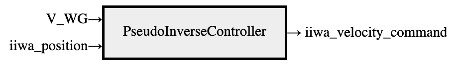

# Robotic Manipulation

[Lectures (fall 2023)](https://youtube.com/playlist?list=PLkx8KyIQkMfWr191lqbN8WfV08j-ui8WX&feature=shared)

[Full course notes](https://manipulation.csail.mit.edu/)

[Deepnote](https://deepnote.com/workspace/bubhub-afbb4b47-384c-4b93-a423-6aad7f9e29f7/projects/Robotic-Manipulation-c00edfe0-5ae4-4acd-a05a-f8f182589fd0)

[Companion code](https://github.com/RussTedrake/manipulation)

Notes from the course "Robotic Manipulation" taught by Russ Tedrake at MIT.

- [Robotic Manipulation](#robotic-manipulation)
  - [1 Introduction](#1-introduction)
  - [2 Let's get you a robot](#2-lets-get-you-a-robot)
    - [2.1 Robot Description Files](#21-robot-description-files)
    - [2.2 Arms](#22-arms)
    - [2.3 Hands](#23-hands)
    - [2.4 Sensors](#24-sensors)
  - [3 Basic Pick-and-Place](#3-basic-pick-and-place)
    - [3.1 Monogram Notation](#31-monogram-notation)
    - [3.2 Pick and Place via Spatial Transforms](#32-pick-and-place-via-spatial-transforms)
    - [3.3 Spatial Algebra](#33-spatial-algebra)
    - [3.4 Forward Kinematics](#34-forward-kinematics)
    - [3.5 Differential Kinematics (Jacobians)](#35-differential-kinematics-jacobians)
    - [3.6 Differential Inverse Kinematics](#36-differential-inverse-kinematics)
    - [3.7-3.9 Pick and Place](#37-39-pick-and-place)
    - [3.10 Differential Inverse Kinematics with Constraints](#310-differential-inverse-kinematics-with-constraints)
  - [4 Geometric Pose Estimation](#4-geometric-pose-estimation)
    - [4.1 Cameras and Depth Sensors](#41-cameras-and-depth-sensors)
    - [4.2 Representations for Geometry](#42-representations-for-geometry)
    - [4.3 Point Cloud Registration with Known Correspondences](#43-point-cloud-registration-with-known-correspondences)
    - [4.4 Iterative Closest Point (ICP)](#44-iterative-closest-point-icp)
    - [4.5 Dealing with Partial Views and Outliers](#45-dealing-with-partial-views-and-outliers)
    - [4.6 Non-Penetration and "Free-Space" Constraints](#46-non-penetration-and-free-space-constraints)

## 1 Introduction

[Lecture 1](https://youtu.be/v04rn86Dehg?feature=shared)

[Notes](https://manipulation.csail.mit.edu/intro.html)

[Deepnote](https://deepnote.com/workspace/bubhub-afbb4b47-384c-4b93-a423-6aad7f9e29f7/project/01-Introduction-bdfeaeb4-e107-472c-a8e7-6848fbd990d0)

- Manipulation is more than pick-and-place
  - 80s and 90s: manipulation referred to pick-and-place and grasping
  - Now, manipulation is broader: buttoning shirt, spreading peanut butter, etc.
- Open-world problem: the world has infinite variability
  - Diversity in open-world problems might make the problem easier
  - For example, now we need quirky solutions to specific problems
  - These quirky solutions may be discarded when the landscape is more diverse
- Simulation
  - Modern simulators can even train models and expect them to work in the real world
  - Models like transformer more general: won't overfit to quirks of simulator image data
  - [Drake](http://drake.mit.edu/) is a simulator that emphasizes the governing equations of motion and physics

## 2 Let's get you a robot

[Lecture 2](https://youtu.be/q896_lTh8eA?feature=shared)

[Notes](https://manipulation.csail.mit.edu/robot.html)

[Deepnote](https://deepnote.com/workspace/bubhub-afbb4b47-384c-4b93-a423-6aad7f9e29f7/project/02-Lets-get-you-a-robot-58888247-ce19-4f68-822f-76be6ce00f27)

### 2.1 Robot Description Files

- UDRF: Universal Robot Description Format
- SDF: Simulation Description Format
- MJCF: MuJoCo XML Configuration Format

### 2.2 Arms

- Gears
  - Gear ratio: output teeth:intput teeth
    - Exmaple: 10:1 means 10 output teeth for every 1 input tooth, 10 rotations of input gear for 1 rotation of output gear
  - **Tradeoff speed for torque**
    - Motor has high speed and low torque, while the work requires low speed and high torque
    - Solution: use a high gear ratio
  - Most motors have a fixed range of rotational speed and torque
    - Work that needs to be done generally requires much lower speeds and higher torque than what the motor can deliver efficiently
- Position-controlled robots
  - Given a desired joint position, robot executes
  - Basically means it does not offer torque control
  - **Torque control**: the rotational force applied by a motor is directly controlled
    - Allows robot to adapt to external forces
  - Position control is the norm
    - Reason: for electric motors, torque of motor output is directly proportional to current
    - We typically choose small electric motors with large gear reductions (large gear ratio), which come with difficult to model friction, vibration, backlash, etc.
    - Thus, the directly proportional relationship between torque and current is not upheld
- Position control
  - Need sensors on motor side
  - Position sensor is most common: encoder or potentiometer
    - Provides accurate measure of joint position and velocity
    - Sufficient to accurately track position trajectory
    - Joint position $q$, desired position $q^d$, error $e = q_d - q$
    - **PID controller**: $\tau = k_p e + k_d \dot{e} + k_i \int e dt$
      - $k_p$: proportional gain
      - $k_d$: derivative gain
      - $k_i$: integral gain
- **Reflected inertia**: the inertial load that is felt on the opposite side of a transmission
  - Mass of the motor is small relative to robot mass, but they play a significant role in the dynamics
- Torque control
  - Some robots *do* have electric motors with smaller gear reduction
  - Hydraulic actuators can apply large torque without large transmission
  - Add sensors to measure torque at the joint side of the actuator (rather than motor side)
    - Series elastic actuators: spring between motor and load
      - Example: Baxter
- Physic engine in Drake: MultibodyPlant
- Visualizer in Drake: SceneGraph

### 2.3 Hands

- **Dexterity**: the ability to manipulate objects in a variety of ways
  - Lack of dextrous hands on the market
- Simple grippers: two fingers, like Schunk WSG 050
- Soft/underactuated hands
  - **Underactuated hands**: hands with fewer actuators than degrees of freedom
  - Often use cable-drive mechanism to close fingers, where a single tendon can move multiple joints
  - Soft hands can improve dexterity and safety
- Other end effectors: suction cups, jamming gripper, etc.

### 2.4 Sensors

- So far, we have seen:
  - Joint feedback
    - iiwa: measured position, estimated velocity, measured torque
    - Schunk gripper: measured state (position + velocity), measured force
  - Joint acceleration typically too noisy to rely on

## 3 Basic Pick-and-Place

[Lecture 3](https://youtu.be/0-34RZJxyww?feature=shared)

[Lecture 4](https://youtu.be/1mkzXp9_QYY?feature=shared)

[Lecture 5](https://youtu.be/YaQrC_Zm8qg?feature=shared)

[Notes](https://manipulation.csail.mit.edu/pick.html)

[Deepnote](https://deepnote.com/workspace/bubhub-afbb4b47-384c-4b93-a423-6aad7f9e29f7/project/03-Basic-Pick-and-Place-Duplicate-80b33bd1-45f4-4c4b-8e9b-5e98e0e84bf5)

### 3.1 Monogram Notation

- **$^Bp^A_F$: position of point $A$ measured from point $B$ in frame $F$**
  - $^Bp^A_{F_x}$ is the $x$ component of the above
- $W$ is the world frame
  - $^Wp^A_W$ is the position of point $A$ relative to the origin of $W$ measured in the $W$ frame
  - **Shorthand: if the position is measured from and expressed in the same frame, we can omit the subscript**
    - $^Wp^A$ is the same as $^Wp^A_W$
- $B_i$ denotes the frame for body $i$
- $^BR^A$ denotes the orientation of frame $A$ measured from frame $B$
- Frame $F$ can be specified by position and rotation relative to another frame
  - Spatial pose = position + orientation
  - **Transform is the verb form of pose**
  - $^BX^A$ denotes the pose of frame $A$ relative to frame $B$
  - When we refer to pose of object $O$ without mentioning relative frame, we mean $^WX^O$
  - No subscript, we always want pose expressed in the reference frame
- Notation in code
  - $^Bp^A_C$ is written as `p_BA_C`
  - $^BR^A$ is written as `R_BA`
  - $^BX^A$ is written as `X_BA`

### 3.2 Pick and Place via Spatial Transforms

- Basic pick and place problem formulation
  - **Object** $O$
  - **Gripper** $G$
  - Ideal perception sensor gives us $^WX^O$
  - Desired frame $O_d$ of the object
  - Pick and place tries to make $X^O$ match $X^{O_d}$
- Steps
  - Move gripper to a pregrasp position $^OX^{G_{pregrasp}}$ above $O$ (to avoid collision with object)
  - Move gripper to a grasp pos $^OX^{G_{grasp}}$
  - Close gripper
  - Move gripper to desired pose, $X^O = X^{O_d}$
  - Open gripper and retract the hand

### 3.3 Spatial Algebra

- Adding position: $^Ap^B_F + ^Bp^C_F = ^Ap^C_F$
- Additive inverse: $^Ap^B_F + ^Bp^A_F = 0$
- Multiplication by rotation: $^Ap^B_G = ^GR^F \cdot ^Ap^B_F$
- Multiplying rotations: $^AR^B \cdot ^BR^C = ^AR^C$
- Inverse of rotation: $(^AR^B)^{-1} = ^BR^A$
- Rotation matrices are orthonormal: $R^T = R^{-1}$
- Transforms: $^Gp^A = ^GX^F \cdot ^Fp^A = ^Gp^F + ^Fp^A_G = ^Gp^F + ^GR^F \cdot ^Fp^A$
- Transform composition: $^AX^B \cdot ^BX^C = ^AX^C$
- Inverse of transform: $(^AX^B)^{-1} = ^BX^A$
  - Note: $X^T \neq X^{-1}$
- In practice, transforms implemented as homogeneous coordinates
- 3D rotation representations
  - $3 \times 3$ rotation matrix
  - Euler angles (roll-pitch-yaw)
  - Axis angles
  - Unit quaternions
    - Singularity in roll-pitch-yaw (at pitch = $\pm \frac{\pi}{2}$, roll and yaw indistinguishable when converting rotation matrix to Euler angles)
      - Becomes problematic when taking derivatives
    - Need at least 4 numbers to represent 3D rotation, hence quaternions

### 3.4 Forward Kinematics

- Forward kinematics: given joint angles, find pose of end effector
  - **Joint positions denoted $q$**
  - **Goal: produce a map $X^G = f_{kin}^G(q)$**
- Kinematic tree
  - Every body in kinematic tree has a parent except world, connected by joints
  - Every joint has position variables that know how compute transforms
    - Configuration between any body and its parent: $^PX^C(q) = ^PX^{J_P} \cdot ^{J_P}X^{J_C}(q) \cdot ^{J_C}X^C$
- Forward kinematics for pick and place
  - Query parent of gripper frame in kinematic tree
  - Recursively compose transforms to get pose of gripper in world frame, $X^G$

### 3.5 Differential Kinematics (Jacobians)

- Change in pose related to change in joint positions by the partial derivative of forward kinematics
  - $dX^G = \frac{\delta f_{kin}^G(q)}{\delta q} dq = J^G(q)dq$
  - $J^G(q)$ is the Jacobian - the derivative of kinematics
- **Spatial velocity (twist) of frame $B$ measured in frame $A$ expressed in frame $C$**: $^AV^B_C = \begin{bmatrix} ^A\omega^B_C \\ ^Av^B_C \end{bmatrix} \in \mathbb{R}^6$
  - $\omega \in \mathbb{R}^3$: angular velocity
    - Can be expressed in three components (but rotations need 4) because $\omega$ is not periodic, it can take any value
  - $v \in \mathbb{R}^3$: translational (linear) velocity
  - Properties
    - Adding angular velocities: $^A\omega^B_F + ^B\omega^C_F = ^A\omega^C_F$
    - Additive inverse: $^A\omega^B_F + ^B\omega^A_F = 0$
    - Translational velocities compose: $^Av^C_F = ^Av^B_F + ^Bv^C_F + ^A\omega^B_F \cdot ^Bp^C_F$
    - Additive inverse: $-^Av^B_F = ^Bv^A_F + ^A\omega^B_F \cdot ^Bp^A_F$
  - There can be many other representations kinematic Jacobian due to different representations of 3D rotation
    - **Analytic Jacobian** is the one previously defined: $dX^G = J^G(q)dq$
      - Linearly relates pose change with joint changes
    - **Geometric Jacobian**: $V^G = J^G(q)v$
      - Linearly relates spatial velocity with generalized velocities
    - Note: $dq \neq v$ necessarily
      - $dq$ is the change in joint positions, but $q$ is often in $\mathbb{R}^7$ due to the representation of rotation as a quaternion in $\mathbb{R}^4$
      - $v$ is in $\mathbb{R}^6$ so the fimensions don't match

### 3.6 Differential Inverse Kinematics

- Geometric Jacobian: $V^G = J^G(q)v$
  - $v$ is the generalized velocity
  - $V^G$ is the spatial velocity of the gripper
  - $v = [J^G(q)]^{-1}V^G$
- For a 7-DOF iiwa robot, $J^G(q_{iiwa}) \in \mathbb{R}^{6 \times 7}$
  - This is not square, so it is not invertible!
  - More DOF than desired spatial velocity representation, which is good: many solutions for $v$ that give the same $V^G$
- **Moore-Penrose pseudo-inverse**: $J^+$
  - $v = [J^G(q)]^+V^G$
  - When $J$ square and invertible, $J^+ = J^{-1}$
  - When many solutions, $J^+$ gives the solution with the smallest norm
  - When no solutions, $J^+$ gives the joint velocities that produce a spatial velocity as close to desired $V^G$ as possible
- **Kinematic singularities**: configurations $q$ for which $\text{rank}(J(q)) < 6$
  - When smallest singular value apporaches zero, the robot is near a singularity: norm of $J^+$ becomes large

### 3.7-3.9 Pick and Place

- Note xyz = rgb in frame visualizations
- Pregrasp pose is above the object to avoid collisions
- Need to define desired $X$ poses (i.e. moving to pre-grasp, grasp, pre-place, and place)
  - $X$ is made up of position and orientation
  - Thus, we can get a pose trajectory
  - We can convert this pose trajectory to a spatial velocity trajectory $V$
  - Then, we can use the Pseudo-inverse Jacobian controller to get the velocity commands
  - 
  - This completes the pick and place task!

### 3.10 Differential Inverse Kinematics with Constraints

- THe above pick-and-place solution works, but the pseudo-inverse controller does not perform well around singularities
  - Small singular value leads to large joint velocities
  - Cannot handle constraints on joint angles, velocities, accelerations, torques (robot will clip out of range commands)
- **Pseudo-inverse as optimization**
  - $\min_v |J^G(q)v - V^{G_d}|_2^2$
  - The solution to this is the pseudo-inverse
- Velocity constraints
  - $\min_v |J^G(q)v - V^{G_d}|_2^2$ subject to $v_{min} \leq v \leq v_{max}$
  - Convex quadratic programming (QP) problem
- Adding position and acceleration constraints
  - Denote time step $h$
  - $\min_{v_n} |J^G(q)v_n - V^{G_d}|_2^2$ subject to
    - $v_{min} \leq v_n \leq v_{max}$
    - $q_{min} \leq q + h v_n \leq q_{max}$
    - $\dot{v}_{min} \leq \frac{v_{n+1} - v_n}{h} \leq \dot{v}_{max}$
- Joint centering
  - $J^G$ for iiwa is $6 \times 7$, so rank of $J^G$ is less than the DOF
    - Infinite number of solutions
    - Convex optimization solver normally chooses something reasonable, but we can modify the problem to choose a unique solution
  - **Secondary controller** that attempts to control all the joints
    - Consider simple proportional joint-space controller $v=K(q_0 - q)$
    - Denote $P(q)$ as an orthonormal basis for the kernal (null space) of a Jacobian
      - Can be implemented with pseudoinverse: $P(q) = I - J^+(q)J(q)$
      - The null space of a Jacobian represents the directions in which the arm can move without changing the end effector pose
    - Adding $Pv = PK(q_0 - q)$ as a secondary objective
    - $\min_{v_n} |J^G(q)v_n - V^{G_d}|_2^2 + \epsilon |P(q)(v_n - K(q_0 - q))|^2_2$ subject to constraints
      - **This secondary objective represents the velocity (projected onto the null space) that tries to achieve the desired velocity and reduce the configuration error $q_0 - q$**
      - $\epsilon \ll 1$ only needed if there are constraints because constraints cause these two objectives to clash

## 4 Geometric Pose Estimation

[Lecture 6](https://www.youtube.com/watch?v=1a3KhOq1938&list=PLkx8KyIQkMfWr191lqbN8WfV08j-ui8WX&index=8)

[Lecture 7](https://www.youtube.com/watch?v=Cs49WVNqEdk&list=PLkx8KyIQkMfWr191lqbN8WfV08j-ui8WX&index=9)

[Notes](https://manipulation.csail.mit.edu/pose.html)

[Deepnote](https://deepnote.com/workspace/bubhub-afbb4b47-384c-4b93-a423-6aad7f9e29f7/project/04-Geometric-Pose-Estimation-24486d11-2a0b-4aaa-800e-8fe1eda187f6)

### 4.1 Cameras and Depth Sensors

- Improvements in cameras have made estimation easier, with better resolution and frame rate
- RGB-D cameras
  - Intel RealSense D415
  - Far from ideal: lighting conditions, material properties, color channels are noisy
  - Occlusions: cameras only get line of sight
  - Cluttered scenes will occlude object of interest
  - Ideal range: 0.3-1.5 meters, so if too close or too far, depth data is unreliable
  - Partial solution is to put as many cameras as we can in the scene

### 4.2 Representations for Geometry

- Many different representations possible
- We focus on depth images and point clouds
- Depth image
  - Each pixel value is a single number that represents the distance between the camera and the nearest object in the scene
  - Combining this with the camera intrinsics, we can get a 3D point cloud, $s_i$ ("scene points")
- **Point cloud, $s$**
  - These points have a pose and color value
  - Pose of each point is defined in camera frame: $^CX^{s_i}$
  - Conversion from depth image to point cloud does lose some information: information about the ray that was cast from the camera to arrive at that point
  - In addition to declaring "there is geometry at this point", the depth image combined with the camera pose also implies that "there is no geometry in the straight line path between camera and this point"

### 4.3 Point Cloud Registration with Known Correspondences

- **Objective**: we have a known object in the robot's workspace and we have a point cloud from depth cameras; how do we estimate the pose of the object $X^O$?
  - First point cloud: object described by **model points** $m_i$, their pose in object frame $^OX^{m_i}$, total $N_m$ points
  - Second point cloud: scene points $s_i$, their pose in camera frame $^CX^{s_i}$, total $N_s$ points
- **Point cloud registration**: aligning two point clouds
  - Assumption 1: we know pose of camera $X^C$ (i.e. by solving forward kinematics of arm for wrist camera)
    - Camera calibration very important, small errors lead to large artifacts
  - Assumption 2: **"known correspondences"**
    - For each point in scene point cloud, we can pair it with a point in the model point cloud
    - Not a realistic assumption in practice
    - Correspondence vector $c\in [1, N_m]^{N_s}$: $c_i = j$ means $s_i$ corresponds to $m_j$
  - **Point cloud registry is just inverse kinematics:** $^Wp^{m_{c_i}} = ^WX^O \cdot ^Op^{m_{c_i}} = ^WX^C \cdot ^Cp^{s_i}$
    - Only one unknown: $^WX^O$
    - Differential kinematics easier than inverse kinematics, but we need to solve this inverse kinematics problem at least once
  - **Least squares solution:** $\min_{X\in \text{SE}(3)} \sum_{i=1}^{N_s} ||X \cdot ^Op^{m_{c_i}} - X^C\cdot ^Cp^{s_i}||^2$
    - $\text{SE}(3)$: special Euclidean group, i.e. denotes that $X$ must be a valid rigid transform
  - Ex. using rotation matrices
    - $\min_{p\in \mathbb{R}^3, R\in \mathbb{R}^{3\times 3}} \sum_{i=1}^{N_s} ||p + R \cdot ^Op^{m_{c_i}} - X^C\cdot ^Cp^{s_i}||^2$ subject to
      - $R^T = R^{-1}$
      - $\det(R) = 1$ (if $\det(R) = -1$, we have an "improper" rotation; i.e. a reflection across the axis of rotation)
- **The relative position between points is affected by rotation but not by translation**
  - We can subtract the **central point** and make the problem translation-invariant, then add it back at the end
  - For least squares, this is the center of mass $\bar{m}, \bar{s}$
    - $^Op^{\bar{m}} = \frac{1}{N_m} \sum_{i=1}^{N_s} (^Op^{m_{c_i}})$
    - $^Cp^{\bar{s}} = \frac{1}{N_s} \sum_{i=1}^{N_s} (^Cp^{s_i})$
- **Elegant numerical solution to least squares problem: singular value decomposition (SVD)**
  - $W = \sum_{i=1}^{N_s} (p^{s_i} - p^{\bar{s}})(^Op^{m_{c_i}} - ^Op^{\bar{m}})^T$
  - SVD: $W = U\Sigma V^T$
  - Optimal solution: $R^* = UDV^T$, $p^* = p^{\bar{s}} - R^* \cdot ^Op^{\bar{m}}$
  - $D$ is a diagonal matrix with entries $[1,1,\det(UV^T)]$

### 4.4 Iterative Closest Point (ICP)

### 4.5 Dealing with Partial Views and Outliers

### 4.6 Non-Penetration and "Free-Space" Constraints
