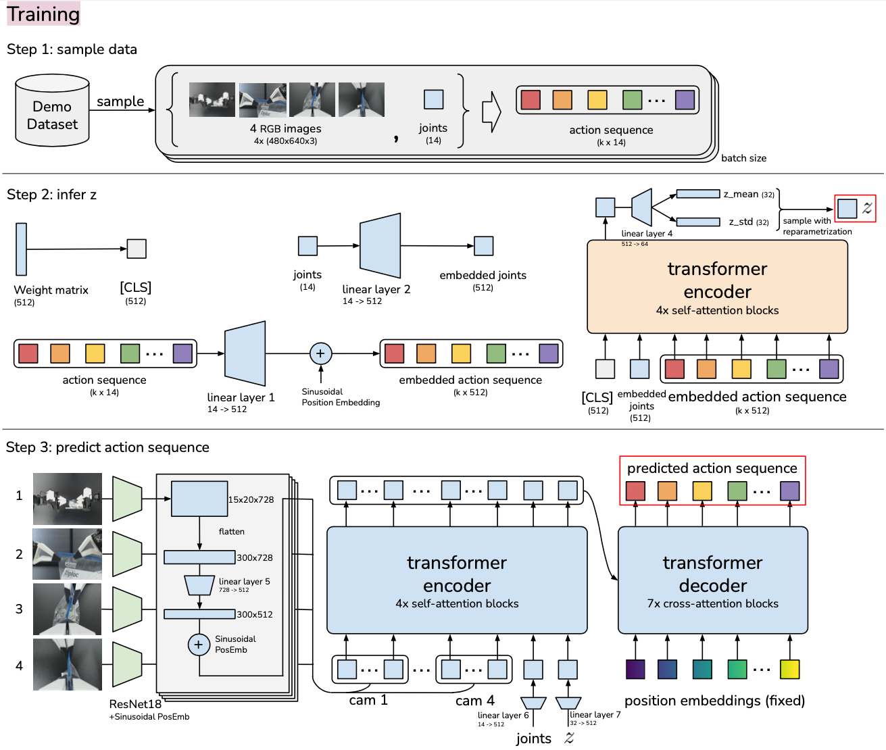

# Robotic Foundation Model

- [Robotic Foundation Model](#robotic-foundation-model)
  - [Background](#background)
  - [Literature](#literature)
    - [(Mar 2023) Diffusion Policy: Visuomotor Policy Learning via Action Diffusion](#mar-2023-diffusion-policy-visuomotor-policy-learning-via-action-diffusion)
    - [(Apr 2023) ACT: Learning Fine-Grained Bimanual Manipulation with Low-Cost Hardware](#apr-2023-act-learning-fine-grained-bimanual-manipulation-with-low-cost-hardware)
    - [(Dec 2023) Octo: An Open-Source Generalist Robot Policy](#dec-2023-octo-an-open-source-generalist-robot-policy)
    - [(Dec 2023) ATM: Any-point Trajectory Modeling for Policy Learning](#dec-2023-atm-any-point-trajectory-modeling-for-policy-learning)
  - [LMN usage](#lmn-usage)

## Background

- Imitation learning
  - Imitation learning, also known as learning from demonstration, is a technique where robots learn to perform tasks by mimicking human behavior
  - Learn demonstrations: a human operator performs a task
  - **Behavior cloning**: robot learns a direct mapping from observed states to actions
    - Treat the learning problem as a supervised learning task
    - Input is the state of the environment
    - Output is the action taken by the human demonstrator
    - The robot essentially learns to replicate the actions based on the state information
  - **Inverse reinforcement learning**: the robot aims to infer the underlying reward function that the human demonstrator is seemingly optimizing
    - Instead of directly learning the actions from the states, the robot learns the reward function of the task
    - Uses reinforcement learning to find the optimal policy that maximizes this reward function

## Literature

### (Mar 2023) Diffusion Policy: Visuomotor Policy Learning via Action Diffusion

[Code](https://github.com/real-stanford/diffusion_policy), [Website](https://diffusion-policy.cs.columbia.edu/)

### (Apr 2023) ACT: Learning Fine-Grained Bimanual Manipulation with Low-Cost Hardware

[Code](https://github.com/tonyzhaozh/act), [Website](https://tonyzhaozh.github.io/aloha/)

- Introduction
  - Behavioral cloning
    - Compounding error of imitation learning, even with high-quality demonstrations
    - Compounding error: errors from previous timesteps accumulate and cause robot to drift
  - Solve this by "action chunking": seqeunces of actions grouped together and executed as a single unit
  - **Action Chunking Transformer (ACT)**: a transformer-based model that learns to chunk actions
    - trained as a conditional VAE
- Method
  - Data collection
    - Collect human demonstrations, recording joint positions of leader robots as actions
    - Important to use leader joints because force applied is implicitly defined by the difference between them, through the PID controller inside the Dynamixel servos
  - **Action chunking**: fix the chunk size to be $k$
    - Every $k$ steps, the agent recieves an observation, generates the next $k$ actions, and executes them
    - Chunking helps model non-Markovian behavior (Markovian is when future state can only depend on current state) compared to single-step action prediction
    - Naive chunking can result in jerky motion
      - Solution: query the policy at every timestep (generating overlapping chunks)
      - Temporal ensemble: weighted average of the predictions from the overlapping chunks, where $w_i = \exp (-m * i)$, $w_0$ is the weight of the oldest action
      - Smaller $m$ means faster incorporation of new observations
  - Architecture
    - **Conditional variational autoencoder (CVAE)** generates action sequence conditioned on current observations
      - **CVAE encoder**
        - Only servers to train decoder, discarded at test time
        - Predicts mean and variance of the style variable $z$
        - Implemented as BERT-like transformer encoder
        - Input: current joint positions and target action sequence of length $k$ from the demonstration dataset, prepended with [CLS] token
        - Output: feature corresponding to [CLS] is used to predict mean and variance of style variable $z$
      - **CVAE decoder (the policy)**
        - Predicts the action sequence conditioned on both $z$ and the current observations (images + joint positions)
        - Implemented with ResNet image encoder, transformer encoder, and transformer decoder
        - ResNet processes images and flatens along spatial dimensions; we add position embeddings to preserve spatial information
        - Also add current joint positions and style variable $z$ to the input
        - Transformer encoder synthesizes information from this input
        - Transformer decoder generates coherent action sequence
        - **Action space is vector of joint angles, so total output (the "action sequence") is $k\times n$ tensor where $n$ is the number of joints**
      - Maximize log-likelihood of the demonstration action chunks: $\min_{\theta} -\sum_{s_t, a_{t:t+k}\in D} \log \pi_{\theta}(a_{t:t+k}|s_t)$
      - Standard VAE objective
      - Train from scratch for each task
    - 
    - 
- Experiments
  - Outperforms BC-ConvMLP, BeT, RT-1, and VINN on 6 tasks
  - Collect 10-20 minutes of data (50 demonstrations) for each task
  - Ablation study
    - Chunking around $k=100$ is best
    - Temporal ensemble improves performance only slightly, by 3.3%
    - Training with CVAE is crucial

### (Dec 2023) Octo: An Open-Source Generalist Robot Policy

[Code](https://github.com/octo-models/octo), [Website](https://octo-models.github.io/)

### (Dec 2023) ATM: Any-point Trajectory Modeling for Policy Learning

[Website](https://xingyu-lin.github.io/atm/)

## LMN usage

**Directories in ```foundation``` Docker container**

- ```$LMN_CODE_DIR: /lmn/foundation/code/```
- ```$LMN_MOUNT_DIR: /lmn/foundation/mount/```
- ```$LMN_OUTPUT_DIR: /lmn/foundation/output/```
- ```$LMN_SCRIPT_DIR: /lmn/foundation/script/```

**Transfer output files in Docker container to local machine**

- ```echo 'some-output' > $LMN_OUTPUT_DIR/output_file.txt```
- In local directory, output will be in ```/.output/output/```
  - lmn will copy the output to the local machine when the container is closed
- In remote directory, output will be in ```/scratch/kevinywu/lmn/kevinywu/foundation/output/```
  - This will show up immediately, since the container is running on the remote machine
