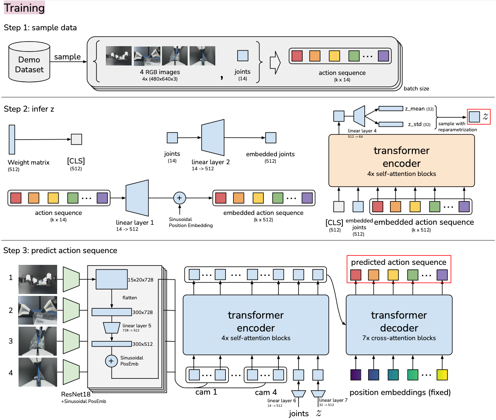
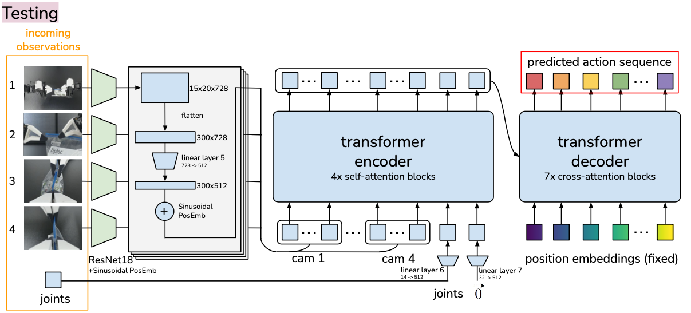
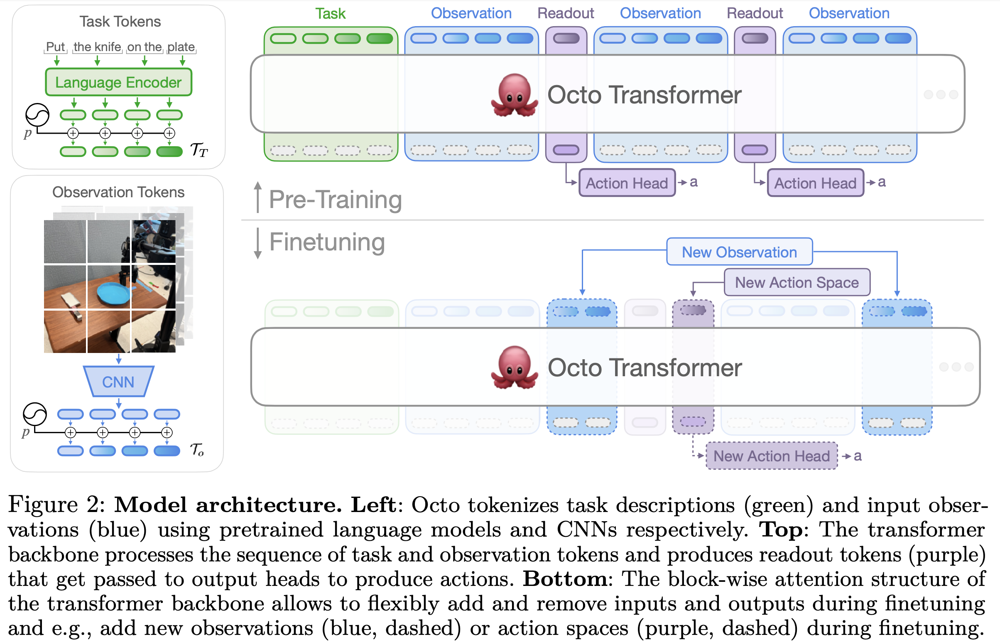

# Robotic Foundation Model

- [Robotic Foundation Model](#robotic-foundation-model)
  - [Background](#background)
  - [Literature](#literature)
    - [(May 2020) DETR: End-to-End Object Detection with Transformers](#may-2020-detr-end-to-end-object-detection-with-transformers)
    - [(Feb 2021) CLIP: Learning Transferable Visual Models From Natural Language Supervision](#feb-2021-clip-learning-transferable-visual-models-from-natural-language-supervision)
    - [(Dec 2022) Whisper: Robust Speech Recognition via Large-Scale Weak Supervision](#dec-2022-whisper-robust-speech-recognition-via-large-scale-weak-supervision)
    - [(Mar 2023) Diffusion Policy: Visuomotor Policy Learning via Action Diffusion](#mar-2023-diffusion-policy-visuomotor-policy-learning-via-action-diffusion)
    - [(Apr 2023) ACT: Learning Fine-Grained Bimanual Manipulation with Low-Cost Hardware](#apr-2023-act-learning-fine-grained-bimanual-manipulation-with-low-cost-hardware)
    - [(Dec 2023) Octo: An Open-Source Generalist Robot Policy](#dec-2023-octo-an-open-source-generalist-robot-policy)
    - [(Mar 2024) VQ-BeT: Behavior Generation with Latent Actions](#mar-2024-vq-bet-behavior-generation-with-latent-actions)
    - [(Jun 2024) OpenVLA: An Open-Source Vision-Language-Action Model](#jun-2024-openvla-an-open-source-vision-language-action-model)

## Background

- Imitation learning
  - Imitation learning, also known as learning from demonstration, is a technique where robots learn to perform tasks by mimicking human behavior
  - Learn demonstrations: a human operator performs a task
  - **Behavior cloning**: robot learns a direct mapping from observed states to actions
    - Treat the learning problem as a supervised learning task
    - Input is the state of the environment
    - Output is the action taken by the human demonstrator
    - The robot essentially learns to replicate the actions based on the state information
  - **Inverse reinforcement learning**: the robot aims to infer the underlying reward function that the human demonstrator is seemingly optimizing
    - Instead of directly learning the actions from the states, the robot learns the reward function of the task
    - Uses reinforcement learning to find the optimal policy that maximizes this reward function

## Literature

### (May 2020) DETR: End-to-End Object Detection with Transformers

[Code](https://github.com/facebookresearch/detr), [Annotated Code 1](https://amaarora.github.io/posts/2021-07-26-annotateddetr.html), [Annotated Code 2](https://amaarora.github.io/posts/2023-03-11_Understanding_CLIP_part_2.html), [Video](https://www.youtube.com/watch?v=T35ba_VXkMY)

### (Feb 2021) CLIP: Learning Transferable Visual Models From Natural Language Supervision

[Code](https://github.com/openai/CLIP), [Annotated Code](https://amaarora.github.io/posts/2023-03-06_Understanding_CLIP.html), [Video](https://www.youtube.com/watch?v=T9XSU0pKX2E)

### (Dec 2022) Whisper: Robust Speech Recognition via Large-Scale Weak Supervision

[Code](https://github.com/openai/whisper)

### (Mar 2023) Diffusion Policy: Visuomotor Policy Learning via Action Diffusion

[Code](https://github.com/real-stanford/diffusion_policy), [Website](https://diffusion-policy.cs.columbia.edu/)

### (Apr 2023) ACT: Learning Fine-Grained Bimanual Manipulation with Low-Cost Hardware

[Code](https://github.com/tonyzhaozh/act), [Website](https://tonyzhaozh.github.io/aloha/)

- Introduction
  - Behavioral cloning
    - Compounding error of imitation learning, even with high-quality demonstrations
    - Compounding error: errors from previous timesteps accumulate and cause robot to drift
  - Solve this by "action chunking": seqeunces of actions grouped together and executed as a single unit
  - **Action Chunking Transformer (ACT)**: a transformer-based model that learns to chunk actions
    - trained as a conditional VAE
- Method
  - Data collection
    - Collect human demonstrations, recording joint positions of leader robots as actions
    - Important to use leader joints because force applied is implicitly defined by the difference between them, through the PID controller inside the Dynamixel servos
  - **Action chunking**: fix the chunk size to be $k$
    - Every $k$ steps, the agent recieves an observation, generates the next $k$ actions, and executes them
    - Chunking helps model non-Markovian behavior (Markovian is when future state can only depend on current state) compared to single-step action prediction
    - Naive chunking can result in jerky motion
      - Solution: query the policy at every timestep (generating overlapping chunks)
      - Temporal ensemble: weighted average of the predictions from the overlapping chunks, where $w_i = \exp (-m * i)$, $w_0$ is the weight of the oldest action
      - Smaller $m$ means faster incorporation of new observations
  - Architecture
    - **Conditional variational autoencoder (CVAE)** generates action sequence conditioned on current observations
      - **CVAE encoder**
        - Only servers to train decoder, discarded at test time
        - Predicts mean and variance of the style variable $z$
        - Implemented as BERT-like transformer encoder
        - Input: current joint positions and target action sequence of length $k$ from the demonstration dataset, prepended with [CLS] token
        - Output: feature corresponding to [CLS] is used to predict mean and variance of style variable $z$
      - **CVAE decoder (the policy)**
        - Predicts the action sequence conditioned on both $z$ and the current observations (images + joint positions)
        - Implemented with ResNet image encoder, transformer encoder, and transformer decoder
        - ResNet processes images and flatens along spatial dimensions; we add position embeddings to preserve spatial information
        - Also add current joint positions and style variable $z$ to the input
        - Transformer encoder synthesizes information from this input
        - Transformer decoder generates coherent action sequence
        - **Action space is vector of joint angles, so total output (the "action sequence") is $k\times n$ tensor where $n$ is the number of joints**
      - Maximize log-likelihood of the demonstration action chunks: $\min_{\theta} -\sum_{s_t, a_{t:t+k}\in D} \log \pi_{\theta}(a_{t:t+k}|s_t)$
      - Standard VAE objective
      - Train from scratch for each task
    - 
    - 
- Experiments
  - Outperforms BC-ConvMLP, BeT, RT-1, and VINN on 6 tasks
  - Collect 10-20 minutes of data (50 demonstrations) for each task
  - Ablation study
    - Chunking around $k=100$ is best
    - Temporal ensemble improves performance only slightly, by 3.3%
    - Training with CVAE is crucial
      - Variational autoencoder is a generative model, it learns a compact representation of the input data and learns how to generate new data similar to the input data
      - Conditional VAE is a VAE that is conditioned on some input data
      - Predictions based on style variable $z$ and current observations, allowing the model to generate different actions depending on the environment
      - Human teleoperated demonstrations can be noisy and multi-modal (human might perform the same task in different ways), so style variable $z$ helps the model understand the context better
      - With scripted data, CVAE did not help, but with human demonstrations, CVAE success rate was 35% vs 2% without CVAE

### (Dec 2023) Octo: An Open-Source Generalist Robot Policy

[Code](https://github.com/octo-models/octo), [Website](https://octo-models.github.io/)

- Introduction
  - Generalist robot policy (GRP): model that directly maps robot observations to actions and provide zero-shor or few-shot generalization to new tasks
  - Ex. GNM, RoboCat, RT-X
  - Octo: pretrained on 800k robot trajectories from Open X-Embodiement
- Octo model
  - **Supports both natural language and goal image conditioning**
  - 
  - Architecture
    - Input tokenizers transform language intructions $l$, goal images $g$, and robot observation sequences $o_1, o_2, \ldots, o_H$ into tokens $[\mathcal{T}_l, \mathcal{T}_g, \mathcal{T}_o]$
    - Transformer backbone processes these tokens and produces embeddings $e_l, e_g, e_o = T(\mathcal{T}_l, \mathcal{T}_g, \mathcal{T}_o)$
    - Readout heads $R$ produce action logits $a = R(e_l, e_g, e_o)$
    - Tasks and observation tokens
      - Laguage inputs tokenized and passed through pretrained t5-base (111M)
      - Image observations tokenized and passed through shallow convolutional stack, then split into sequence of flattened patches
    - Transformer backbone and readout heads
      - Observation tokens can only attend to tokens from the same or earlier time steps and task tokens (green)
      - Readout tokens $\mathcal{T}_{R, t}$ (purple) attend to observations and task tokens but is not attended to by any observation or task token, so they can only passively read and process internal embeddings without influencing them
      - This design is flexible to add new task and observations inputs
    - Design decisions
      - Transformer over ResNet for image encodings with shallow CNN
      - Early input fusion: transformer requires quadratic scaling with input length, so channel stack goal images with observation images
- Training details
  - Trained on mixture of 25 datasets from [Open X-Embodiement](https://robotics-transformer-x.github.io/)
  - Downweight larger datasets
  - Zero-pad any missing camera channels
  - Binary gripper command: 1 if gripper is open, 0 if gripper is closed
  - Training objective
    - Use conditional diffusion decoding to predict continuous, multi-modal action distributions
    - Only one forward pass of the transformer backbone is performed per action prediction, after which the multi-step denoising process is carried out within the small diffusion head
    - To generate action, sample a Gaussian noise vector $x^K \sim \mathcal{N}(0, I)$ and apply $K$ steps of denoising with a learned denoising network $\epsilon_{\theta}(x^k, e, k)$
      - $\epsilon_{\theta}(x^k, e, k)$ is conditoned on the output $x^k$ of the previous denoising step, the step index $k$, and the output embedding $e$ of the transformer action readout
        - $x^{k-1} = \alpha (x^k - \gamma \epsilon_{\theta}(x^k, e, k) + \mathcal{N}(0, \sigma^2 I))$
        - Parameters $\alpha, \gamma, \sigma$ correspond to cosine noise schedule
  - Model sizes
    - Octo-Small: 27M parameters
    - Octo-Base: 93M parameters
- Conclusion
  - Things that improved performance
    - Adding one frame of history as context
    - Using action chunking (no temporal ensemble needed)
    - Decreasing patch size
    - Increasing shuffle buffer size
  - Things that did not work
    - MSE action head rather than diffusion decoding
    - Discrete action heads
    - ResNet Encoders
    - Pretrained Encoders
    - Relative gripper action representation
    - Adding proprioceptive observations
    - Fine-tuning language model (T5 encoder)

### (Mar 2024) VQ-BeT: Behavior Generation with Latent Actions

[Code](https://github.com/jayLEE0301/vq_bet_official), [Website](https://sjlee.cc/vq-bet/)

### (Jun 2024) OpenVLA: An Open-Source Vision-Language-Action Model

[Code](https://github.com/openvla/openvla), [Website](https://openvla.github.io/)
