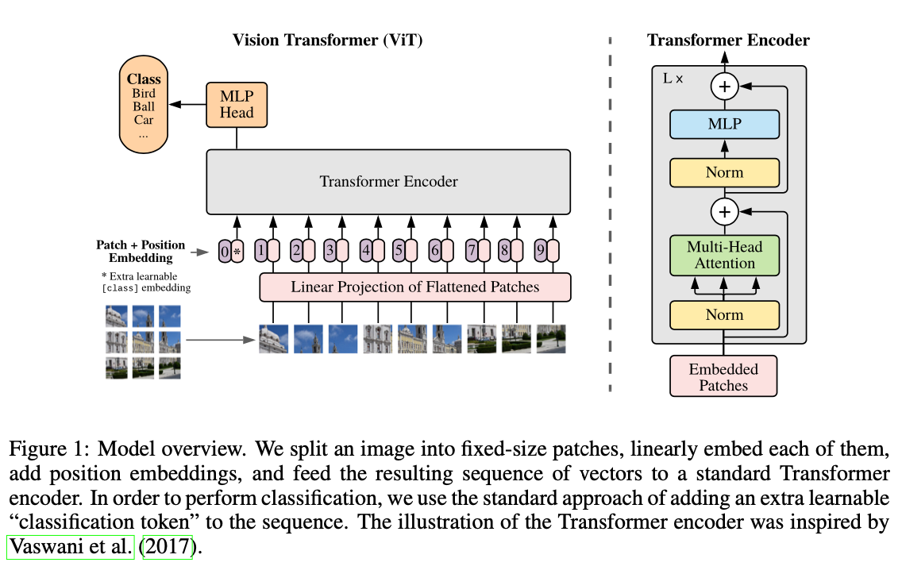
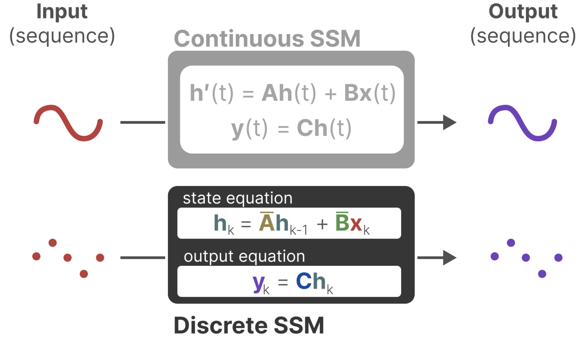
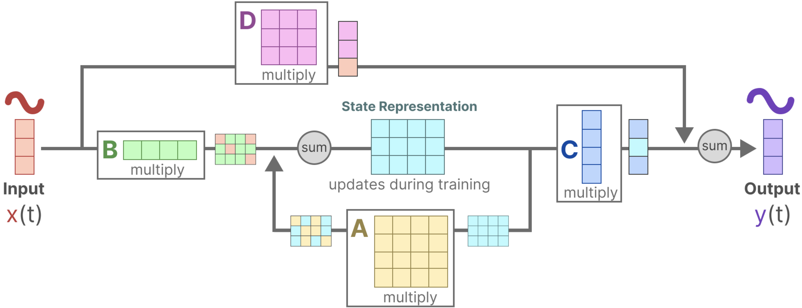
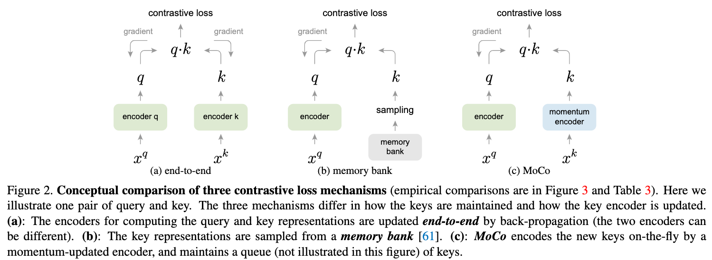
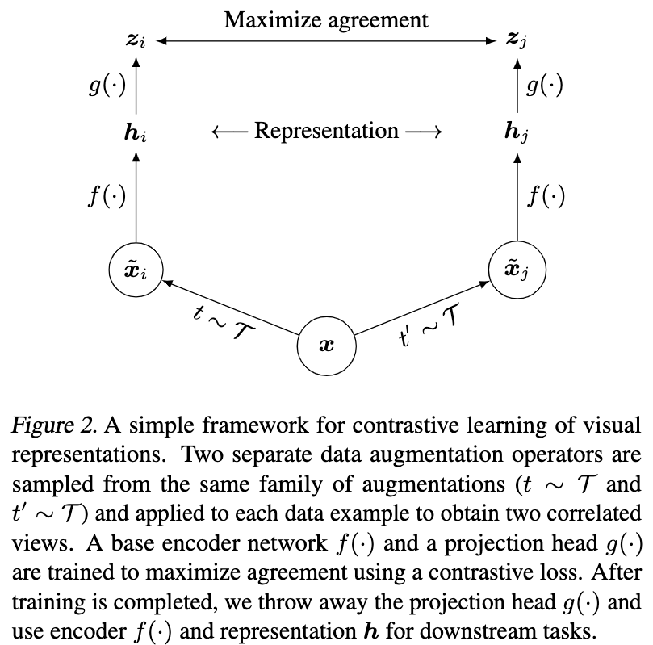
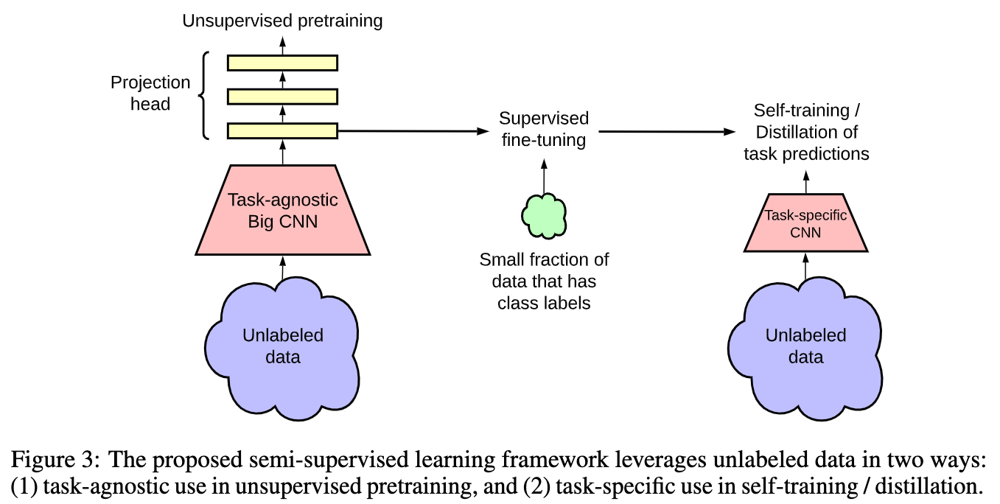
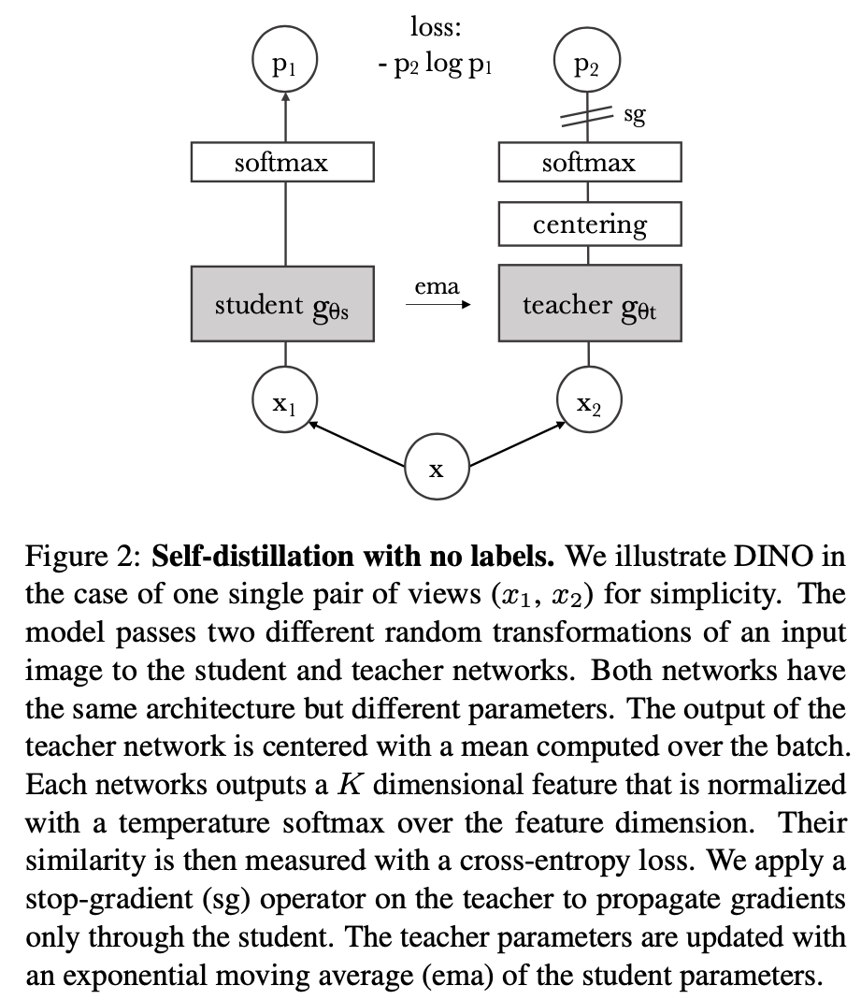
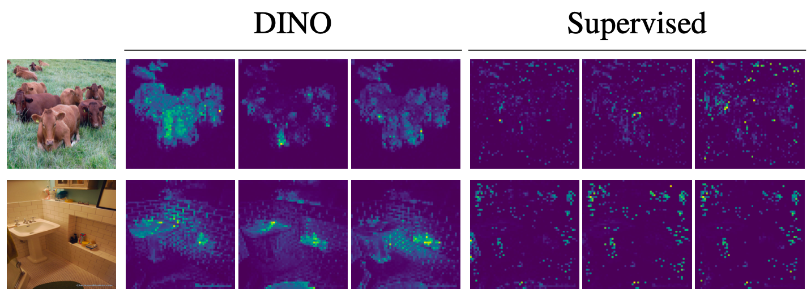
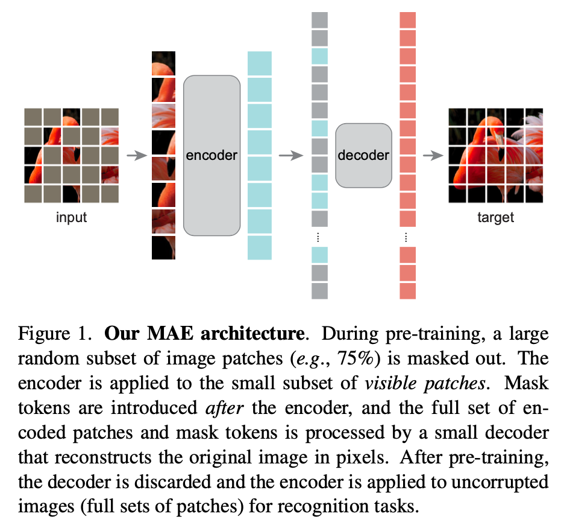

# Appendix

- [Appendix](#appendix)
  - [Machine Learning](#machine-learning)
    - [(Dec 2013) VAE: Auto-Encoding Variational Bayes](#dec-2013-vae-auto-encoding-variational-bayes)
    - [(Jun 2014) GAN: Generative Adversarial Networks](#jun-2014-gan-generative-adversarial-networks)
    - [(Dec 2015) CVAE: Learning Structured Output Representation using Deep Conditional Generative Models](#dec-2015-cvae-learning-structured-output-representation-using-deep-conditional-generative-models)
  - [Transformers](#transformers)
    - [(Jun 2017) Attention is All You Need](#jun-2017-attention-is-all-you-need)
    - [(Oct 2020) ViT: An Image is Worth 16x16 Words: Transformers for Image Recognition at Scale](#oct-2020-vit-an-image-is-worth-16x16-words-transformers-for-image-recognition-at-scale)
    - [(Apr 2024) Leave No Context Behind: Efficient Infinite Context Transformers with Infini-attention](#apr-2024-leave-no-context-behind-efficient-infinite-context-transformers-with-infini-attention)
  - [Diffusion Models](#diffusion-models)
    - [(Apr 2022) Video Diffusion Models](#apr-2022-video-diffusion-models)
  - [Reinforcement Learning](#reinforcement-learning)
    - [(Dec 2013) DQN: Playing Atari with Deep Reinforcement Learning](#dec-2013-dqn-playing-atari-with-deep-reinforcement-learning)
  - [Structured State Space Models](#structured-state-space-models)
    - [(Apr 2021) S4: Efficiently Modeling Long Sequences with Structured State Spaces](#apr-2021-s4-efficiently-modeling-long-sequences-with-structured-state-spaces)
    - [(Dec 2023) Mamba: Linear-Time Sequence Modeling with Selective State Spaces](#dec-2023-mamba-linear-time-sequence-modeling-with-selective-state-spaces)
  - [Unsupervised Representation Learning](#unsupervised-representation-learning)
    - [(Nov 2019) MoCo: Momentum Contrast for Unsupervised Visual Representation Learning](#nov-2019-moco-momentum-contrast-for-unsupervised-visual-representation-learning)
    - [(Feb 2020) SimCLR: A Simple Framework for Contrastive Learning of Visual Representations](#feb-2020-simclr-a-simple-framework-for-contrastive-learning-of-visual-representations)
    - [(Jun 2020) SimCLRv2: Big Self-Supervised Models are Strong Semi-Supervised Learners](#jun-2020-simclrv2-big-self-supervised-models-are-strong-semi-supervised-learners)
    - [(Apr 2021) DINO: Emerging Properties in Self-Supervised Vision Transformers](#apr-2021-dino-emerging-properties-in-self-supervised-vision-transformers)
    - [(Nov 2021) MAE: Masked Autoencoders Are Scalable Vision Learners](#nov-2021-mae-masked-autoencoders-are-scalable-vision-learners)
    - [(Jan 2023) I-JEPA: Self-Supervised Learning from Images with a Joint-Embedding Predictive Architecture](#jan-2023-i-jepa-self-supervised-learning-from-images-with-a-joint-embedding-predictive-architecture)
    - [(Apr 2023) DINOv2: Learning Robust Visual Features without Supervision](#apr-2023-dinov2-learning-robust-visual-features-without-supervision)
    - [(Feb 2024) V-JEPA: Revisiting Feature Prediction for Learning Visual Representations from Video](#feb-2024-v-jepa-revisiting-feature-prediction-for-learning-visual-representations-from-video)

## Machine Learning

### (Dec 2013) VAE: Auto-Encoding Variational Bayes

[Code](https://github.com/AntixK/PyTorch-VAE?tab=readme-ov-file), [Annotated Code](https://vxlabs.com/2017/12/08/variational-autoencoder-in-pytorch-commented-and-annotated/), [Blog](https://kvfrans.com/variational-autoencoders-explained/), [KL-Divergence Blog](https://kvfrans.com/deriving-the-kl/)

### (Jun 2014) GAN: Generative Adversarial Networks

[Annotated Code](https://nn.labml.ai/gan/original/index.html) [Code](https://github.com/eriklindernoren/PyTorch-GAN?tab=readme-ov-file), [Blog](https://kvfrans.com/generative-adversial-networks-explained/), [Video](https://www.youtube.com/watch?v=eyxmSmjmNS0)

### (Dec 2015) CVAE: Learning Structured Output Representation using Deep Conditional Generative Models

[Blog](https://agustinus.kristia.de/techblog/2016/12/17/conditional-vae/)

## Transformers

### (Jun 2017) Attention is All You Need

[Annotated Code](http://nlp.seas.harvard.edu/annotated-transformer/), [Video](https://www.youtube.com/watch?v=iDulhoQ2pro), [3B1B Part 1](https://youtu.be/wjZofJX0v4M?feature=shared), [3B1B Part 2](https://youtu.be/eMlx5fFNoYc?feature=shared)

### (Oct 2020) ViT: An Image is Worth 16x16 Words: Transformers for Image Recognition at Scale

[Annotated Code](https://nn.labml.ai/transformers/vit/index.html), [Code](https://github.com/google-research/vision_transformer), [Video](https://www.youtube.com/watch?v=TrdevFK_am4)

- Introduction
  - Transformer architecture has been successful in NLP
  - Apply standard transformer to image patches, providing sequence of linear embeddings of these patches as an input to a transformer
  - Worse than ResNet on ImageNet, but better on larger datasets
  - **Transformer is a generalization of an MLP**
    - The "weight" between nodes in consecutive layers is fixed in MLP, but computed on the fly in a transformer
    - This makes a transformer the most general, least generalized thing we can train in ML!
    - Transformer is less biased than other architectures
    - This is why we concatenate the input and positional encoding in a transformer
  - Completely discards the notion of convolutions
- Method
  - Follow original transformer as closely as possible
  - Standard transformer recieves a 1D sequence of token embeddings
  - For 2d images, reshape the image $x \in \mathbb{R}^{H \times W \times C}$ into a sequence of flattened 2D patches $x \in \mathbb{R}^{N \times (P^2 \cdot C)}$
    - $N = H \times W / P^2$ is the number of patches; the input sequence length
    - $P$ is the patch size
      - Use patches instead of the whole image for computational efficiency
      - Naive self attention would require each pixel to attend to every other pixel
    - $C$ is the number of channels
    - Flatten the patches and map to $D$ dimensions with linear layer; output is called the "patch embedding"
    - Position embeddings added to patch embeddings to retain positional information
    - **Patch + position embeddings are input to the transformer encoder**, output feeds into MLP for classification
  - 
  - **ViT has less image specific inductive bias than CNNs**
    - Inductive bias refers to the set of assumptions a model makes about the data
    - CNNs assume **locality** (pixels close to each other are related) and **translation invariance** (features are the same regardless of where they are in the image)
    - ViTs use self attention to consider relationships between all parts of the image simultaneously
      - Positional embeddings at initialization don't carry information about 2D position of the patches
      - For classification, only the MLP head in ViT assumes locality and translational invariance
- Experiments
  - ViT outperforms CNNs with the same computational budget
  - Internal representations
    - First layer linearly projects flattened patches to lower dimenstion
    - Learned positional embeddings are added to the patch embeddings, closer patches tend to have more similar positional embeddings, as well as row-column structure
    - 

### (Apr 2024) Leave No Context Behind: Efficient Infinite Context Transformers with Infini-attention

[Video](https://www.youtube.com/watch?v=r_UBBfTPcF0)

## Diffusion Models

### (Apr 2022) Video Diffusion Models

[Website](https://video-diffusion.github.io/)

## Reinforcement Learning

### (Dec 2013) DQN: Playing Atari with Deep Reinforcement Learning

[Annotated Code](https://nn.labml.ai/rl/dqn/index.html), [Video](https://www.youtube.com/watch?v=rFwQDDbYTm4), [Q-Learning](https://www.youtube.com/watch?v=nOBm4aYEYR4)

- Introduction
  - Challenges with deep learning for RL
    - Most deep learning applications to date require labelled training data, while RL algoithms must learn from a scalar reward signal that is sparse, noisy, and delayed
    - Deep learning assumes data samples to be independent, RL data is correlated
    - In RL, data distribution changs as the algorithm learns new behaviours; deep learning assumes fixed underlying distribution
  - This paper: **CNN + Q-learning + SGD**
  - **Experience replay**: randomly sample previous transitions to alleviate problems of correlated data and non-stationary distributions
- Background
  - At each time step, the agent selects an action from the set of legal game actions
    - Action passed to emulator and modifies game score
    - Agent only observes the raw pixels $x_t$ and reward $r_t$ representing the change in game score
  - Cannot understand current situation from only $x_t$, so consider sequences of actions and observations $s_t = x_1, a_1, x_2, a_2, ..., x_t$
    - Use complete sequence $s_t$ as state representation at time $t$
  - Q-learning
    - Future rewards discounted by factor $\gamma$ at each time step
    - **Future discounted return at time $t$**: $R_t = \sum_{t'=t}^T \gamma^{t'-t}r_{t'}$
    - **Optimal action-value function**: $Q^*(s, a) = \max_{\pi} \mathbb{E}[R_t | s_t = s, a_t = a, \pi]$
    - $\pi$ is the policy mapping sequences to actions
    - **Bellman equation**: $Q^*(s, a) = \mathbb{E}_{s'}[r + \gamma \max_{a'} Q^*(s', a') | s, a]$
      - Intuition: optimal value of current state-action pair is the reward received from that action plus the expected value of the best action from the next state
      - Many RL algorithms estimate $Q$ with a function approximator, $Q(s, a; \theta) \approx Q^*(s, a)$
    - **Q-network**: $Q(s, a; \theta) \approx Q^*(s, a)$
      - Nonlinear function approximator wth network weights $\theta$
      - **Loss function**: $L_i(\theta_i) = \mathbb{E}_{s, a\sim \rho(.)}[(y_i - Q(s, a; \theta_i))^2]$
        - Changes at each iteration $i$, parameters from previous iteration $\theta_{i-1}$ are fixed when optimizing $L_i(\theta_i)$
        - $y_i = \mathbb{E}_{s' \sim \mathcal{E}}[r + \gamma \max_{a'} Q(s', a'; \theta_{i-1}) | s, a]$ is the target for iteration $i$
        - Behavior desitribution: $\rho(s, a)$ is the probability distribution over sequences and actions
      - Gradient of loss: $\nabla_{\theta_i} L_i(\theta_i) = \mathbb{E}_{s, a\sim \rho(.), s'\sim \mathcal{E}}[(r + \gamma \max_{a'} Q(s', a'; \theta_{i-1}) - Q(s, a; \theta_i)) \nabla_{\theta_i} Q(s, a; \theta_i)]$
    - Q-learning is model free: does not need to estimate the emulator
    - Q-learning is off-policy: the policy that the agent uses to select actions during learning is different from the policy the agent is trying to improve
- Deep reinforcement learning
  - On policy training: agent learns from the data it collects
    - Ex. TD-Gammon updates parameters directly from on-policy samples of experience $(s_t, a_t, r_t, s_{t+1})$ from the algorithms interaction with the environment
  - **Experience replay (offline)**: store agent's experiences $e_t = (s_t, a_t, r_t, s_{t+1})$ at each time step in a dataset $\mathcal{D} = \{e_1, ..., e_N\}$
    - At each time step, sample a minibatch of random transitions from $\mathcal{D}$ to update the Q-network
    - $\epsilon$-greedy policy: with probability $\epsilon$ select a random action, otherwise select the action that maximizes the Q-value
  - Deep Q-learning advantages over standard online Q-learning
    - Data efficiency: each experience is used in many parameter updates
    - Randomizing samples break correlations between samples and reduces update variance
    - Reduces unwanted feedback loops
      - On-policy current parameters determine the next data sample the parameters are trained on
      - Experience replay smooths learning and avoids oscillations or divergence of parameters
- Experiments
  - Clip all positive rewards at 1 and negative rewards at -1, and 0 rewards are unchanged
    - Allows use of same learning rate across different games
    - Could negatively affect performance in games
  - Frame-skipping: repeat the selected action for $k$ frames and only record the reward and change in score for the last frame
  - Evaluation metric: predicted $Q$ is more smooth than average reward

## Structured State Space Models

### (Apr 2021) S4: Efficiently Modeling Long Sequences with Structured State Spaces

[Code](https://github.com/state-spaces/s4), [Annotated Code](https://srush.github.io/annotated-s4/), [Blog](https://huggingface.co/blog/lbourdois/get-on-the-ssm-train)

### (Dec 2023) Mamba: Linear-Time Sequence Modeling with Selective State Spaces

[Code](https://github.com/state-spaces/mamba), [Annotated Code](https://srush.github.io/annotated-mamba/hard.html), [Video](https://www.youtube.com/watch?v=9dSkvxS2EB0), [Blog](https://newsletter.maartengrootendorst.com/p/a-visual-guide-to-mamba-and-state)

- The problem with Transformers
  - When generating the next token in inference, we need to re-calculate the attention for the entire sequence
  - This is $O(n^2)$, where $n$ is the sequence length
  - RNN solution
    - RNN takes the previous hidden state and the current token as input: $O(n)$ in inference
    - Only needs to consider previous hidden state rather than the entire sequence
    - Problem: RNNs tend to forget informatio since they only have a fixed-size hidden state
    - Also, slow training, need to be trained sequentially (not parallelizable)
- State space model
  - Map input sequence $x(t)$ to a sequence of hidden states $h(t)$ to an output sequence $y(t)$
  - Instead of discrete input, use continuous state input sequence
    - State equation: $h'(t) = Ah(t) + Bx(t)$
    - Output equation: $y(t) = Ch(t) + Dx(t)$
  - Can be descretized turns function-to-function into sequence-to-sequence
    - Can model like an RNN
  - 
  - Signal first gets multiplied by $B$ which describes how the inputs influence the system
  - Multiply the state with $A$ which describes how internal states are connected as they represent the underlying dynamics of the system
    - $A$ is applied before creating the state representations and updated after the state representation has been updated
  - $C$ describes how the state is transformed into the output
  - $D$ (skip connection) how the input directly impacts output
  - 
- Mamba
  - **Selective scan algorithm**, which allows the model to filter (ir)relevant information
    - SSM lacks the ability to focus on or ignore particular inputs
    - In a Structured State Space Model (S4), the matrices $A, B, C$ are independent of the input since their dimensions are static and do not change
    - Mamba makes matrices $B, C$, and even the step size $\Delta$, dependent on the input by incorporating the sequence length and batch size of input
    - Parallel scan algorithm
  - **Hardware-aware algorithm** that allows for efficient storage of (intermediate) results through parallel scan, kernel fusion, and recomputation

## Unsupervised Representation Learning

### (Nov 2019) MoCo: Momentum Contrast for Unsupervised Visual Representation Learning

[Code](https://github.com/facebookresearch/moco)

- Introduction
  - Unsupervised representation learning successful in NLP but not in vision
  - Maintain the dictionary as a queue of data samples: the encoded representations of the current mini-batch are enqueued, and the oldest are dequeued
  - A slowly progressing key encoder, implemented as a momentum-based moving average of the query encoder, is proposed to maintain consistency
  - A query matches a key if they are encoded views (e.g., different crops) of the same image
- Method
  - **Contrastive learning as dictionary look-up**
  - Consider an encoded query $q$ and set of encoded samples $\{k_0, k_1, k_2, \ldots\}$ that are the keys of a dictionary
  - Assume that there is a single key (denoted as $k^+$) in the dictionary that $q$ matches
  - A contrastive loss is a function whose value is low when $q$ is similar to its positive key $k^+$ and dissimilar to all other keys (considered negative keys for $q$)
  - InfoNCE loss: $\mathcal{L} = -\log\frac{\exp(q\cdot k^+/\tau)}{\sum_{k\in\mathcal{K}}\exp(q\cdot k/\tau)}$
    - $\tau$ is a temperature parameter
  - Momentum contrast
    - Queue of data samples can be much larger than a mini-batch (size is hyperparameter), older samples are dequeued as they are the most outdated keys
    - Momentum update: $\theta_k \leftarrow m\theta_k + (1-m)\theta_q$
      - $\theta_k$ is the key encoder's ($f_k$) parameters
      - $\theta_q$ is the query encoder's ($f_q$) parameters
      - $m$ is the momentum coefficient, empirically, larger (slowly evolving key encoder) is better
    - 
  - Pretext task: query and key are positive pair if they originate from the same image, negative otherwise
    - Take two random crops of image under random augmentation as positive pair
  - Use ResNet as encoder
  - Batchnorm prevents good representations: use shuffling BN

### (Feb 2020) SimCLR: A Simple Framework for Contrastive Learning of Visual Representations

[Code](https://github.com/google-research/simclr), [Blog](https://research.google/blog/advancing-self-supervised-and-semi-supervised-learning-with-simclr/)

- Introduction
  - Data augmentation improves unsupervised constrastive learning
  - Learnable nonlinear transformation between representation and contrastive loss improves learned representations
  - Representation learning with contrastive cross-entropy loss benefits from normalized embeddings and temperature param
  - Contrastive learning benefits from larger batch sizes and longer training compared to supervised counterpart
- Method
  - SimCLR learns representations by maximizing agreement between differently augmented views of the same data instance via a contrastive loss in the latent space
  - Framework
    - **Data augmentation** to generate positive pairs
    - **Base encoder** $f(\cdot)$ to extract representation vectors: ResNet
    - **Projection head** $g(\cdot)$ to map representations to a space where contrastive loss is applied: MLP, 1 hidden layer
      - This is discarded after pretraining
    - 
    - **Contrastive loss function**: attempt to identify the positive pair from a set of examples (treat ALL others as negative)
      - $\text{sim}(u, v) = \frac{u^Tv}{\|u\|\|v\|}$ cosine similarity
      - For a positive pair of examples $(i, j)$, NT-Xent (normalized temperature-scaled cross-entropy loss) is used
      - $l_{i,j} = -\log\left(\frac{\exp(\text{sim}(z_i, z_j)/\tau)}{\sum_{k=1}^{2N}\mathbb{1}_{[k\neq i]}\exp(\text{sim}(z_i, z_k)/\tau)}\right)$
        - $\tau$ is the temperature parameter, higher temperature leads to softer probability distribution
        - $z_i = g(f(x_i))$ is the projection of the representation of $x_i$
  - Training and Evaluation
    - No memory bank (to store embeddings of past data samples)
    - Batch size $N$ gives $2N-2$ negative examples per positive pair
    - LARS optimizer: Layer-wise Adaptive Rate Scaling
- Data Augmentation for Contrastive Representation Learning
  - Composition of multiple augmentations
  - Crop, resize, rotate, cutout, color distort, sobel, Gaussian blur
  - **No single transformation suffices to learn good representations**
- Architectures for Encoder and Head
  - Unsupervised learning benefits more from bigger models than its supervised counterpart
  - **The hidden layer before the projection head is a better representation than the layer after, i.e. $h = f(x)$ is better than $z = g(h)$**
    - Projection head $g$ is discarded after pretraining
    - Possible reason: the importance of using the representation before the nonlinear projection is due to loss of information induced by the contrastive loss
    - $g$ is trained to be invariant to data transformation, so it can remove information that may be useful for the task like color or orientation of objects

### (Jun 2020) SimCLRv2: Big Self-Supervised Models are Strong Semi-Supervised Learners

[Code](https://github.com/google-research/simclr), [Video](https://www.youtube.com/watch?v=2lkUNDZld-4)

- Introduction
  - Unsupervised pretrain, supervised fine-tune
  - For semi-supervised learning, the fewer the labels, the more it benefits from a bigger model
- Method
  - Stages
    - **Pretrain**: first stage of unlabeled data, task-agnostic pretraining, learn general visual representations
    - **Fine-tune**: then, general representations are fine-tuned on a small labeled dataset
    - **Distill**: second stage of unlabled data, task-specific pretraining, learn task-specific representations
    - 
  - Improvement over [SimCLR](#feb-2020-simclr-a-simple-framework-for-contrastive-learning-of-visual-representations)
    - Larger models (deeper but less wide)
    - Increase capacity of non-linear projection head, $g(\cdot)$, recall that it was an MLP with 1 hidden layer in SimCLR
      - Also don't discard the projection head after pretraining, instead fine-tune from a middle layer
    - Incorporate memory mechanism of [MoCo](#nov-2019-moco-momentum-contrast-for-unsupervised-visual-representation-learning)
  - Fine-tuning
    - Fine-tune from a middle layer of the projection head instead of the input layer of the projection head as in SimCLR
  - Knowledge distillation
    - Use the fine-tuned network as a teacher to assign labels for training a student network
      - **A teacher-assigned soft label for an image is a probability distributions over the classes**
    - Student network an be a smaller version of the teacher network with the same performance
    - Self-distillation: student is the same architecture as the teacher
    - $\mathcal{L}^{\text{distill}} = -\sum_{x_i\in\mathcal{D}}\left [\sum_{y}P^T(y|x_i;\tau)\log P^S(y|x_i;\tau)\right]$
      - $P^T(y|x_i)$ is the teacher's output, fixed during training
      - $P^T(y|x_i; \tau) = \exp(f^{\text{task}}(x_i) [y]/\tau)/\sum_{y'}\exp(f^{\text{task}}(x_i) [y']/\tau)$
      - $P^S(y|x_i)$ is the student's output, learned during training
  - Discussion
    - Bigger models, which could easily overfit with few labelled examples, actually generalize better
    - Findings can be used to improve accuracy in any application of computer vision where it is more expensive or difficult to label additional data than to train larger models

### (Apr 2021) DINO: Emerging Properties in Self-Supervised Vision Transformers

[Code](https://github.com/facebookresearch/dino), [Blog](https://ai.meta.com/blog/dino-paws-computer-vision-with-self-supervised-transformers-and-10x-more-efficient-training/), [Video](https://www.youtube.com/watch?v=h3ij3F3cPIk)

- Introduction
  - Self-supervised ViT features explicitly contain the scene layout and, in particular, object boundaries; this information is directly accessible in the self-attention modules of the last block
  - DINO: self-**di**stillation with **no** labels
  - Directly predicts the output of a teacher network
  - **DINO only works with a centering and sharpening of the teacher output to avoid collapse**
  - BYOL: Bootstrap Your Own Latent; features are trained by matching them to representations obtained with a momentum encoder
  - Momentum encoder
    - Target (teacher) network: main encoder whose parameters are updated slowly
    - Query (student) network: encoder whose parameters are updated quickly through backpropagation during training
    - Parameter update: $\theta_{\text{t}} \leftarrow m\theta_{\text{t}} + (1-m)\theta_{\text{s}}$, momentum $m$ is close to 1 for stability and smoothness
    - [MoCo](#nov-2019-moco-momentum-contrast-for-unsupervised-visual-representation-learning) uses this idea
    - Advantages: stability in learning, consistency in representations especially with unlabelled data
  - Knowledge distillation idea from [SimCLRv2](#jun-2020-simclrv2-big-self-supervised-models-are-strong-semi-supervised-learners)
    - DINO's teacher is dynamically built during training rather than pre-trained
    - This way, knowledge distillation is not a post-processing step but a self-supervised learning task
- Method
  - **Knowledge distillation**
    - A learning paradigm to train a student network $g_{\theta_{s}}$ to mimic the behavior of a teacher network $g_{\theta_{t}}$
    - Given an input image $x$, the both networks output probability distributions over $K$ dimensions denoted by $P_s$ and $P_t$
      - Normalized with softmax
      - Temperature parameter $\tau$ that controls the sharpness of the distribution
    - Given a fixed teacher, learn by minimizing cross-entropy loss between the student and teacher outputs
      - $\mathcal{L} = \min_{\theta_s} H(P_t(x), P_s(x))$, where $H(a, b) = -a\log b$
  - 
  - Dino adapts **knowledge distillation** for self-supervised learning
    - Construct different crops (distorted views) of the same image
      - Two large global views $x_1^g, x_2^g$ and several smaller local views
      - All crops passed to student, onl global views passed to teacher, encouraging local-to-global correspondence
      - $\mathcal{L} = \min_{\theta_s} \sum_{x\in \{x_1^g, x_2^g\}} \sum_{x'\in V, x'\neq x} H(P_t(x), P_s(x'))$
    - Teacher network
      - exponential moving average (EMA) on the student weights
      - $\theta_{\text{t}} \leftarrow m\theta_{\text{t}} + (1-m)\theta_{\text{s}}$
    - Network architecture
      - Backbone $f$ is ViT or ResNet
      - Projection head $h$ is a 3-layer MLP
      - Note that ViT does not use batchnorm, so we also don't use batchnorm in the projection head
    - Avoiding collapse
      - **Collapse**: failure to capture the diversity and complexity of the data, instead learns to output the nearly constant representation for all inputs
      - Centering and sharpening the teacher output
      - **Centering**: subtract the mean of the teacher output
        - $g_t(x) \leftarrow g_t(x) + c$
        - $c = mc + (1-m)\frac{1}{B} \sum_{x=1}^B g_{{\theta}_t}(x_i)$
      - **Sharpening**: divide by the standard deviation of the teacher output
        - Done by using a low temperature ${\tau}_t$ for the teacher softmax
      - Centering prevents one dimension to dominate but encourages callapse to uniform distribution, sharpening does the opposite
- Discussion
  - Self-supervised ViT features perform particularly well with a basic k-NN without any finetuning, linear classifier, nor data augmentation
  - **One advantage of self-supervised learning: does not hyperoptimize from the specific images in the dataset for the specific task**
    - In the image below, you can see DINO focuses on the main object where supervised learning learns some random parts of the background
  - 

### (Nov 2021) MAE: Masked Autoencoders Are Scalable Vision Learners

[Code](https://github.com/facebookresearch/mae), [Video](https://www.youtube.com/watch?v=Dp6iICL2dVI)

- Introduction
  - Masked autoencoding in BERT: remove a portion of the input and predict it
  - Autoencoding in vision lags behind NLP
    - Until recently, vision relied on CNN, so hard to integrate mask tokens or positional embeddings
    - Information density is different, i.e. masking 15% of words is nontrivial, but masking 15% of pixels is easier to reconstruct
    - Decoding reconstructs pixels (low semantic information), not words (high semantic information), so less trivial than BERT, which can use an MLP decoder
  - **MAE is asymmetric**
    - Encoder operates only on visible patches
    - Decoder is lightweight and reconstructs input from latent representation and masked patches
    - **Very high masking ratio**: optimizes accuracy and reduces training time
  - Outperforms all previous results on ImageNet-1k
- Method
  - **Encoder** maps observed signal to a latent representation
  - **Decoder** reconstructs the original signal from latent representation
  - 
  - Divide image into non-overlapping patches, removing high percentage of random patches
  - Encoder
    - ViT, only applied to visible patches
      - Adds positional embeddings to the patch embeddings
      - Can train very large encoders with less compute
  - Decoder
    - Series of transformer blocks
    - Input is full set of tokens consisting of encoded visible patches and mask tokens
    - Mask token is a shared, learned vector that indicates presence of a missing patch to be predicted
    - MAE decoder only used during pre-training for the image reconstruction task, so architecture can be designed independently of the encoder
  - Reconstruction target
    - Each element of decoder output is a vector of pixel values representing a patch
    - **Loss is MSE between reconstructed and original images in pixel space**
- Experiments
  - Masking ratio: around 75% is best for both linear probing and fine-tuning
  - Decoder depth
    - For linear probing, sufficiently deep decoder necessary to account for the specialization of the many encoder layers
    - For fine-tuning, single block decoder can perform stronly
  - Mask token: encoder performs worse with mask tokens
  - **Does not rely heavily on data augmentation like MoCo, SimCLR, BYOL**
    -Contrastive learning must rely on augmentation
  - Transfer learning
    - MAE outperforms supervised pre-training on COCO object detection and segmentation
    - Does well on semantic segmentation and classification

### (Jan 2023) I-JEPA: Self-Supervised Learning from Images with a Joint-Embedding Predictive Architecture

[Code](https://github.com/facebookresearch/ijepa), [Blog](https://ai.meta.com/blog/yann-lecun-ai-model-i-jepa/)

### (Apr 2023) DINOv2: Learning Robust Visual Features without Supervision

[Code](https://github.com/facebookresearch/dinov2), [Blog](https://ai.meta.com/blog/dino-v2-computer-vision-self-supervised-learning/)

### (Feb 2024) V-JEPA: Revisiting Feature Prediction for Learning Visual Representations from Video

[Code](https://github.com/facebookresearch/jepa), [Video](https://www.youtube.com/watch?v=7UkJPwz_N_0), [Blog](https://ai.meta.com/blog/v-jepa-yann-lecun-ai-model-video-joint-embedding-predictive-architecture/)
