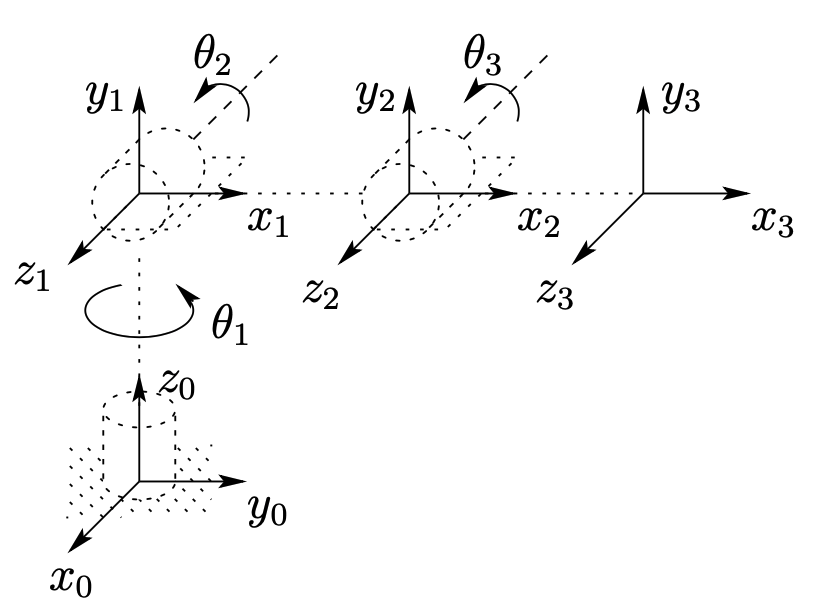
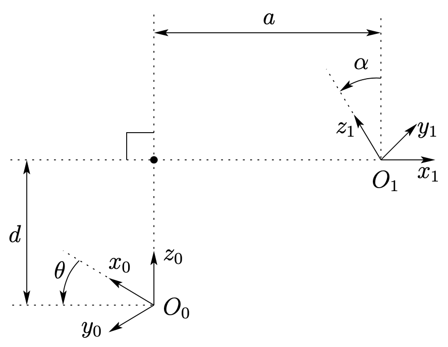
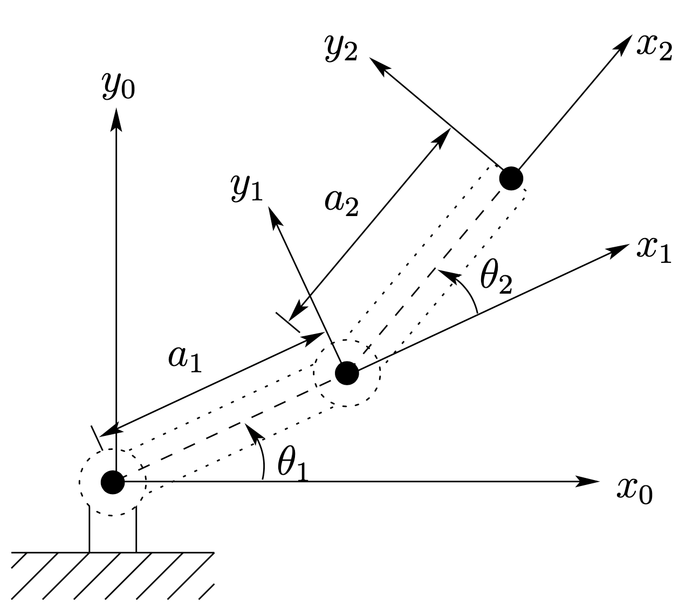

# Robot Dynamics and Control

Notes from the book "Robot Dynamics and Control, 2nd Edition" by Mark W. Spong, Seth Hutchinson, and M. Vidyasagar.

- [Robot Dynamics and Control](#robot-dynamics-and-control)
  - [1 Introduction](#1-introduction)
    - [1.1 Robotics](#11-robotics)
    - [1.2 History of Robotics](#12-history-of-robotics)
    - [1.3 Components and Structure of Robots](#13-components-and-structure-of-robots)
    - [1.4 Outline of the Text](#14-outline-of-the-text)
  - [2 Rigid Motions and Homogeneous Transformations](#2-rigid-motions-and-homogeneous-transformations)
    - [2.1 Representing Positions](#21-representing-positions)
    - [2.2 Representing Rotations](#22-representing-rotations)
    - [2.3 Rotational Transformations](#23-rotational-transformations)
    - [2.4 Composition of Rotations](#24-composition-of-rotations)
    - [2.5 Parametrization of Rotations](#25-parametrization-of-rotations)
    - [2.6 Homogeneous Transformations](#26-homogeneous-transformations)
  - [3 Forward Kinematics: The Denavit-Hartenberg Convention](#3-forward-kinematics-the-denavit-hartenberg-convention)
    - [3.1 Kinematic Chains](#31-kinematic-chains)
    - [3.2 Denavit-Hartenberg Representation](#32-denavit-hartenberg-representation)
    - [3.3 Examples](#33-examples)

## 1 Introduction

### 1.1 Robotics

- Kinematics, dynamics, motion planning, computer vision, and control

### 1.2 History of Robotics

- RIA definition of robot: "A robot is a reprogrammable multifunctional manipulator designed to move material, parts, tools, or specialized devices through variable programmed motions for the performance of a variety of tasks"
- Modern robots came from teleoperators and numerically controlled milling machines

### 1.3 Components and Structure of Robots

- Composed of links connected by joints into a kinematic chain
- Revolute joints (R): rotation about an axis
- Prismatic joints (P): translation along an axis
- **Degrees of freedom** (DOF): number of independent joint variables required to specify the configuration of the robot
  - At least 6 DOF to access any point in 3D space (3 for position, 3 for orientation)
- Workspace: set of all points reachable by the end-effector
  - Reachable workspace: set of all points reachable by the end-effector without considering joint limits
  - Dextrous workspace: set of all points reachable by the end-effector while satisfying joint limits
- Servo robot: robot with closed-loop control
  - Closed-loop control: system output is monitored and used to adjust the input
- **Robotic system consists of: arm, external power source, end-of-arm tooling, external and internal sensors, computer interface, and control computer**
- Controller resolution: smallest increment of control input that can be commanded
- Rotational axes more accumulation of errors than linear axes

### 1.4 Outline of the Text

- Forward kinematics: mapping from joint space to task space
  - Base frame: fixed frame to which all objects are referenced
  - Denavit-Hartenberg equations
- Inverse  kinematics: mapping from task space to joint space
- Velocity kinematics: mapping from joint space to task space velocities
  - Differentiate Denavit-Hartenberg forward kinematics equations
  - Obtain the Jacobian matrix of the manipulator, $J$
  - $\dot{x} = J\dot{\theta} \leftrightarrow \dot{\theta} = J^{-1}\dot{x}$
  - Jacobian without inverse is a singular configuration
- Path Planning
  - Path planning, trajectory generation, trajectory planning
- Vision
  - Camera sensors as opposed to joint sensors
- Dynamics
  - How much force and torque is required to move the robot
- Position control
  - Control algorithms to execute programmed tasks
  - Tracking and disturbance rejection: tracking desired trajectories and rejecting disturbances i.e. friction, noise
- Force control
  - Errors in position could lead to large forces that damage the end-effector
  - Solution is force control, ex. hybrid control, impedance control

## 2 Rigid Motions and Homogeneous Transformations

### 2.1 Representing Positions

- Geometric reasoning
  - Synthetic approach: reason directly about geometric objects (points, lines, planes)
  - Analytic approach: reason about coordinates of points, use algebraic manipulations
- Vectors are invariant w.r.t. coordinate systems, but their representation by coordinates is not
- Need to make all coordinate vectors defined w.r.t. a common frame to perform algebraic manipulations using coordinates

### 2.2 Representing Rotations

- Denote $x_1^0$ as the point $x_1$ expressed in frame $0$
  - If the reference frame is obvious, we can drop the superscript
- Rotation matrix (2D example)
  - $R_1^0 = [x_1^0 | y_1^0] = \begin{bmatrix} \cos\theta & -\sin\theta \\ \sin\theta & \cos\theta \end{bmatrix}$
  - 
- **Dot product of two vectors is the cosine of the angle between them**
  - We can instead project the axis of the $1$ frame onto the $0$ frame
  - $R_1^0 = \begin{bmatrix} x_1 \cdot x_0 & y_1 \cdot x_0 \\ x_1 \cdot y_0 & y_1 \cdot y_0 \end{bmatrix}$
  - Note that if we project $0$ onto $1$, we have $R_0^1 = (R_1^0)^T = (R_1^0)^{-1}$
- Properties of rotation matrices, $n = 2,3$
  - $R\in SO(n)$
  - **Orthogonal**: $R^T = R^{-1}$
  - $\det(R) = 1$
  - Columns are unit length and mutually orthogonal
- **Right hand rule**: thumb points in the direction of the first vector, fingers curl in the direction of the second vector
- **Basic rotation matrix**
  - Subscript denotes rotation axis
  - $R_x(\theta) = \begin{bmatrix} 1 & 0 & 0 \\ 0 & \cos\theta & -\sin\theta \\ 0 & \sin\theta & \cos\theta \end{bmatrix}$, $R_y(\theta) = \begin{bmatrix} \cos\theta & 0 & \sin\theta \\ 0 & 1 & 0 \\ -\sin\theta & 0 & \cos\theta \end{bmatrix}$, $R_z(\theta) = \begin{bmatrix} \cos\theta & -\sin\theta & 0 \\ \sin\theta & \cos\theta & 0 \\ 0 & 0 & 1 \end{bmatrix}$
  - Properties
    - $R_{z,0} = I$
    - $R_{z,\theta}\cdot R_{z,\phi} = R_{z,\theta+\phi}$
    - Implies that $R_{z, \theta}^{{-1}} = R_{z, -\theta}$

### 2.3 Rotational Transformations

- Consider point $p$ in frame $1$, ie.e $p_1$
  - Rotation matrix can transform coordinates from one frame to another
  - $p_0 = R_1^0p_1$, represents the same point $p$ in frame $0$
- We can also use rotation matrices to represent rigid motions in the same frame
  - If point $p_b$ is obtained by rotating the point $p_a$ by $R$, then the coordinates of $p_b$ are $R\cdot p_a$

### 2.4 Composition of Rotations

- **Composition law for rotational transformations**: $R_2^0 = R_1^0\cdot R_2^1$
  - This is rotating from frame $2$ to frame $1$ and then from frame $1$ to frame $0$
  - $p^0 = R_1^0\cdot R_2^1\cdot p^2$
  - Rotational transformations do not commute in general
- Rotation with respect to a **fixed** frame
  - Want to perform sequence of rotations each about the same fixed frame
  - **Reverse order than composition law for rotational transformations**
  - Example
    - $o_0x_0y_0z_0$ is the reference frame
    - $o_1x_1y_1z_1$ is the frame obtained by rotating $o_0x_0y_0z_0$ by $R_1^0$
    - $o_2x_2y_2z_2$ is the frame obtained by rotating $o_1x_1y_1z_1$ **w.r.t. reference frame** (not $o_1x_1y_1z_1$), denote this rotation $R$
    - Let $R_2^0$ be the orientation of $o_2x_2y_2z_2$ w.r.t. $o_0x_0y_0z_0$
      - This matrix is what we want to find
      - By the composition law, $R_2^0 = R_1^0\cdot R_2^1$
      - Need to determine $R_2^1$
      - $R_2^1$ is equivalent to first rotating the $1$ frame to the reference frame, $(R_1^0)^{-1}$, and then rotating the by $R$ to get the $2$ frame from the $1$ frame in the fixed frame, then we must undo the first rotation by $R_1^0$
      - Thus, $R_2^0 = R_1^0\cdot R_2^1 = R_1^0[(R_1^0)^{-1}RR_1^0] = RR_1^0$

### 2.5 Parametrization of Rotations

- We can represent rotations in different ways, only needing three independent parameters
- Euler angles
  - 
  - Successive rotations about the moving axes
  - $(\phi, \theta, \psi)$
    - Rotate about $z$ by $\phi$
    - Rotate about current $y$ by $\theta$
    - Rotate about current $z$ by $\psi$
  - Also denoted $R_1^0 = R_{z,\phi}R_{y,\theta}R_{z,\psi}$
    - See the basic rotation matrices in section [2.2](#22-representing-rotations)
    - Can derive angles from a rotation matrix by expanding the basic rotation matrices and solving for the angles (see book pg. 50)
- Yaw-Pitch-Roll angles
  - 
  - Successive rotations about the fixed axes
  - $(\phi, \theta, \psi)$
    - Rotate about $x_0$ by $\phi$ (yaw)
    - Rotate about $y_0$ by $\theta$ (pitch)
    - Rotate about $z_0$ by $\psi$ (roll)
  - Also denoted $R_1^0 = R_{z,\phi}R_{y,\theta}R_{x,\psi}$
- Axis-Angle representation
  - 
  - Let $k = [k_x, k_y, k_z]^T$ be a unit vector in the $0$ frame and $\theta$ be the angle of rotation
  - Rotation matrix $R_{k, \theta}$
    - To derive this, rotate $k$ into a coordinate axes (say $z_0$), then about $z_0$ by $\theta$, then rotate $k$ back to its original position
    - In the example above, $R_{k, \theta} = R_{z, \alpha}R_{y, \beta}R_{z, \theta}R_{y,-\beta}R_{z,-\alpha}$
    - Since $k$ is a unit vector, we can fine the rotation matrix $R_{k, \theta}$
  - **Any rotatation matrix can be represented by a single rotation about a suitable axis**: $k = [k_x, k_y, k_z]^T$ and angle $\theta$
    - This is four parameters, however, we only need two of the three components of $k$ since $k$ is a unit vector
    - **Can write it as** $r = [r_x, r_y, r_z]^T = [\theta k_x, \theta k_y, \theta k_z]^T$
    - Direction of $r$ is the axis of rotation, magnitude is the angle of rotation
  - Given a rotation matrix $R$
    - $\theta$ = $\cos^{-1}\left(\frac{1}{2}(\text{tr}(R) - 1)\right) = \cos^{-1}\left(\frac{1}{2}(r_{11} + r_{22} + r_{33} - 1)\right)$
    - $k = \frac{1}{2\sin\theta}\begin{bmatrix} r_{32} - r_{23} \\ r_{13} - r_{31} \\ r_{21} - r_{12} \end{bmatrix}$
  - $R_{k, \theta} = R_{-k, -\theta}$

### 2.6 Homogeneous Transformations

- A transformation of the form $p^0 = R_1^0p^1 + d_1^0$ is said to define a **rigid motion** if $R$ is orthogonal
  - Composition of rigid motions is a rigid motion
    - $p^0 = R_1^0p^1 + d_1^0$
    - $p^1 = R_2^1p^2 + d_2^1$
    - $p^0 = R_1^0R_2^1p^2 + R_1^0d_2^1 + d_1^0 = R_2^0p^2 + d_2^0$
      - Where $d_2^0 = R_1^0d_2^1 + d_1^0$
      - Vector from origin of $0$ frame to origin $2$ frame has coordinates given by the sum of $d_1^0$ (vector from $o_0$ to $o_1$ w.r.t. $0$) and the rotated $d_2^1$ (vector from $o_1$ to $o_2$ w.r.t. $0$ after rotation $R_1^0$)
- Rigid motions can be expressed as $H = \begin{bmatrix} R & d \\ 0 & 1 \end{bmatrix}$
  - $0$ and $d$ are vectors, $R$ is a rotation matrix
- This $H$ is called a **homogeneous transformation**
  - Inverse of $H$ is $H^{-1} = \begin{bmatrix} R^T & -R^Td \\ 0 & 1 \end{bmatrix}$
  - Need to augmeent the vectors $p^0$ and $p^1$ with a $1$ to make them homogeneous
  - $P^0 = [p^0; 1]^T$, $P^1 = [p^1; 1]^T$
  - $P^0, P^1$ known as homogeneous representations
- Set of $4\times 4$ matrices $H$ of that form are denoted $E(3)$
- **Basic homogeneous transformations**
  - These generate $E(3)$, the set of all rigid motions
  - $\text{Trans}_{x,a} = \begin{bmatrix} 1 & 0 & 0 & a \\ 0 & 1 & 0 & 0 \\ 0 & 0 & 1 & 0 \\ 0 & 0 & 0 & 1 \end{bmatrix}$, $\text{Trans}_{x,b} = \begin{bmatrix} 1 & 0 & 0 & 0 \\ 0 & 1 & 0 & b \\ 0 & 0 & 1 & 0 \\ 0 & 0 & 0 & 1 \end{bmatrix}$, $\text{Trans}_{x,c} = \begin{bmatrix} 1 & 0 & 0 & 0 \\ 0 & 1 & 0 & 0 \\ 0 & 0 & 1 & c \\ 0 & 0 & 0 & 1 \end{bmatrix}$
  - $\text{Rot}_{x,\alpha} = \begin{bmatrix} 1 & 0 & 0 & 0 \\ 0 & \cos\alpha & -\sin\alpha & 0 \\ 0 & \sin\alpha & \cos\alpha & 0 \\ 0 & 0 & 0 & 1 \end{bmatrix}$, $\text{Rot}_{y,\beta} = \begin{bmatrix} \cos\beta & 0 & \sin\beta & 0 \\ 0 & 1 & 0 & 0 \\ -\sin\beta & 0 & \cos\beta & 0 \\ 0 & 0 & 0 & 1 \end{bmatrix}$,  $\text{Rot}_{z,\gamma} = \begin{bmatrix} \cos\gamma & -\sin\gamma & 0 & 0 \\ \sin\gamma & \cos\gamma & 0 & 0 \\ 0 & 0 & 1 & 0 \\ 0 & 0 & 0 & 1 \end{bmatrix}$
- General homogeneous transformation
  - $H_1^0 = \begin{bmatrix} n_x & s_x & a_x & d_x \\ n_y & s_y & a_y & d_y \\ n_z & s_z & a_z & d_z \\ 0 & 0 & 0 & 1 \end{bmatrix} = \begin{bmatrix} n & s & a & d \\ 0 & 0 & 0 & 1 \end{bmatrix}$
  - $n$ represents the $x$ axis of frame $1$ w.r.t. frame $0$
  - $s$ represents the $y$ axis of frame $1$ w.r.t. frame $0$
  - $a$ represents the $z$ axis of frame $1$ w.r.t. frame $0$
  - $d$ represents the origin of frame $1$ w.r.t. frame $0$
- $E(3)$ has same composition and ordering of transformations as $3\times 3$ rotations

## 3 Forward Kinematics: The Denavit-Hartenberg Convention

### 3.1 Kinematic Chains

- Forward kinematics problem: determine position and orientation of end-effector given joint variables
- Robot manipulator is composed of a set of links connected together by various joints (revolute, prismatic, ball-and-socket, etc.)
- For single DOF joints, the action can be described as one number (angle for revolute, displacement for prismatic)
- Robot manipulator with $n$ joints will have $n+1$ links
  - Joints $1, 2, \ldots, n$ connect links $0, 1, \ldots, n$
  - Joint $i$ connects link $i-1$ to link $i$
  - When joint $i$ is actuated, link $i$ moves (so link $0$ is fixed)
  - **Joint variable $q_i$ describes the $i^{th}$ joint**
  - Attach a coordinate frame $o_ix_iy_iz_i$ to each link $i$
    - The coordinates of each point on link $i$ always constant w.r.t. frame $i$
    - 
  - Inertial frame $o_0x_0y_0z_0$ is fixed
- $A_i$ is the homogeneous transformation matrix that expresses the position and orientation of $o_ix_iy_iz_i$ w.r.t. $o_{i-1}x_{i-1}y_{i-1}z_{i-1}$
  - $A_i$ depends only on the joint variable $q_i$: $A_i = A_i(q_i)$
- **Transformation matrix** $T^i_j$ expresses the position and orientation of $o_jx_jy_jz_j$ w.r.t. $o_ix_iy_iz_i$
  - $T^i_j = A_{i+1}\ldots A_{j}$
  - $T^i_j = I$ if $i = j$
  - $T^i_j = (T^j_i)^{-1}$ if $j > i$
- **Homogeneous transformation matrix**: $H = \begin{bmatrix} R_n^0 & o_n^0 \\ 0 & 1 \end{bmatrix}$
  - $o^0_n \in \mathbb{R}^3$ is the coordinates of the origin of the end effector frame w.r.t. the base frame
  - $R_n^0 \in SO(3)$ is the orientation of the end effector w.r.t. the base frame
  - Then $H = T_n^0 = A_1(q_1)\cdots A_n(q_n)$
- $A_i = \begin{bmatrix} R_i^{i-1} & o_i^{i-1} \\ 0 & 1 \end{bmatrix}$
  - Then $T_j^i = A_{i+1}\cdots A_j = \begin{bmatrix} R_j^i & o_j^i \\ 0 & 1 \end{bmatrix}$
  - $R_j^i = R_{i+1}^i \cdots R_j^{j-1}$
  - Recursively $o_j^i = o_{j-1}^i + R_{j-1}^io_j^{j-1}$ (check this by multiplying the matrices)

### 3.2 Denavit-Hartenberg Representation

- Each homogeneous transformation $A_i$ for link $i$ and joint $i$ is represented as a product of four basic transformations
- $A_i = Rot_{z,\theta_i} Trans_{z,d_i} Trans_{x, a_i} Rot_{x, \alpha_i}$
  - Thus, $A_i = \begin{bmatrix} c_{\theta_i} & -s_{\theta_i} c_{\alpha_i} & s_{\theta_i} s_{\alpha_i} & a_i c_{\theta_i} \\ s_{\theta_i} & c_{\theta_i} c_{\alpha_i} & -c_{\theta_i} s_{\alpha_i} & a_i s_{\theta_i} \\ 0 & s_{\alpha_i} & c_{\alpha_i} & d_i \\ 0 & 0 & 0 & 1 \end{bmatrix}$
  - Where $c_{\theta_i} = \cos\theta_i$, $s_{\theta_i} = \sin\theta_i$
  - $a_i$: link length
  - $\alpha_i$: link twist
  - $d_i$: link offset
  - $\theta_i$: joint angle
  - Three of these four values are fixed for each link ($\theta_i$ varies for revolute joint, $d_i$ varies for prismatic joint)
- Arbitrary homogeneous transformations $H = \begin{bmatrix} R & d \\ 0 & 1 \end{bmatrix} \in \mathbb{R}^{4\times 4}$ need six parameters: three for position and three Euler angles for orientation
  - DH only has four!
  - This is possible due to clever choice of origin and coordinate axes
- DH assumptions
  - **DH1: the axis $x_1$ is perpendicular to the axis $z_0$**
  - **DH2: the axis $x_1$ intersects the axis $z_0$**
  - The coordinate frames below satisfy DH1 and DH2
  - 
  - **Under these conditions, there exists unique $a, d, \theta, \alpha$ such that $A = \begin{bmatrix} R_1^0 & o_1^0 \\ 0 & 1 \end{bmatrix} = Rot_{z,\theta} Trans_{z,d} Trans_{x, a} Rot_{x, \alpha}$**
    - This is proved using the key idea that DH1 implies $x_1 \cdot z_0 = 0$ and DH2 implies the dispacement between $o_0$ and $o_1$ can be expressed as a linear combination of $x_1$ and $z_0$ ($o_1 = o_0 + d z_0 + a x_1$)
  - Physical interpretation (see above figure)
    - $a$: distance between $z_0$ and $z_1$ along $x_1$
    - $\alpha$: angle between $z_0$ and $z_1$ measured in a plane normal to $x_1$
      - Use right hand rule to get the positive direction
    - $d$: distance between $o_0$ and the intersection of $x_1$ and $z_0$ along $z_0$
    - $\theta$: angle between $x_0$ and $x_1$ measured in a plane normal to $z_0$
      - Use right hand rule to get the positive direction
- Assigning the coordinate frames
  - We can always choose frames for each link such that DH1 and DH2 are satisfied for any manipulator
  - **These choices are not unique, but the end matrix $T_n^0$ will be the same**
  - The final coordinate system $o_nx_ny_nz_n$ is the end effector or tool frame
  - **Steps**
    - Step 1: locate a label the joint axes $z_0, z_1, \ldots, z_{n-1}$
    - Step 2: Establish the base frame, setting the origin anywhere on the $z$ axis then choosing $x_0$ and $y_0$ to form a right-handed coordinate system
    - For $i = 1, \ldots, n-1$
      - Step 3: Locate the origin $o_i$ of where the common normal to $z_{i-1}$ and $z_i$ intersects $z_i$ (if $z_{i-1}$ and $z_i$ are nto coplanar). If they intersect, $o_i$ is at the intersection. If they are parallel, $o_i$ is at any convenient location along $z_i$
      - Step 4: Choose $x_i$ to be the common normal to $z_{i-1}$ and $z_i$ through $o_i$. If $z_{i-1}$ and $z_i$ intersect, $x_i$ is along the direction normal to the $z_{i-1} - z_i$ plane
      - Step 5: Choose $y_i$ to complete the right-handed coordinate system
    - Step 6: Establish end-effector frame $o_nx_ny_nz_n$ at the end of the manipulator
    - Step 7: Create table of link parameters $a_i, \alpha_i, d_i, \theta_i$ for $i = 1, \ldots, n$
    - Step 8: Write the transformation matrix $A_i$ for each link. Recall each $A_i$ is a function of a single joint variable
    - Step 9: Compute the transformation matrix $T_n^0 = A_1\cdots A_n$, giving the position and orientation of the end effector frame w.r.t. the base frame

### 3.3 Examples

- Planar elbow manipulator
- 
- Link parameters
  - $a_1 = a_1$, $\alpha_1 = 0$, $d_1 = 0$, $\theta_1 = \theta_1$
  - $a_2 = a_2$, $\alpha_2 = 0$, $d_2 = 0$, $\theta_2 = \theta_2$
  - The only variables are $\theta_1, \theta_2$
