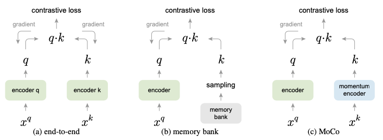
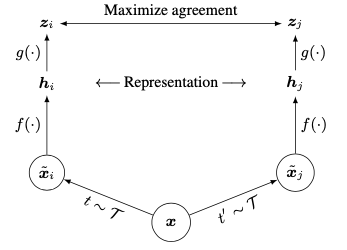
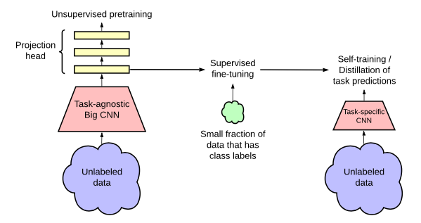

# Video2Reward

## Background

- Supervised learning
  - Labelled data, requires human annotation
- Unsupervised learning
  - No labelled data, learn from data itself
  - Pretext task: task solved not for genuine interest but to learn useful representations
  - Generative learning
    - Learn the distribution of the data
    - Autoencoders, GANs
  - Discriminative learning
    - Learning the decision boundary between classes
    - Clustering, PCA, t-SNE
  - Contrastive learning
    - Learn a representation space where similar instances are brought closer together while dissimilar instances are pushed apart
    - Siamese networks, SimCLR
- Representation learning
  - Represent raw data in a format that is easier for ML algorithms to work with
  - Unsupervised representation learning
    - Automatic feature extraction from raw data
    - Autoencoders, GANs, VAEs, dimensionality reduction, etc.

## Literature

### (Nov 2019) MoCo: Momentum Contrast for Unsupervised Visual Representation Learning

[Code](https://github.com/facebookresearch/moco)

- Introduction
  - Unsupervised representation learning successful in NLP but not in vision
  - Maintain the dictionary as a queue of data samples: the encoded repre- sentations of the current mini-batch are enqueued, and the oldest are dequeued
  - A slowly progressing key encoder, implemented as a momentum-based moving average of the query encoder, is proposed to maintain consistency
  - A query matches a key if they are encoded views (e.g., different crops) of the same image
- Method
  - **Contrastive learning as dictionary look-up**
  - Consider an encoded query $q$ and set of encoded samples $\{k_0, k_1, k_2, \ldots\}$ that are the keys of a dictionary
  - Assume that there is a single key (denoted as $k^+$) in the dictionary that $q$ matches
  - A contrastive loss is a function whose value is low when $q$ is similar to its positive key $k^+$ and dissimilar to all other keys (considered negative keys for $q$)
  - InfoNCE loss: $\mathcal{L} = -\log\frac{\exp(q\cdot k^+/\tau)}{\sum_{k\in\mathcal{K}}\exp(q\cdot k/\tau)}$
    - $\tau$ is a temperature parameter
  - Momentum contrast
    - Queue of data samples can be much larger than a mini-batch (size is hyperparameter), older samples are dequeued as they are the most outdated keys
    - Momentum update: $\theta_k \leftarrow m\theta_k + (1-m)\theta_q$
      - $\theta_k$ is the key encoder's ($f_k$) parameters
      - $\theta_q$ is the query encoder's ($f_q$) parameters
      - $m$ is the momentum coefficient, empirically, larger (slowly evolving key encoder) is better
    - 
  - Pretext task: query and key are positive pair if they originate from the same image, negative otherwise
    - Take two random crops of image under random augmentation as positive pair
  - Use ResNet as encoder
  - Batchnorm prevents good representations: use shuffling BN

### (Feb 2020) SimCLR: A Simple Framework for Contrastive Learning of Visual Representations

[Code](https://github.com/google-research/simclr)

[Blog](https://research.google/blog/advancing-self-supervised-and-semi-supervised-learning-with-simclr/)

- Introduction
  - Data augmentation improves unsupervised constrastive learning
  - Learnable nonlinear transformation between representation and contrastive loss improves learned representations
  - Representation learning with contrastive cross-entropy loss benefits from normalized embeddings and temperature param
  - Contrastive learning benefits from larger batch sizes and longer training compared to supervised counterpart
- Method
  - SimCLR learns representations by maximizing agreement between differently augmented views of the same data instance via a contrastive loss in the latent space
  - Framework
    - **Data augmentation** to generate positive pairs
    - **Base encoder** $f(\cdot)$ to extract representation vectors: ResNet
    - **Projection head** $g(\cdot)$ to map representations to a space where contrastive loss is applied: MLP, 1 hidden layer
      - This is discarded after pretraining
    - 
    - **Contrastive loss function**: attempt to identify the positive pair from a set of examples (treat ALL others as negative)
      - $\text{sim}(u, v) = \frac{u^Tv}{\|u\|\|v\|}$ cosine similarity
      - For a positive pair of examples $(i, j)$, NT-Xent (normalized temperature-scaled cross-entropy loss) is used
      - $l_{i,j} = -\log\left(\frac{\exp(\text{sim}(z_i, z_j)/\tau)}{\sum_{k=1}^{2N}\mathbb{1}_{[k\neq i]}\exp(\text{sim}(z_i, z_k)/\tau)}\right)$
        - $\tau$ is the temperature parameter, higher temperature leads to softer probability distribution
        - $z_i = g(f(x_i))$ is the projection of the representation of $x_i$
  - Training and Evaluation
    - No memory bank (to store embeddings of past data samples)
    - Batch size $N$ gives $2N-2$ negative examples per positive pair
    - LARS optimizer: Layer-wise Adaptive Rate Scaling
- Data Augmentation for Contrastive Representation Learning
  - Composition of multiple augmentations
  - Crop, resize, rotate, cutout, color distort, sobel, Gaussian blur
  - **No single transformation suffices to learn good representations**
- Architectures for Encoder and Head
  - Unsupervised learning benefits more from bigger models than its supervised counterpart
  - **The hidden layer before the projection head is a better representation than the layer after, i.e. $h = f(x)$ is better than $z = g(h)$**
    - Projection head $g$ is discarded after pretraining
    - Possible reason: the importance of using the representation before the nonlinear projection is due to loss of information induced by the contrastive loss
    - $g$ is trained to be invariant to data transformation, so it can remove information that may be useful for the task like color or orientation of objects

### (Jun 2020) SimCLRv2: Big Self-Supervised Models are Strong Semi-Supervised Learners

[Code](https://github.com/google-research/simclr)

- Introduction
  - Unsupervised pretrain, supervised fine-tune
  - For semi-supervised learning, the fewer the labels, the more it benefits from a bigger model
- Method
  - Stages
    - **Pretrain**: first stage of unlabeled data, task-agnostic pretraining, learn general visual representations
    - **Fine-tune**: then, general representations are fine-tuned on a small labeled dataset
    - **Distill**: second stage of unlabled data, task-specific pretraining, learn task-specific representations
    - 
  - Improvement over SimCLR
    - Larger models (deeper but less wide)
    - Increase capacity of non-linear projection head, $g(\cdot)$, recall that it was an MLP with 1 hidden layer in SimCLR
      - Also don't discard the projection head after pretraining, instead fine-tune from a middle layer
    - Incorporate memory mechanism of MoCo
  - Fine-tuning
    - Fine-tune from a middle layer of the projection head instead of the input layer of the projection head as in SimCLR
  - Knowledge distillation
    - Use the fine-tuned network as a teacher to assign labels for training a student network
      - **A teacher-assigned soft label for an image is a probability distributions over the classes**
    - Student network an be a smaller version of the teacher network with the same performance
    - Self-distillation: student is the same architecture as the teacher
    - $\mathcal{L}^{\text{distill}} = -\sum_{x_i\in\mathcal{D}}\left [\sum_{y}P^T(y|x_i;\tau)\log P^S(y|x_i;\tau)\right]$
      - $P^T(y|x_i)$ is the teacher's output, fixed during training
      - $P^T(y|x_i; \tau) = \exp(f^{\text{task}}(x_i) [y]/\tau)/\sum_{y'}\exp(f^{\text{task}}(x_i) [y']/\tau)$
      - $P^S(y|x_i)$ is the student's output, learned during training
  - Discussion
    - Bigger models, which could easily overfit with few labelled examples, actually generalize better
    - Findings can be used to improve accuracy in any application of computer vision where it is more expensive or difficult to label additional data than to train larger models
