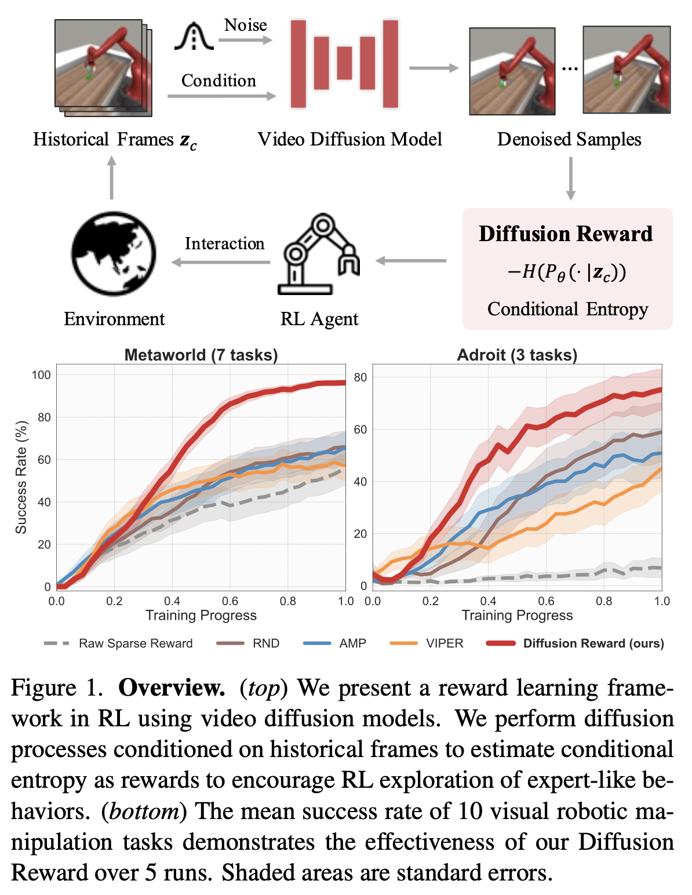

# Video2Reward

- [Video2Reward](#video2reward)
  - [Background](#background)
  - [Literature](#literature)
    - [(Apr 2017) TCN: Time-Contrastive Networks: Self-Supervised Learning from Video](#apr-2017-tcn-time-contrastive-networks-self-supervised-learning-from-video)
    - [(Jul 2021) DrQ-v2: Mastering Visual Continuous Control: Improved Data-Augmented Reinforcement Learning](#jul-2021-drq-v2-mastering-visual-continuous-control-improved-data-augmented-reinforcement-learning)
    - [(Sep 2022) VIP: Towards Universal Visual Reward and Representation via Value-Implicit Pre-Training](#sep-2022-vip-towards-universal-visual-reward-and-representation-via-value-implicit-pre-training)
    - [(Nov 2022) HOLD: Learning Reward Functions for Robotic Manipulation by Observing Humans](#nov-2022-hold-learning-reward-functions-for-robotic-manipulation-by-observing-humans)
    - [(May 2023) VIPER: Video Prediction Models as Rewards for Reinforcement Learning](#may-2023-viper-video-prediction-models-as-rewards-for-reinforcement-learning)
    - [(Oct 2023) UVD: Long-Horizon Manipulation Made Easy](#oct-2023-uvd-long-horizon-manipulation-made-easy)
    - [(Dec 2023) Diffusion Reward: Learning Rewards via Conditional Video Diffusion](#dec-2023-diffusion-reward-learning-rewards-via-conditional-video-diffusion)
    - [(Feb 2024) VPDD: Large-Scale Actionless Video Pre-Training via Discrete Diffusion for Efficient Policy Learning](#feb-2024-vpdd-large-scale-actionless-video-pre-training-via-discrete-diffusion-for-efficient-policy-learning)
    - [(Apr 2024) Rank2Reward: Learning Shaped Reward Functions from Passive Video](#apr-2024-rank2reward-learning-shaped-reward-functions-from-passive-video)

## Background

- Supervised learning
  - Labelled data, requires human annotation
- Unsupervised learning
  - No labelled data, learn from data itself
  - Pretext task: task solved not for genuine interest but to learn useful representations
  - Generative learning
    - Learn the distribution of the data
    - Autoencoders, GANs
  - Discriminative learning
    - Learning the decision boundary between classes
    - Clustering, PCA, t-SNE
  - Contrastive learning
    - Learn a representation space where similar instances are brought closer together while dissimilar instances are pushed apart
    - Siamese networks, SimCLR
- Representation learning
  - Represent raw data in a format that is easier for ML algorithms to work with
  - Unsupervised representation learning
    - Automatic feature extraction from raw data
    - Autoencoders, GANs, VAEs, dimensionality reduction, etc.
- Reinforcement learning
  - Learn a policy that maximizes the expected reward
  - Offline RL: learn a policy from a fixed dataset of transitions rather than interacting with the environment
  - Sparse reward: agent recieves non-zero rewards infrequently
  - Dense reward: agent recieves non-zero rewards frequently, i.e. frequent feedback for most actions

## Literature

### (Apr 2017) TCN: Time-Contrastive Networks: Self-Supervised Learning from Video

[Code](https://github.com/kekeblom/tcn), [Website](https://sermanet.github.io/imitate/)

### (Jul 2021) DrQ-v2: Mastering Visual Continuous Control: Improved Data-Augmented Reinforcement Learning

[Code](https://github.com/facebookresearch/drqv2)

### (Sep 2022) VIP: Towards Universal Visual Reward and Representation via Value-Implicit Pre-Training

[Code](https://github.com/facebookresearch/vip), [Website](https://sites.google.com/view/vip-rl), [Video](https://www.youtube.com/watch?v=K9aKAoLI-ss)

- Introduction
  - Learning from humans does not require intensive robotic data collection
  - A key unsolved problem to pre-training for robotic control is the challenge of reward specification
  - Conditioned on goal image
  - **Instead of solving the impossible primal problem of direct policy learning from out-of-domain, action-free videos, we can instead solve the Fenchel dual problem of goal-conditioned value function learning**
  - VIP is able to capture a general notion of goal-directed task progress that makes for effective reward-specification for unseen robot tasks specified via goal images
- Problem setting
  - Assume access to training video data $D = \{v_i = (o_1^i, o_2^i, \ldots, o_T^i)\}_{i=1}^N$
    - $o_t^i\in O := \mathbb{R}^{H\times W \times 3}$ is the observation at time $t$ in video $i$
    - Assume $D$ does not include any robotic or domain-specific actions
  - A learning algorithm $\mathcal{A}$ takes in training data and outputs **visual encoder** $\phi := \mathcal{A}(D) : \mathbb{R}^{H\times W \times 3} \rightarrow K$
    - $K$ is the embedding space dimension
  - **Reward function** for a given transition tuple $(o_t, o_{t+1})$ and goal image $g$
    - $R(o_t, o_{t+1}; \phi, \{g\}) := \mathcal{S}_{\phi}(o_{t+1}; g) - \mathcal{S}_{\phi}(o_t, g)$
    - $\mathcal{S}_{\phi}(o_t; g)$ is a distance function on the $\phi$-representation space
    - $\mathcal{S}_{\phi}(o_t; g) := -\|\phi(o) - \phi(g)\|_2$
  - Parameters of $\phi$ are frozen during policy learning
    - Want to learn a policy $\pi:\mathbb{R}^K \rightarrow A$ that output action based on embedded observation
- 
- Value-Implicit Pre-Training
  - Human videos naturally contain goal-directed behavior
  - Solve an offline goal-conditioned RL problem over the space of human policies and then extract the learned visual representation
  - KL-regularized offline RL objective
  - $\max_{\pi_{H, \phi}} E_{\pi_H}\left [\sum_t \gamma^t r(o;g)\right ] - D_{\text{KL}}\left (d^{\pi_H}(o; a^H; g) || d^D(o, \tilde{a}^H; g)\right )$
    - $r(o; g)$ is the reward function
    - $d^{\pi_H}(o; a^H; g)$ is the distribution over observations and actions $\pi_H$ visits conditioned on goal $g$
    - Dummy action $\tilde{a}$ is added to every transition $(o_h^i, \tilde{a}_h^i, o_{h+1}^i)$ in the dataset $D$ so that KL regularization is well defined
    - $\tilde{a}_i^h$ can be thought of as the unobserved true human action taken to transition from $o_h^i$ to $o_{h+1}^i$
    - This objective is implausible because the offline dataset $D^H$ does not contain any actions labels, nor can $A^H$ be concretely defined in practice
  - **Take the Fenchel dual of this objective, which does not contain any actions (see paper pg. 4)**
    - The algorithm simplifies this dual and samples subtrajectories
    - Then computes the objective value $\mathcal{L}(\phi)$ with architecture $\phi$
    - Then updates $\phi$ weights with SGD: $\phi \leftarrow \phi - \alpha \nabla_{\phi}\mathcal{L}(\phi)$
- Experiments
  - Uses standard ResNet-50 as the visul encoder
  - Evaluate against RM3 pre-trained on Ego4D, supervised ResNet, self-supervised ResNet with MoCo pretraining, CLIP, and also VIP with sparse reward
  - FrankaKitchen dataset
  - **VIP with sparse reward fails to solve any task: necessity of dense reward**
  - VIP on real-world robots works, showing that learning from in-the-wild human videos can be effective for robotic control
  - We hypothesize that VIP learns the most temporally smooth embedding that enables effective zero-shot reward-specification

### (Nov 2022) HOLD: Learning Reward Functions for Robotic Manipulation by Observing Humans

[Code](https://github.com/minttusofia/hold-rewards), [Website](https://sites.google.com/view/hold-rewards), [Video](https://www.youtube.com/watch?v=t6g3Em4HDwI)

- Introduction
  - We propose two methods for scoring states relative to a goal image: through direct temporal regression, and through distances in an embedding space obtained with time-contrastive learning
  - By conditioning the function on a goal image, we are able to reuse one model across a variety of tasks
  - Use of videos of people solving manipulation tasks to learn a notion of distance between images from the observation space of a task
  - The learned distance function captures roughly how long it takes for an expert to transition from one state to another
  - Model-free RL typically requires extensive data collection in robot action space
    - Propose to learn a state-value function from observation-only data
- Method
  - Functional distances from observation-only data
    - **Goal is to learn functional distance $d(s, g)$ between image $s$ of current state and goal image $g$**
    - This should correlate with $\delta (s, g)$, the nuber of time steps it takes for an expert $\pi^*$ to reach goal $g$ from the state $s$
  - We assume access to a dataset of $N$ video demonstrations of humans executing a variety of manipulation tasks using approximately shortest paths
    - Although the absolute length of such time intervals may not be consistent across demonstrators, their relative durations provide a useful learning signal
  - 
  - Two methods for learning $d$ from this data
    - **Direct regression (HOLD-R)**
      - $\theta^* = \arg\min \sum_{i=1}^N \sum_{t=1}^{T_i} \sum_{\delta = 1}^{T_i - t} \|d_{\theta}(s^i_t, s^i_{t+\delta}) - \delta \|^2_2$
      - $s_t^i$ is the image at time $t$ in video $i$
      - $T_i$ is the length of video $i$
      - $d_{\theta}$ is the learned distance function trained to predict $\delta$
      - The third summation corresponds to data augmentation allowing any future time step in the video to be considered the goal rather than only the last
    - **Time-contrastive embeddings (HOLD-C)**
      - Directly predicting time intervals can be difficult and sensitive to noise
      - Use single-view time-contrastive objective like [TCN](#apr-2017-tcn-time-contrastive-networks-self-supervised-learning-from-video) to learn an embedding space where the distance between two images is proportional to the time it takes to transition between them
      - Advantages over TCN
        - HOLD enables the robot to outperform the human demonstrator while TCN tries to mimic the demonstrator 1:1
        - HOLD requires less supervision: only the goal image, not the full trajectory
        - HOLD uses simpler Euclidean distance in the embedding space rather than mixture of Euclidean and Huber style loss
  - Policy learning
    - **Although their reward function is goal conditioned and shared across tasks, they still learn a separate policy for each task**
    - Reward function: $r(s_t, a_t, s_{t+1}, g) = -\max (0, d(s_{t+1}, g) - d(g, g))/T$
    - Subtracting $d(g,g)$ ensures that the reward is zero when the goal is reached (this value may be positive due to untrimmed training videos) and no other state has higher reward
  - Experimental results
    - Dataset: Something-Something V2 (220k video clips of 174 human action classes)
    - Training details
      - Two sizes of network: ResNet-50 and Video Vision Transformer (ViViT)
      - For HOLD-C, pretrain on ImageNet-21k
    - Policy learning
      - Pushing an drawer opening task from RLV
      - Close drawer, push cup forward, turn faucet right task from DVD
      - Soft Actor-Critic as the RL algorithm
      - **Augment learned reward with sparse task reward, 1 for success, 0 otherwise**
        - This improves the base learned reward function
    - Outperforms TCN and R3M rewards on both RLV tasks

### (May 2023) VIPER: Video Prediction Models as Rewards for Reinforcement Learning

[Code](https://github.com/Alescontrela/viper_rl), [Website](https://www.escontrela.me/viper/)

### (Oct 2023) UVD: Long-Horizon Manipulation Made Easy

[Code](https://github.com/zcczhang/UVD/?tab=readme-ov-file#Usage), [Website](https://zcczhang.github.io/UVD/)

### (Dec 2023) Diffusion Reward: Learning Rewards via Conditional Video Diffusion

[Code](https://github.com/TEA-Lab/diffusion_reward), [Website](https://diffusion-reward.github.io/)

- Introduction
  - Designing dense rewards for RL is hard
    - Sparse rewards less effort but worse performance
    - Solution: learn from expert (but unlabeled) videos
  - Diffusion Reward leverages conditional video diffusion models to capture the expert video distribution and extract dense rewards
    - Our key insight is that higher generative diversity is observed when conditioned on expert-unlike videos, while lower given expert videos.
  - **Generative models can extract rewards unsupervisedly without future information like goal frame**
- Preliminaries
  - Finite-horizon MDP: $(\mathcal{S}, \mathcal{A}, \mathcal{T}, \mathcal{R}, \gamma)$
    - $\mathcal{S}$ is the state space
    - $\mathcal{A}$ is the action space
    - $\mathcal{T}$ is the transition function
    - $\mathcal{R}$ is the reward function
    - $\gamma$ is the discount factor
  - Goal: learn a policy $\pi$ that maximizes the expected return $J(\pi) = E_{\tau\sim\pi}[\sum_{t=0}^T\gamma^t r(s_t, a_t)]$
  - Expert videos: $\mathcal{D} = \{\mathcal{D}^1, \mathcal{D}^2, \ldots, \mathcal{D}^N\}$
    - Each $\mathcal{D}^i$ is a set fof demonstrated videos from task $i$, containing multiple expert trajectories $\tau^i$
- Method
  - High level: leverage entropy information from video diffusion models pre-trained on expert videos to encourage RL agents to explore expert-like trajectories more
  - 
  - **Diffusion model**: probabilistic models that aim to model data distribution by gradually denoising a normal distribution through a reverse diffusion process
    - Latent diffusion process
      - Train unsupervised encoder from expert videos to compress high-dimensional observation with VQ-GAN
    - Condition on historical frames to utilize temporal information
      - Can be viewed as matching the distribution of expert and agent trajectories
  - Conditional entropy as rewards
    - Previous studies like [VIPER](#may-2023-viper-video-prediction-models-as-rewards-for-reinforcement-learning) use log-likelihood as rewards
      - This struggles with accurately modeling the expert distribution with intricate dynamics
      - Out-of distribution learned rewards drop
    - **Diffusion reward key idea: increased generation diversity with unseen historical observations, reduced with seen ones**
      - Diffusion conditioned on expert-like trajectories exhibits lower diversity where the agent ought to be rewarded more and vice versa
      - Estimate negative conditional entropy given historical frames
    - **Diffusion reward**: $r^{\text{diff}} = (1-\alpha)\bar{r}^{\text{ce}} + \alpha\bar{r}^{\text{rnd}} + r^{\text{spar}}$
      - $\bar{r}^{\text{ce}}$ is the conditional entropy reward
      - $\bar{r}^{\text{rnd}}$ is the random reward to encourage exploration
      - $r^{\text{spar}}$ is the raw sparse reward to guide the agent to the goal
- Experiments
  - 7 tasks from MetaWorld, 3 from Adroit
  - Baselines
    - Raw sparse reward: uses environment's sparse reward
    - [RND](https://arxiv.org/abs/1810.12894), [AMP](https://arxiv.org/abs/2104.02180), [VIPER](https://arxiv.org/abs/2305.14343)
  - All methods use DrQv2 as the RL backbone

### (Feb 2024) VPDD: Large-Scale Actionless Video Pre-Training via Discrete Diffusion for Efficient Policy Learning

[Website](https://video-diff.github.io/)

### (Apr 2024) Rank2Reward: Learning Shaped Reward Functions from Passive Video

[Code](https://github.com/dxyang/rank2reward/), [Website](https://rank2reward.github.io/)

- Introduction
  - Challenges in inverse RL
    - Requires demonstration data with state-action tuples
    - Learned reward functions may explain expert data well but not be "well-shaped" for exploration
  - **Key assumption: video demonstrations typically make monotonic progress towards a goal**
  - Ranking function to predict the relative progress between two video frames
  - Ranking function trained on only expert data
    - To account for out-of-distribution data, train a seperate discriminator model during policy rollout to differentiate expert and non-expert data
- Related works
  - Inverse RL
    - Reward functions poorly shaped
    - Rank2Reward learns a well-shaped reward function
  - Imitation from observation
    - [Time-Contrastive Networks](#apr-2017-tcn-time-contrastive-networks-self-supervised-learning-from-video) learns representation from contrastive learning across time and viewpoints
      - Their embedding space does not contain a notion of progress towards a goal
      - They rely on tracking a specific expert trajectory which requires temporal alignment
    - **Rank2Reward learns an ordering space that both encodes progress towards a goal and is agnostic to time required to reach the state**
- Method
  - Learning a measure of progress by ranking
    - True reward (unknown) $r(s, a) > \epsilon$ where $\epsilon > 0$ for all tasks
    - Progress along a trajectory can be measured by simply learning a function that can rank different image frames in a trajectory according to their temporal ordering
    - Learn utility function $\hat{u}(s)$ of states
      - Bradley-Terry model aims to learn this utility function suck that the likelihood of preferring a state $s^k_i$ over $s^k_j$ for some expert trajectory $\tau_k$ is given by $p(s_i^k > s_j^k) = \frac{\exp(\hat{u}(s_i^k))}{\exp(\hat{u}(s_i^k)) + \exp(\hat{u}(s_j^k))}$
      - In expert dataset $\mathcal{D}^e$, along $\tau_k$, $s_i^k$ is preferred to $s_j^k$ if it occurs later (i.e. $i > j$, so $\hat{u}(s_i^k) > \hat{u}(s_j^k)$)
    - Setting $\hat{u}(s_0) = 0$, $p(s>s_0) = \frac{1}{1 + \exp(-\hat{u}(s))}$
      - **Denote this "likelihood of making progress" as $p_{RF}(s)$**
    - Learns a monotonically-increasing utility function
  - 
  - Incorporating learned rankings into policy optimization
    - Since the reward function $\hat{r}(s)$ has only been learned on expert dataset, it may overestimate rewards at other states leading to incorrect policies
    - **Pessimistic policy objective:** $\max_{\pi} E_{s\sim d^{\pi}, a\sim \pi(a|s)}[\log p_{RF}(s)] - \alpha D_{KL}(d^{\pi}(s), d^{e}(s))$
      - The state marginal distribution $d^{\pi}(s)$ gives the probability of being in state $s$ when following policy $\pi$
      - First part aims to maximize likelihood of progress
      - Second part is a KL divergence between the state distribution of the policy and the expert
      - $D_{KL}(d^{\pi}(s), d^{e}(s)) = E_{s\sim d^{\pi}}\left [\log \frac{d^{\pi}(s)}{d^{e}(s)}\right ]$
      - Objective to make this divergence small, which means the policy $d^{\pi}(s)$ is close to the expert $d^{e}(s)$
    - $d^e(s) and d^{\pi}(s)$ are not known, so a classifier $D_{\phi}(s)$ is trained to distinguish between the expert and policy states, providing $\frac{d^{\pi}(s)}{d^{e}(s)} \approx \frac{D_{\phi}(s)}{1-D_{\phi}(s)}$
  - **Thus, final objective is** $\max_{\pi} E_{s, a\sim d^{\pi}}\left [\log \left (p_{RF}(s)\left (\frac{D_{\phi}(s)}{1-D_{\phi}(s)} \right )^{\alpha} \right ) \right ]$
    - In training, alternate between:
      - Training classifier $D_{\phi}$ between states in expert video vs. on-policy data
      - Perform policy obtimization with the classifier $D_{\phi}$ and the learned ranking function $p_{RF}$ to get the reward $\hat{r}(s) = \log p_{RF}(s) + \alpha\left (\log (D_{\phi}(s)) - \log (1-D_{\phi}(s)) \right )$
    - Can learn the ranking component $p_{RF}(s)$ offline with only expert data, independent of the policy
- Experimental results
  - Simulated experiments
    - [Meta-world simulator](https://meta-world.github.io/)
    - Tasks: reach, push, hammer, drawer open, door open, door close, button press, assembly
    - Baselines
      - [GAIL](https://arxiv.org/abs/1606.03476), [AIRL](https://arxiv.org/abs/1710.11248), [VICE](https://arxiv.org/abs/1805.11686), [SOIL](https://arxiv.org/abs/2004.04650), [TCN](https://arxiv.org/abs/1704.06888), [ROT](https://arxiv.org/abs/2206.15469)
      - Ranking only: ablation study with only ranking function, no adversarial training
  - Real-world experiments
    - 5 DoF xArm5
    - End-effector position control where action space is normalized delta positions
    - Purely image based observations
    - 6 real-world tasks: reach, push, push with obstacles, drawer opening, sweeping, drawing
  - Ego4D experiments
    - [Ego4D](https://ego4d-data.org/)
    - Utilize the last frame as the goal frame and learn a ranking component conditioned on the goal frame
    - Discriminator training: positive example from same clip as goal, negative example from different clip
    - Evaluate with "true goal" from same clip and "counterfactual goal" from different clip
      - Reward function increases with true goal
      - Reward function is non-monotonic with counterfactual goal and has lower value
- Limitations and future work
  - Embodiment shift between human demonstrations and robot manipulators
  - Rewards are trained on single-task, and it would be hard to have a different reward and agent for every task
  - Classifier $D_{\phi}$ is sensitive to changes in the background and dynamic scenes
