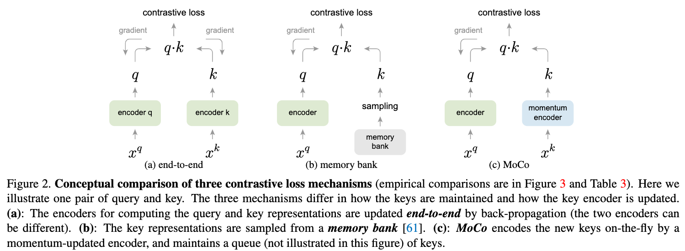
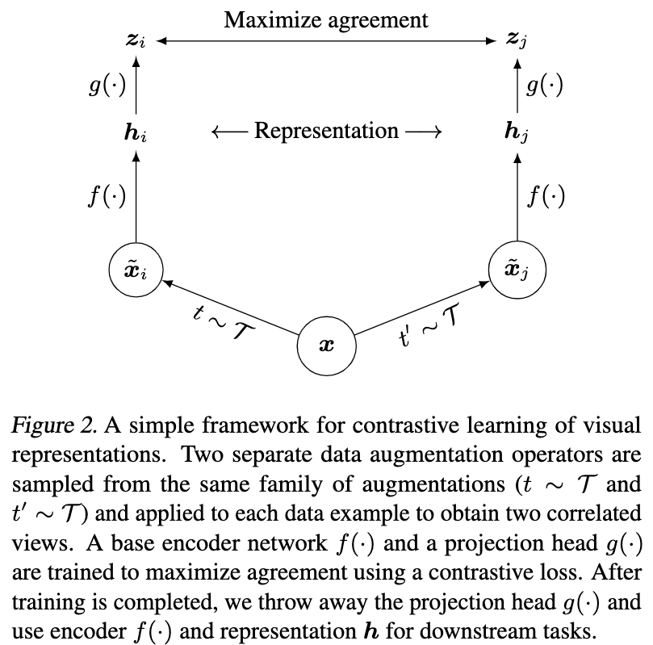
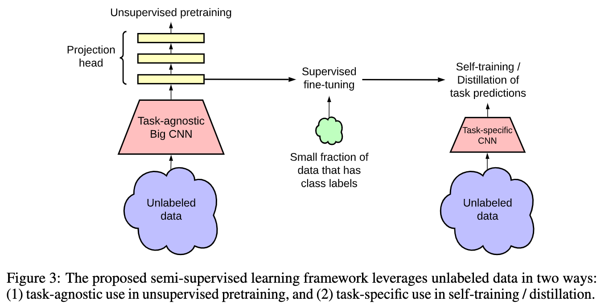
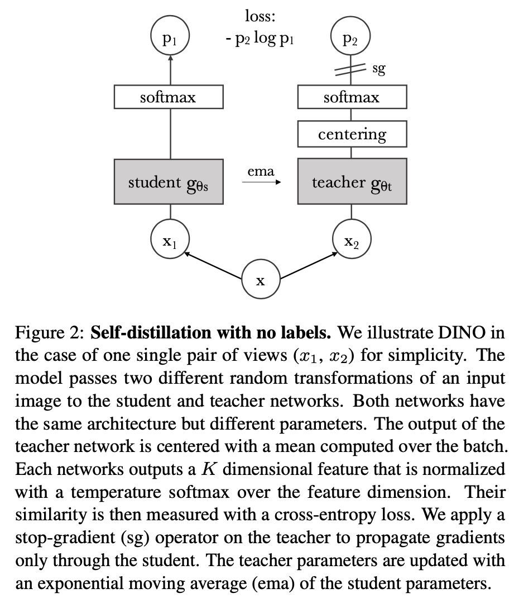
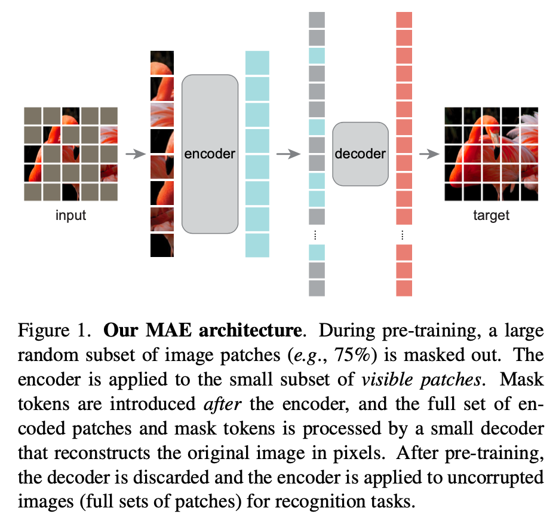
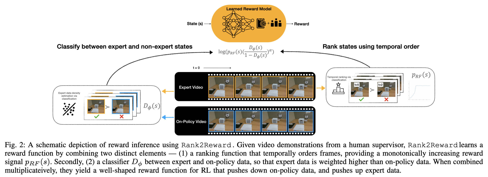

# Video2Reward

- [Video2Reward](#video2reward)
  - [Background](#background)
  - [Literature](#literature)
    - [(Apr 2017) TCN: Time-Contrastive Networks: Self-Supervised Learning from Video](#apr-2017-tcn-time-contrastive-networks-self-supervised-learning-from-video)
    - [(Nov 2019) MoCo: Momentum Contrast for Unsupervised Visual Representation Learning](#nov-2019-moco-momentum-contrast-for-unsupervised-visual-representation-learning)
    - [(Feb 2020) SimCLR: A Simple Framework for Contrastive Learning of Visual Representations](#feb-2020-simclr-a-simple-framework-for-contrastive-learning-of-visual-representations)
    - [(Jun 2020) SimCLRv2: Big Self-Supervised Models are Strong Semi-Supervised Learners](#jun-2020-simclrv2-big-self-supervised-models-are-strong-semi-supervised-learners)
    - [(Apr 2021) DINO: Emerging Properties in Self-Supervised Vision Transformers](#apr-2021-dino-emerging-properties-in-self-supervised-vision-transformers)
    - [(Jul 2021) DrQ-v2: Mastering Visual Continuous Control: Improved Data-Augmented Reinforcement Learning](#jul-2021-drq-v2-mastering-visual-continuous-control-improved-data-augmented-reinforcement-learning)
    - [(Nov 2021) MAE: Masked Autoencoders Are Scalable Vision Learners](#nov-2021-mae-masked-autoencoders-are-scalable-vision-learners)
    - [(Sep 2022) VIP: Towards Universal Visual Reward and Representation via Value-Implicit Pre-Training](#sep-2022-vip-towards-universal-visual-reward-and-representation-via-value-implicit-pre-training)
    - [(Nov 2022) HOLD: Learning Reward Functions for Robotic Manipulation by Observing Humans](#nov-2022-hold-learning-reward-functions-for-robotic-manipulation-by-observing-humans)
    - [(Jan 2023) I-JEPA: Self-Supervised Learning from Images with a Joint-Embedding Predictive Architecture](#jan-2023-i-jepa-self-supervised-learning-from-images-with-a-joint-embedding-predictive-architecture)
    - [(May 2023) VIPER: Video Prediction Models as Rewards for Reinforcement Learning](#may-2023-viper-video-prediction-models-as-rewards-for-reinforcement-learning)
    - [(Apr 2023) DINOv2: Learning Robust Visual Features without Supervision](#apr-2023-dinov2-learning-robust-visual-features-without-supervision)
    - [(Oct 2023) UVD: Long-Horizon Manipulation Made Easy](#oct-2023-uvd-long-horizon-manipulation-made-easy)
    - [(Dec 2023) Diffusion Reward: Learning Rewards via Conditional Video Diffusion](#dec-2023-diffusion-reward-learning-rewards-via-conditional-video-diffusion)
    - [(Feb 2024) V-JEPA: Revisiting Feature Prediction for Learning Visual Representations from Video](#feb-2024-v-jepa-revisiting-feature-prediction-for-learning-visual-representations-from-video)
    - [(Feb 2024) VPDD: Large-Scale Actionless Video Pre-Training via Discrete Diffusion for Efficient Policy Learning](#feb-2024-vpdd-large-scale-actionless-video-pre-training-via-discrete-diffusion-for-efficient-policy-learning)
    - [(Apr 2024) Rank2Reward: Learning Shaped Reward Functions from Passive Video](#apr-2024-rank2reward-learning-shaped-reward-functions-from-passive-video)

## Background

- Supervised learning
  - Labelled data, requires human annotation
- Unsupervised learning
  - No labelled data, learn from data itself
  - Pretext task: task solved not for genuine interest but to learn useful representations
  - Generative learning
    - Learn the distribution of the data
    - Autoencoders, GANs
  - Discriminative learning
    - Learning the decision boundary between classes
    - Clustering, PCA, t-SNE
  - Contrastive learning
    - Learn a representation space where similar instances are brought closer together while dissimilar instances are pushed apart
    - Siamese networks, SimCLR
- Representation learning
  - Represent raw data in a format that is easier for ML algorithms to work with
  - Unsupervised representation learning
    - Automatic feature extraction from raw data
    - Autoencoders, GANs, VAEs, dimensionality reduction, etc.
- Reinforcement learning
  - Learn a policy that maximizes the expected reward
  - Offline RL: learn a policy from a fixed dataset of transitions rather than interacting with the environment
  - Sparse reward: agent recieves non-zero rewards infrequently
  - Dense reward: agent recieves non-zero rewards frequently, i.e. frequent feedback for most actions

## Literature

### (Apr 2017) TCN: Time-Contrastive Networks: Self-Supervised Learning from Video

[Code](https://github.com/kekeblom/tcn), [Website](https://sermanet.github.io/imitate/)

### (Nov 2019) MoCo: Momentum Contrast for Unsupervised Visual Representation Learning

[Code](https://github.com/facebookresearch/moco)

- Introduction
  - Unsupervised representation learning successful in NLP but not in vision
  - Maintain the dictionary as a queue of data samples: the encoded repre- sentations of the current mini-batch are enqueued, and the oldest are dequeued
  - A slowly progressing key encoder, implemented as a momentum-based moving average of the query encoder, is proposed to maintain consistency
  - A query matches a key if they are encoded views (e.g., different crops) of the same image
- Method
  - **Contrastive learning as dictionary look-up**
  - Consider an encoded query $q$ and set of encoded samples $\{k_0, k_1, k_2, \ldots\}$ that are the keys of a dictionary
  - Assume that there is a single key (denoted as $k^+$) in the dictionary that $q$ matches
  - A contrastive loss is a function whose value is low when $q$ is similar to its positive key $k^+$ and dissimilar to all other keys (considered negative keys for $q$)
  - InfoNCE loss: $\mathcal{L} = -\log\frac{\exp(q\cdot k^+/\tau)}{\sum_{k\in\mathcal{K}}\exp(q\cdot k/\tau)}$
    - $\tau$ is a temperature parameter
  - Momentum contrast
    - Queue of data samples can be much larger than a mini-batch (size is hyperparameter), older samples are dequeued as they are the most outdated keys
    - Momentum update: $\theta_k \leftarrow m\theta_k + (1-m)\theta_q$
      - $\theta_k$ is the key encoder's ($f_k$) parameters
      - $\theta_q$ is the query encoder's ($f_q$) parameters
      - $m$ is the momentum coefficient, empirically, larger (slowly evolving key encoder) is better
    - 
  - Pretext task: query and key are positive pair if they originate from the same image, negative otherwise
    - Take two random crops of image under random augmentation as positive pair
  - Use ResNet as encoder
  - Batchnorm prevents good representations: use shuffling BN

### (Feb 2020) SimCLR: A Simple Framework for Contrastive Learning of Visual Representations

[Code](https://github.com/google-research/simclr), [Blog](https://research.google/blog/advancing-self-supervised-and-semi-supervised-learning-with-simclr/)

- Introduction
  - Data augmentation improves unsupervised constrastive learning
  - Learnable nonlinear transformation between representation and contrastive loss improves learned representations
  - Representation learning with contrastive cross-entropy loss benefits from normalized embeddings and temperature param
  - Contrastive learning benefits from larger batch sizes and longer training compared to supervised counterpart
- Method
  - SimCLR learns representations by maximizing agreement between differently augmented views of the same data instance via a contrastive loss in the latent space
  - Framework
    - **Data augmentation** to generate positive pairs
    - **Base encoder** $f(\cdot)$ to extract representation vectors: ResNet
    - **Projection head** $g(\cdot)$ to map representations to a space where contrastive loss is applied: MLP, 1 hidden layer
      - This is discarded after pretraining
    - 
    - **Contrastive loss function**: attempt to identify the positive pair from a set of examples (treat ALL others as negative)
      - $\text{sim}(u, v) = \frac{u^Tv}{\|u\|\|v\|}$ cosine similarity
      - For a positive pair of examples $(i, j)$, NT-Xent (normalized temperature-scaled cross-entropy loss) is used
      - $l_{i,j} = -\log\left(\frac{\exp(\text{sim}(z_i, z_j)/\tau)}{\sum_{k=1}^{2N}\mathbb{1}_{[k\neq i]}\exp(\text{sim}(z_i, z_k)/\tau)}\right)$
        - $\tau$ is the temperature parameter, higher temperature leads to softer probability distribution
        - $z_i = g(f(x_i))$ is the projection of the representation of $x_i$
  - Training and Evaluation
    - No memory bank (to store embeddings of past data samples)
    - Batch size $N$ gives $2N-2$ negative examples per positive pair
    - LARS optimizer: Layer-wise Adaptive Rate Scaling
- Data Augmentation for Contrastive Representation Learning
  - Composition of multiple augmentations
  - Crop, resize, rotate, cutout, color distort, sobel, Gaussian blur
  - **No single transformation suffices to learn good representations**
- Architectures for Encoder and Head
  - Unsupervised learning benefits more from bigger models than its supervised counterpart
  - **The hidden layer before the projection head is a better representation than the layer after, i.e. $h = f(x)$ is better than $z = g(h)$**
    - Projection head $g$ is discarded after pretraining
    - Possible reason: the importance of using the representation before the nonlinear projection is due to loss of information induced by the contrastive loss
    - $g$ is trained to be invariant to data transformation, so it can remove information that may be useful for the task like color or orientation of objects

### (Jun 2020) SimCLRv2: Big Self-Supervised Models are Strong Semi-Supervised Learners

[Code](https://github.com/google-research/simclr), [Video](https://www.youtube.com/watch?v=2lkUNDZld-4)

- Introduction
  - Unsupervised pretrain, supervised fine-tune
  - For semi-supervised learning, the fewer the labels, the more it benefits from a bigger model
- Method
  - Stages
    - **Pretrain**: first stage of unlabeled data, task-agnostic pretraining, learn general visual representations
    - **Fine-tune**: then, general representations are fine-tuned on a small labeled dataset
    - **Distill**: second stage of unlabled data, task-specific pretraining, learn task-specific representations
    - 
  - Improvement over [SimCLR](#feb-2020-simclr-a-simple-framework-for-contrastive-learning-of-visual-representations)
    - Larger models (deeper but less wide)
    - Increase capacity of non-linear projection head, $g(\cdot)$, recall that it was an MLP with 1 hidden layer in SimCLR
      - Also don't discard the projection head after pretraining, instead fine-tune from a middle layer
    - Incorporate memory mechanism of [MoCo](#nov-2019-moco-momentum-contrast-for-unsupervised-visual-representation-learning)
  - Fine-tuning
    - Fine-tune from a middle layer of the projection head instead of the input layer of the projection head as in SimCLR
  - Knowledge distillation
    - Use the fine-tuned network as a teacher to assign labels for training a student network
      - **A teacher-assigned soft label for an image is a probability distributions over the classes**
    - Student network an be a smaller version of the teacher network with the same performance
    - Self-distillation: student is the same architecture as the teacher
    - $\mathcal{L}^{\text{distill}} = -\sum_{x_i\in\mathcal{D}}\left [\sum_{y}P^T(y|x_i;\tau)\log P^S(y|x_i;\tau)\right]$
      - $P^T(y|x_i)$ is the teacher's output, fixed during training
      - $P^T(y|x_i; \tau) = \exp(f^{\text{task}}(x_i) [y]/\tau)/\sum_{y'}\exp(f^{\text{task}}(x_i) [y']/\tau)$
      - $P^S(y|x_i)$ is the student's output, learned during training
  - Discussion
    - Bigger models, which could easily overfit with few labelled examples, actually generalize better
    - Findings can be used to improve accuracy in any application of computer vision where it is more expensive or difficult to label additional data than to train larger models

### (Apr 2021) DINO: Emerging Properties in Self-Supervised Vision Transformers

[Code](https://github.com/facebookresearch/dino), [Blog](https://ai.meta.com/blog/dino-paws-computer-vision-with-self-supervised-transformers-and-10x-more-efficient-training/), [Video](https://www.youtube.com/watch?v=h3ij3F3cPIk)

- Introduction
  - Self-supervised ViT features explicitly contain the scene layout and, in particular, object boundaries; this information is directly accessible in the self-attention modules of the last block
  - DINO: self-**di**stillation with **no** labels
  - Directly predicts the output of a teacher network
  - **DINO only works with a centering and sharpening of the teacher output to avoid collapse**
  - BYOL: Bootstrap Your Own Latent; features are trained by matching them to representations obtained with a momentum encoder
  - Momentum encoder
    - Target (teacher) network: main encoder whose parameters are updated slowly
    - Query (student) network: encoder whose parameters are updated quickly through backpropagation during training
    - Parameter update: $\theta_{\text{t}} \leftarrow m\theta_{\text{t}} + (1-m)\theta_{\text{s}}$, momentum $m$ is close to 1 for stability and smoothness
    - [MoCo](#nov-2019-moco-momentum-contrast-for-unsupervised-visual-representation-learning) uses this idea
    - Advantages: stability in learning, consistency in representations especially with unlabelled data
  - Knowledge distillation idea from [SimCLRv2](#jun-2020-simclrv2-big-self-supervised-models-are-strong-semi-supervised-learners)
    - DINO's teacher is dynamically built during training rather than pre-trained
    - This way, knowledge distillation is not a post-processing step but a self-supervised learning task
- Method
  - **Knowledge distillation**
    - A learning paradigm to train a student network $g_{\theta_{s}}$ to mimic the behavior of a teacher network $g_{\theta_{t}}$
    - Given an input image $x$, the both networks output probability distributions over $K$ dimensions denoted by $P_s$ and $P_t$
      - Normalized with softmax
      - Temperature parameter $\tau$ that controls the sharpness of the distribution
    - Given a fixed teacher, learn by minimizing cross-entropy loss between the student and teacher outputs
      - $\mathcal{L} = \min_{\theta_s} H(P_t(x), P_s(x))$, where $H(a, b) = -a\log b$
  - 
  - Dino adapts **knowledge distillation** for self-supervised learning
    - Construct different crops (distorted views) of the same image
      - Two large global views $x_1^g, x_2^g$ and several smaller local views
      - All crops passed to student, onl global views passed to teacher, encouraging local-to-global correspondence
      - $\mathcal{L} = \min_{\theta_s} \sum_{x\in \{x_1^g, x_2^g\}} \sum_{x'\in V, x'\neq x} H(P_t(x), P_s(x'))$
    - Teacher network
      - exponential moving average (EMA) on the student weights
      - $\theta_{\text{t}} \leftarrow m\theta_{\text{t}} + (1-m)\theta_{\text{s}}$
    - Network architecture
      - Backbone $f$ is ViT or ResNet
      - Projection head $h$ is a 3-layer MLP
      - Note that ViT does not use batchnorm, so we also don't use batchnorm in the projection head
    - Avoiding collapse
      - **Collapse**: failure to capture the diversity and complexity of the data, instead learns to output the nearly constant representation for all inputs
      - Centering and sharpening the teacher output
      - **Centering**: subtract the mean of the teacher output
        - $g_t(x) \leftarrow g_t(x) + c$
        - $c = mc + (1-m)\frac{1}{B} \sum_{x=1}^B g_{{\theta}_t}(x_i)$
      - **Sharpening**: divide by the standard deviation of the teacher output
        - Done by using a low temperature ${\tau}_t$ for the teacher softmax
      - Centering prevents one dimension to dominate but encourages callapse to uniform distribution, sharpening does the opposite
- Discussion
  - Self-supervised ViT features perform particularly well with a basic k-NN without any finetuning, linear classifier, nor data augmentation
  - **One advantage of self-supervised learning: does not hyperoptimize from the specific images in the dataset for the specific task**
    - In the image below, you can see DINO focuses on the main object where supervised learning learns some random parts of the background
  - 

### (Jul 2021) DrQ-v2: Mastering Visual Continuous Control: Improved Data-Augmented Reinforcement Learning

[Code](https://github.com/facebookresearch/drqv2)

### (Nov 2021) MAE: Masked Autoencoders Are Scalable Vision Learners

[Code](https://github.com/facebookresearch/mae), [Video](https://www.youtube.com/watch?v=Dp6iICL2dVI)

- Introduction
  - Masked autoencoding in BERT: remove a portion of the input and predict it
  - Autoencoding in vision lags behind NLP
    - Until recently, vision relied on CNN, so hard to integrate mask tokens or positional embeddings
    - Information density is different, i.e. masking 15% of words is nontrivial, but masking 15% of pixels is easier to reconstruct
    - Decoding reconstructs pixels (low semantic information), not words (high semantic information), so less trivial than BERT, which can use an MLP decoder
  - **MAE is asymmetric**
    - Encoder operates only on visible patches
    - Decoder is lightweight and reconstructs input from latent representation and masked patches
    - **Very high masking ratio**: optimizes accuracy and reduces training time
  - Outperforms all previous results on ImageNet-1k
- Method
  - **Encoder** maps observed signal to a latent representation
  - **Decoder** reconstructs the original signal from latent representation
  - 
  - Divide image into non-overlapping patches, removing high percentage of random patches
  - Encoder
    - ViT, only applied to visible patches
      - Adds positional embeddings to the patch embeddings
      - Can train very large encoders with less compute
  - Decoder
    - Series of transformer blocks
    - Input is full set of tokens consisting of encoded visible patches and mask tokens
    - Mask token is a shared, learned vector that indicates presence of a missing patch to be predicted
    - MAE decoder only used during pre-training for the image reconstruction task, so architecture can be designed independently of the encoder
  - Reconstruction target
    - Each element of decoder output is a vector of pixel values representing a patch
    - **Loss is MSE between reconstructed and original images in pixel space**
- Experiments
  - Masking ratio: around 75% is best for both linear probing and fine-tuning
  - Decoder depth
    - For linear probing, sufficiently deep decoder necessary to account for the specialization of the many encoder layers
    - For fine-tuning, single block decoder can perform stronly
  - Mask token: encoder performs worse with mask tokens
  - **Does not rely heavily on data augmentation like MoCo, SimCLR, BYOL**
    -Contrastive learning must rely on augmentation
  - Transfer learning
    - MAE outperforms supervised pre-training on COCO object detection and segmentation
    - Does well on semantic segmentation and classification

### (Sep 2022) VIP: Towards Universal Visual Reward and Representation via Value-Implicit Pre-Training

[Code](https://github.com/facebookresearch/vip), [Website](https://sites.google.com/view/vip-rl), [Video](https://www.youtube.com/watch?v=K9aKAoLI-ss)

- Introduction
  - Learning from humans does not require intensive robotic data collection
  - A key unsolved problem to pre-training for robotic control is the challenge of reward specification
  - Conditioned on goal image
  - **Instead of solving the impossible primal problem of direct policy learning from out-of-domain, action-free videos, we can instead solve the Fenchel dual problem of goal-conditioned value function learning**
  - VIP is able to capture a general notion of goal-directed task progress that makes for effective reward-specification for unseen robot tasks specified via goal images
- Problem setting
  - Assume access to training video data $D = \{v_i = (o_1^i, o_2^i, \ldots, o_T^i)\}_{i=1}^N$
    - $o_t^i\in O := \mathbb{R}^{H\times W \times 3}$ is the observation at time $t$ in video $i$
    - Assume $D$ does not include any robotic or domain-specific actions
  - A learning algorithm $\mathcal{A}$ takes in training data and outputs **visual encoder** $\phi := \mathcal{A}(D) : \mathbb{R}^{H\times W \times 3} \rightarrow K$
    - $K$ is the embedding space dimension
  - **Reward function** for a given transition tuple $(o_t, o_{t+1})$ and goal image $g$
    - $R(o_t, o_{t+1}; \phi, \{g\}) := \mathcal{S}_{\phi}(o_{t+1}; g) - \mathcal{S}_{\phi}(o_t, g)$
    - $\mathcal{S}_{\phi}(o_t; g)$ is a distance function on the $\phi$-representation space
    - $\mathcal{S}_{\phi}(o_t; g) := -\|\phi(o) - \phi(g)\|_2$
  - Parameters of $\phi$ are frozen during policy learning
    - Want to learn a policy $\pi:\mathbb{R}^K \rightarrow A$ that output action based on embedded observation
- 
- Value-Implicit Pre-Training
  - Human videos naturally contain goal-directed behavior
  - Solve an offline goal-conditioned RL problem over the space of human policies and then extract the learned visual representation
  - KL-regularized offline RL objective
  - $\max_{\pi_{H, \phi}} E_{\pi_H}\left [\sum_t \gamma^t r(o;g)\right ] - D_{\text{KL}}\left (d^{\pi_H}(o; a^H; g) || d^D(o, \tilde{a}^H; g)\right )$
    - $r(o; g)$ is the reward function
    - $d^{\pi_H}(o; a^H; g)$ is the distribution over observations and actions $\pi_H$ visits conditioned on goal $g$
    - Dummy action $\tilde{a}$ is added to every transition $(o_h^i, \tilde{a}_h^i, o_{h+1}^i)$ in the dataset $D$ so that KL regularization is well defined
    - $\tilde{a}_i^h$ can be thought of as the unobserved true human action taken to transition from $o_h^i$ to $o_{h+1}^i$
    - This objective is implausible because the offline dataset $D^H$ does not contain any actions labels, nor can $A^H$ be concretely defined in practice
  - **Take the Fenchel dual of this objective, which does not contain any actions (see paper pg. 4)**
    - The algorithm simplifies this dual and samples subtrajectories
    - Then computes the objective value $\mathcal{L}(\phi)$ with architecture $\phi$
    - Then updates $\phi$ weights with SGD: $\phi \leftarrow \phi - \alpha \nabla_{\phi}\mathcal{L}(\phi)$
- Experiments
  - Uses standard ResNet-50 as the visul encoder
  - Evaluate against RM3 pre-trained on Ego4D, supervised ResNet, self-supervised ResNet with [MoCo](#nov-2019-moco-momentum-contrast-for-unsupervised-visual-representation-learning) pretraining, CLIP, and also VIP with sparse reward
  - FrankaKitchen dataset
  - **VIP with sparse reward fails to solve any task: necessity of dense reward**
  - VIP on real-world robots works, showing that learning from in-the-wild human videos can be effective for robotic control
  - We hypothesize that VIP learns the most temporally smooth embedding that enables effective zero-shot reward-specification

### (Nov 2022) HOLD: Learning Reward Functions for Robotic Manipulation by Observing Humans

### (Jan 2023) I-JEPA: Self-Supervised Learning from Images with a Joint-Embedding Predictive Architecture

[Code](https://github.com/facebookresearch/ijepa), [Blog](https://ai.meta.com/blog/yann-lecun-ai-model-i-jepa/)

### (May 2023) VIPER: Video Prediction Models as Rewards for Reinforcement Learning

[Code](https://github.com/Alescontrela/viper_rl), [Website](https://www.escontrela.me/viper/)

### (Apr 2023) DINOv2: Learning Robust Visual Features without Supervision

[Code](https://github.com/facebookresearch/dinov2), [Blog](https://ai.meta.com/blog/dino-v2-computer-vision-self-supervised-learning/)

### (Oct 2023) UVD: Long-Horizon Manipulation Made Easy

[Code](https://github.com/zcczhang/UVD/?tab=readme-ov-file#Usage), [Website](https://zcczhang.github.io/UVD/)

### (Dec 2023) Diffusion Reward: Learning Rewards via Conditional Video Diffusion

[Code](https://github.com/TEA-Lab/diffusion_reward), [Website](https://diffusion-reward.github.io/)

- Introduction
  - Designing dense rewards for RL is hard
    - Sparse rewards less effort but worse performance
    - Solution: learn from expert (but unlabeled) videos
  - Diffusion Reward leverages conditional video diffusion models to capture the expert video distribution and extract dense rewards
    - Our key insight is that higher generative diversity is observed when conditioned on expert-unlike videos, while lower given expert videos.
  - **Generative models can extract rewards unsupervisedly without future information like goal frame**
- Preliminaries
  - Finite-horizon MDP: $(\mathcal{S}, \mathcal{A}, \mathcal{T}, \mathcal{R}, \gamma)$
    - $\mathcal{S}$ is the state space
    - $\mathcal{A}$ is the action space
    - $\mathcal{T}$ is the transition function
    - $\mathcal{R}$ is the reward function
    - $\gamma$ is the discount factor
  - Goal: learn a policy $\pi$ that maximizes the expected return $J(\pi) = E_{\tau\sim\pi}[\sum_{t=0}^T\gamma^t r(s_t, a_t)]$
  - Expert videos: $\mathcal{D} = \{\mathcal{D}^1, \mathcal{D}^2, \ldots, \mathcal{D}^N\}$
    - Each $\mathcal{D}^i$ is a set fof demonstrated videos from task $i$, containing multiple expert trajectories $\tau^i$
- Method
  - High level: leverage entropy information from video diffusion models pre-trained on expert videos to encourage RL agents to explore expert-like trajectories more
  - 
  - **Diffusion model**: probabilistic models that aim to model data distribution by gradually denoising a normal distribution through a reverse diffusion process
    - Latent diffusion process
      - Train unsupervised encoder from expert videos to compress high-dimensional observation with VQ-GAN
    - Condition on historical frames to utilize temporal information
      - Can be viewed as matching the distribution of expert and agent trajectories
  - Conditional entropy as rewards
    - Previous studies like [VIPER](#may-2023-viper-video-prediction-models-as-rewards-for-reinforcement-learning) use log-likelihood as rewards
      - This struggles with accurately modeling the expert distribution with intricate dynamics
      - Out-of distribution learned rewards drop
    - **Diffusion reward key idea: increased generation diversity with unseen historical observations, reduced with seen ones**
      - Diffusion conditioned on expert-like trajectories exhibits lower diversity where the agent ought to be rewarded more and vice versa
      - Estimate negative conditional entropy given historical frames
    - **Diffusion reward**: $r^{\text{diff}} = (1-\alpha)\bar{r}^{\text{ce}} + \alpha\bar{r}^{\text{rnd}} + r^{\text{spar}}$
      - $\bar{r}^{\text{ce}}$ is the conditional entropy reward
      - $\bar{r}^{\text{rnd}}$ is the random reward to encourage exploration
      - $r^{\text{spar}}$ is the raw sparse reward to guide the agent to the goal
- Experiments
  - 7 tasks from MetaWorld, 3 from Adroit
  - Baselines
    - Raw sparse reward: uses environment's sparse reward
    - [RND](https://arxiv.org/abs/1810.12894), [AMP](https://arxiv.org/abs/2104.02180), [VIPER](https://arxiv.org/abs/2305.14343)
  - All methods use DrQv2 as the RL backbone

### (Feb 2024) V-JEPA: Revisiting Feature Prediction for Learning Visual Representations from Video

[Code](https://github.com/facebookresearch/jepa), [Video](https://www.youtube.com/watch?v=7UkJPwz_N_0), [Blog](https://ai.meta.com/blog/v-jepa-yann-lecun-ai-model-video-joint-embedding-predictive-architecture/)

### (Feb 2024) VPDD: Large-Scale Actionless Video Pre-Training via Discrete Diffusion for Efficient Policy Learning

[Website](https://video-diff.github.io/)

### (Apr 2024) Rank2Reward: Learning Shaped Reward Functions from Passive Video

[Code](https://github.com/dxyang/rank2reward/), [Website](https://rank2reward.github.io/)

- Introduction
  - Challenges in inverse RL
    - Requires demonstration data with state-action tuples
    - Learned reward functions may explain expert data well but not be "well-shaped" for exploration
  - **Key assumption: video demonstrations typically make monotonic progress towards a goal**
  - Ranking function to predict the relative progress between two video frames
  - Ranking function trained on only expert data
    - To account for out-of-distribution data, train a seperate discriminator model during policy rollout to differentiate expert and non-expert data
- Related works
  - Inverse RL
    - Reward functions poorly shaped
    - Rank2Reward learns a well-shaped reward function
  - Imitation from observation
    - [Time-Contrastive Networks](#apr-2017-tcn-time-contrastive-networks-self-supervised-learning-from-video) learns representation from contrastive learning across time and viewpoints
      - Their embedding space does not contain a notion of progress towards a goal
      - They rely on tracking a specific expert trajectory which requires temporal alignment
    - **Rank2Reward learns an ordering space that both encodes progress towards a goal and is agnostic to time required to reach the state**
- Method
  - Learning a measure of progress by ranking
    - True reward (unknown) $r(s, a) > \epsilon$ where $\epsilon > 0$ for all tasks
    - Progress along a trajectory can be measured by simply learning a function that can rank different image frames in a trajectory according to their temporal ordering
    - Learn utility function $\hat{u}(s)$ of states
      - Bradley-Terry model aims to learn this utility function suck that the likelihood of preferring a state $s^k_i$ over $s^k_j$ for some expert trajectory $\tau_k$ is given by $p(s_i^k > s_j^k) = \frac{\exp(\hat{u}(s_i^k))}{\exp(\hat{u}(s_i^k)) + \exp(\hat{u}(s_j^k))}$
      - In expert dataset $\mathcal{D}^e$, along $\tau_k$, $s_i^k$ is preferred to $s_j^k$ if it occurs later (i.e. $i > j$, so $\hat{u}(s_i^k) > \hat{u}(s_j^k)$)
    - Setting $\hat{u}(s_0) = 0$, $p(s>s_0) = \frac{1}{1 + \exp(-\hat{u}(s))}$
      - **Denote this "likelihood of making progress" as $p_{RF}(s)$**
    - Learns a monotonically-increasing utility function
  - 
  - Incorporating learned rankings into policy optimization
    - Since the reward function $\hat{r}(s)$ has only been learned on expert dataset, it may overestimate rewards at other states leading to incorrect policies
    - **Pessimistic policy objective:** $\max_{\pi} E_{s\sim d^{\pi}, a\sim \pi(a|s)}[\log p_{RF}(s)] - \alpha D_{KL}(d^{\pi}(s), d^{e}(s))$
      - The state marginal distribution $d^{\pi}(s)$ gives the probability of being in state $s$ when following policy $\pi$
      - First part aims to maximize likelihood of progress
      - Second part is a KL divergence between the state distribution of the policy and the expert
      - $D_{KL}(d^{\pi}(s), d^{e}(s)) = E_{s\sim d^{\pi}}\left [\log \frac{d^{\pi}(s)}{d^{e}(s)}\right ]$
      - Objective to make this divergence small, which means the policy $d^{\pi}(s)$ is close to the expert $d^{e}(s)$
    - $d^e(s) and d^{\pi}(s)$ are not known, so a classifier $D_{\phi}(s)$ is trained to distinguish between the expert and policy states, providing $\frac{d^{\pi}(s)}{d^{e}(s)} \approx \frac{D_{\phi}(s)}{1-D_{\phi}(s)}$
  - **Thus, final objective is** $\max_{\pi} E_{s, a\sim d^{\pi}}\left [\log \left (p_{RF}(s)\left (\frac{D_{\phi}(s)}{1-D_{\phi}(s)} \right )^{\alpha} \right ) \right ]$
    - In training, alternate between:
      - Training classifier $D_{\phi}$ between states in expert video vs. on-policy data
      - Perform policy obtimization with the classifier $D_{\phi}$ and the learned ranking function $p_{RF}$ to get the reward $\hat{r}(s) = \log p_{RF}(s) + \alpha\left (\log (D_{\phi}(s)) - \log (1-D_{\phi}(s)) \right )$
    - Can learn the ranking component $p_{RF}(s)$ offline with only expert data, independent of the policy
- Experimental results
  - Simulated experiments
    - [Meta-world simulator](https://meta-world.github.io/)
    - Tasks: reach, push, hammer, drawer open, door open, door close, button press, assembly
    - Baselines
      - [GAIL](https://arxiv.org/abs/1606.03476), [AIRL](https://arxiv.org/abs/1710.11248), [VICE](https://arxiv.org/abs/1805.11686), [SOIL](https://arxiv.org/abs/2004.04650), [TCN](https://arxiv.org/abs/1704.06888), [ROT](https://arxiv.org/abs/2206.15469)
      - Ranking only: ablation study with only ranking function, no adversarial training
  - Real-world experiments
    - 5 DoF xArm5
    - End-effector position control where action space is normalized delta positions
    - Purely image based observations
    - 6 real-world tasks: reach, push, push with obstacles, drawer opening, sweeping, drawing
  - Ego4D experiments
    - [Ego4D](https://ego4d-data.org/)
    - Utilize the last frame as the goal frame and learn a ranking component conditioned on the goal frame
    - Discriminator training: positive example from same clip as goal, negative example from different clip
    - Evaluate with "true goal" from same clip and "counterfactual goal" from different clip
      - Reward function increases with true goal
      - Reward function is non-monotonic with counterfactual goal and has lower value
- Limitations and future work
  - Embodiment shift between human demonstrations and robot manipulators
  - Rewards are trained on single-task, and it would be hard to have a different reward and agent for every task
  - Classifier $D_{\phi}$ is sensitive to changes in the background and dynamic scenes
